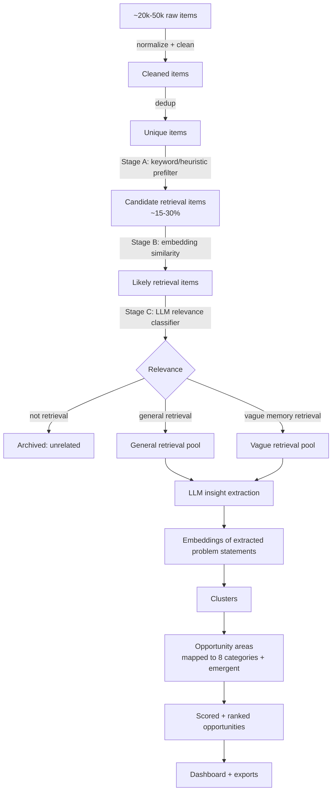
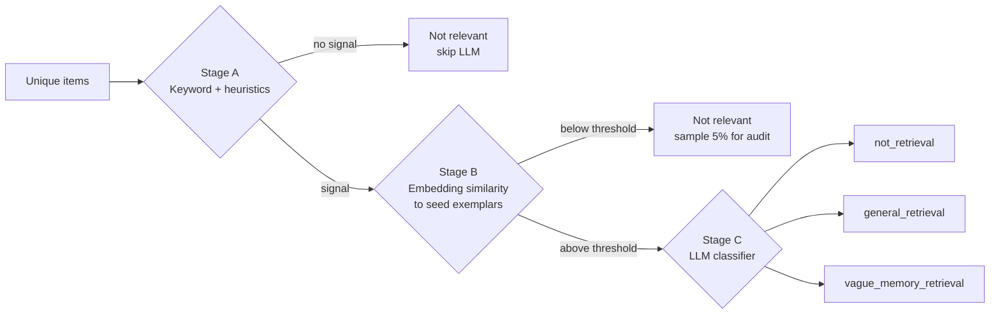
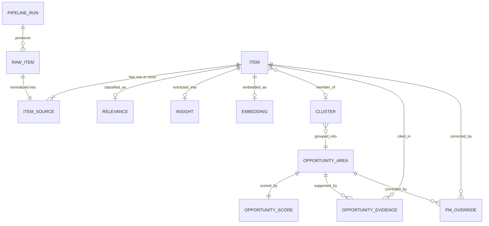
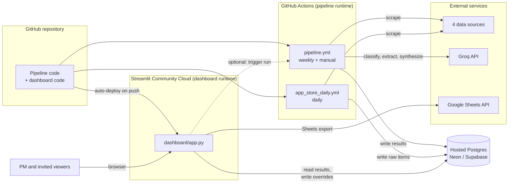

# Architecture: AI-Powered Discovery Engine for Vaguely Remembered Photo Retrieval

> Companion to [`ProblemStatement.md`](./ProblemStatement.md). This document describes how to build the Phase 1 discovery engine end to end: data ingestion, AI analysis, opportunity scoring, the PM dashboard, exports, and deployment.

> **Confirmed platform decisions**
> - **LLM provider: Groq.** All classification, extraction, labeling, synthesis, and rubric scoring calls go through the Groq API.
> - **Deployment: Streamlit.** The PM dashboard is deployed on Streamlit Community Cloud (see [Section 21](#21-deployment-streamlit-community-cloud)).

## Table of Contents

1. [Goals and Design Principles](#1-goals-and-design-principles)
2. [System Overview](#2-system-overview)
3. [Technology Stack](#3-technology-stack)
4. [Repository Structure](#4-repository-structure)
5. [Layer 1: Ingestion (Source Connectors)](#5-layer-1-ingestion-source-connectors)
6. [Layer 2: Normalization, Cleaning, and Deduplication](#6-layer-2-normalization-cleaning-and-deduplication)
7. [Layer 3: Relevance Classification Funnel](#7-layer-3-relevance-classification-funnel)
8. [Layer 4: AI Insight Extraction](#8-layer-4-ai-insight-extraction)
9. [Layer 5: Clustering and Opportunity Synthesis](#9-layer-5-clustering-and-opportunity-synthesis)
10. [Layer 6: Opportunity Scoring Engine](#10-layer-6-opportunity-scoring-engine)
11. [Layer 7: Dashboard](#11-layer-7-dashboard)
12. [Layer 8: Export and Reporting](#12-layer-8-export-and-reporting)
13. [Data Model](#13-data-model)
14. [Taxonomies and Enumerations](#14-taxonomies-and-enumerations)
15. [LLM Strategy, Prompts, and Guardrails](#15-llm-strategy-prompts-and-guardrails)
16. [Pipeline Orchestration](#16-pipeline-orchestration)
17. [Evaluation and Quality Assurance](#17-evaluation-and-quality-assurance)
18. [Compliance, Privacy, and Ethics](#18-compliance-privacy-and-ethics)
19. [Cost and Performance Estimates](#19-cost-and-performance-estimates)
20. [Configuration](#20-configuration)
21. [Deployment (Streamlit Community Cloud)](#21-deployment-streamlit-community-cloud)
22. [Build Plan and Milestones](#22-build-plan-and-milestones)
23. [Risks and Mitigations](#23-risks-and-mitigations)
24. [Future Extensions (Post-Phase 1)](#24-future-extensions-post-phase-1)

---

## 1. Goals and Design Principles

### What the system must do

Turn noisy public feedback from four sources into a **ranked, evidence-backed list of retrieval opportunity areas** that answers, for each area:

- What were users trying to find?
- What did they remember, and what did they forget?
- What did they search for or try?
- Where did the retrieval journey break down?
- How frequent, severe, strategically aligned, and well-evidenced is the problem?

### Design principles

| Principle | What it means in practice |
|---|---|
| **Evidence first** | Every insight, cluster, and score traces back to specific item IDs and verbatim user quotes. No claim exists without a link to its source. |
| **Funnel, not firehose** | Cheap filters run before expensive LLM calls. Most reviews ("great app", "too expensive") never reach the LLM extraction stage. |
| **Focus on vague memory** | The system separates *vague memory retrieval* from *general retrieval* and from *unrelated complaints*. Backup, storage, pricing, sync, sharing, and deletion complaints are kept only when they block retrieval of a remembered photo. |
| **Preserve original language** | Original text is stored unmodified. Cleaning produces a separate analysis copy. |
| **Reproducible and incremental** | Every stage is idempotent and cached by content hash + prompt version. Re-running the pipeline only processes new or changed items. |
| **Human in the loop** | The PM can override categories, scores, and relevance in the dashboard. Overrides are stored and feed the evaluation set. |
| **MVP-sized** | Built for a single PM and a small team, handling tens of thousands of items. The heavy pipeline runs on a schedule in GitHub Actions; the lightweight dashboard runs on Streamlit Community Cloud. It is not a Google-scale production system (an explicit non-goal). |
| **Light dashboard, heavy pipeline** | Scraping, embeddings, clustering, and Groq calls run in the pipeline, never inside the Streamlit app. The dashboard only reads precomputed results and writes PM overrides. |

---

## 2. System Overview

### High-level architecture

```mermaid
flowchart LR
    subgraph Sources["Mandatory Data Sources"]
        PS[Google Play Store<br/>Reviews]
        AS[Apple App Store<br/>Reviews]
        GS[Google Sheet<br/>Reddit / Community / Play]
        GC[Google Photos Help<br/>Community Threads]
    end

    subgraph Ingest["Layer 1: Ingestion"]
        C1[Play connector]
        C2[App Store connector]
        C3[Sheet connector]
        C4[Community connector]
        RAW[(Raw store<br/>immutable JSON)]
    end

    subgraph Prep["Layer 2: Prep"]
        N[Normalize to<br/>unified schema]
        CL[Clean + PII redact<br/>+ language detect]
        DD[Deduplicate<br/>exact + near-dup]
    end

    subgraph AI["Layers 3-5: AI Analysis"]
        RF[Relevance funnel<br/>keyword > embedding > Groq LLM]
        EX[Insight extraction<br/>Groq, structured JSON]
        EM[Embeddings]
        CLU[Clustering +<br/>taxonomy mapping]
        SYN[Opportunity synthesis]
    end

    subgraph Score["Layer 6"]
        SC[Scoring engine<br/>6 dimensions]
    end

    subgraph Out["Layers 7-8: Outputs"]
        DB[Streamlit dashboard<br/>Streamlit Community Cloud]
        EXP[CSV / Google Sheets / PDF]
    end

    DBS[(Postgres when deployed<br/>SQLite for local dev)]

    PS --> C1 --> RAW
    AS --> C2 --> RAW
    GS --> C3 --> RAW
    GC --> C4 --> RAW
    RAW --> N --> CL --> DD --> RF --> EX --> EM --> CLU --> SYN --> SC
    DD -.-> DBS
    RF -.-> DBS
    EX -.-> DBS
    CLU -.-> DBS
    SC -.-> DBS
    DBS --> DB
    DBS --> EXP
```



### End-to-end data flow



---

## 3. Technology Stack

| Concern | Choice (MVP) | Why | Upgrade path |
|---|---|---|---|
| Language | Python 3.11+ | Best ecosystem for scraping, NLP, and data apps | — |
| Package management | `uv` (or Poetry) | Fast, reproducible lockfile | — |
| Data validation | Pydantic v2 | Typed schemas for items and LLM outputs | — |
| Play Store scraping | `google-play-scraper` | Mature library, paginated review fetch with rating/date/metadata | — |
| App Store scraping | iTunes Customer Reviews RSS JSON feed + `httpx` | Public, stable, no JS rendering needed | Apple AMP API (more data, more fragile) |
| Google Sheet ingestion | Sheet CSV export endpoint, or `gspread` with a service account | Simple; supports multiple tabs | — |
| Community scraping | Playwright (headless Chromium) | Thread list pages are JS-rendered | — |
| HTTP resiliency | `httpx` + `tenacity` | Retries, backoff, timeouts | — |
| Storage | **Hosted Postgres** (e.g. Neon or Supabase free tier) when deployed; SQLite for local development. Both via SQLAlchemy, selected by `DATABASE_URL`. | Streamlit Community Cloud does not keep files written by the app, so shared data and PM overrides need a database that lives outside the app | Larger managed Postgres |
| Embedding store | Postgres table (`pgvector` or binary column) when deployed; NumPy/Parquet files locally | Simple at this scale (<100k vectors); only the pipeline reads embeddings | Dedicated vector database |
| Language detection | `fasttext` lid.176 or `langdetect` | Fast, offline | — |
| Near-duplicate detection | `datasketch` (MinHash LSH) + `rapidfuzz` | Scales well, catches reposts and copy-pasted reviews | — |
| LLM | **Groq** via the official `groq` Python SDK (OpenAI-compatible API), wrapped in a thin client in `ai/llm_client.py` | Very fast inference on open models, low per-token cost, JSON output modes | Groq Batch API for large backfills |
| Embeddings | `sentence-transformers` (e.g. `bge-small-en` / `all-MiniLM-L6-v2`), run inside the pipeline | Groq is used for text generation only; local embeddings are free, fast, and good enough for clustering | Larger embedding models |
| Clustering | UMAP (`umap-learn`) + HDBSCAN (`scikit-learn`) | Handles unknown cluster counts and noise | BERTopic |
| Dashboard | Streamlit + Plotly, **deployed on Streamlit Community Cloud** | Fastest path to an interactive, filterable PM tool; free hosting straight from a GitHub repo | Self-hosted Streamlit container or Streamlit in Snowflake, with SSO |
| Exports | `pandas` (CSV, via `st.download_button`), `gspread` (Google Sheets), **ReportLab** (PDF) | ReportLab is pure Python, so it installs on Streamlit Community Cloud without system packages | — |
| Pipeline runner | **GitHub Actions** scheduled and on-demand workflows | Enough memory and time for Playwright, embeddings, and clustering; free for this volume; secrets built in | Prefect / Dagster |
| CLI | Typer CLI with stage-level commands | Same commands run locally and in GitHub Actions | — |
| Secrets | `st.secrets` (Streamlit) and GitHub Actions secrets; `.env` for local runs | No keys in the repo | Cloud secret manager |
| Testing | `pytest`, recorded HTTP fixtures (`respx` / VCR) | Deterministic connector tests | — |

---

## 4. Repository Structure

```text
Google_Photos_AI Discovery Engine/
├── Docs/
│   ├── Problem_Statement.txt
│   ├── ProblemStatement.md
│   ├── architecture.md
│   └── implementation-plan.md
├── .github/workflows/
│   ├── pipeline.yml               # scheduled + manual full pipeline run (writes to Postgres)
│   ├── app_store_daily.yml        # daily App Store ingestion
│   └── ci.yml                     # lint + tests
├── .streamlit/
│   ├── config.toml                # theme, server settings
│   └── secrets.toml.example       # DATABASE_URL, Google service account (real file is gitignored)
├── config/
│   ├── settings.yaml              # sources, limits, model names, thresholds
│   ├── scoring_weights.yaml       # opportunity score weights (PM-editable)
│   ├── taxonomy.yaml              # categories, content types, breakdown points, emotions
│   └── keywords.yaml              # prefilter lexicon + seed exemplars
├── prompts/
│   ├── relevance_v1.md
│   ├── extraction_v1.md
│   ├── cluster_label_v1.md
│   ├── opportunity_synthesis_v1.md
│   └── scoring_rubric_v1.md
├── src/discovery/
│   ├── cli.py                     # Typer entrypoint: ingest, prep, classify, extract, cluster, score, export, run-all
│   ├── config.py
│   ├── models/                    # Pydantic schemas + SQLAlchemy ORM
│   │   ├── schemas.py
│   │   └── orm.py
│   ├── ingest/
│   │   ├── base.py                # SourceConnector interface
│   │   ├── play_store.py
│   │   ├── app_store.py
│   │   ├── google_sheet.py
│   │   └── community.py
│   ├── prep/
│   │   ├── normalize.py
│   │   ├── clean.py               # whitespace, HTML, PII redaction, language detection
│   │   └── dedup.py               # exact hash + MinHash LSH
│   ├── ai/
│   │   ├── llm_client.py          # Groq client: JSON output, rate-limit aware retries, caching
│   │   ├── prefilter.py           # Stage A keyword/heuristics
│   │   ├── semantic_filter.py     # Stage B embedding similarity
│   │   ├── relevance.py           # Stage C LLM classifier
│   │   ├── extraction.py          # per-item insight extraction
│   │   ├── embeddings.py
│   │   ├── clustering.py
│   │   └── synthesis.py           # opportunity area summaries + research questions
│   ├── scoring/
│   │   ├── dimensions.py          # frequency, severity, fit, evidence, leverage, research value
│   │   └── ranker.py
│   ├── export/
│   │   ├── csv_export.py
│   │   ├── sheets_export.py
│   │   └── pdf_report.py
│   └── eval/
│       ├── gold_set.py
│       └── metrics.py
├── dashboard/
│   ├── app.py                     # Streamlit entry (main file path on Streamlit Community Cloud)
│   ├── requirements.txt           # lightweight dashboard-only dependencies
│   ├── data_access.py             # read queries + override writes, cached with st.cache_data
│   └── pages/
│       ├── 1_Overview.py
│       ├── 2_Opportunity_Comparison.py
│       ├── 3_Opportunity_Detail.py
│       ├── 4_Evidence_Explorer.py
│       ├── 5_Data_Quality.py
│       └── 6_Export.py
├── data/                          # gitignored; local development only
│   ├── raw/{source}/{run_id}/*.jsonl
│   ├── discovery.db
│   ├── embeddings/
│   └── exports/
├── tests/
├── .env.example                   # GROQ_API_KEY, DATABASE_URL, Google service account path (local runs)
└── pyproject.toml                 # full pipeline dependencies (Playwright, sentence-transformers, groq, ...)
```

The dashboard has its own `dashboard/requirements.txt` so Streamlit Community Cloud installs only what the app needs (`streamlit`, `plotly`, `pandas`, `sqlalchemy`, `psycopg`, `gspread`, `google-auth`, `reportlab`). Heavy pipeline packages are never installed in the deployed app. Streamlit Community Cloud looks for a dependency file in the main file's folder first, so this one is used instead of the root `pyproject.toml`.

---

## 5. Layer 1: Ingestion (Source Connectors)

All connectors implement one interface, so new sources can be added later without touching downstream code.

```python
class SourceConnector(Protocol):
    source_name: str  # "play_store" | "app_store" | "google_sheet" | "google_community"
    platform: Platform  # Android | iOS | Reddit | Google Community

    def fetch(self, since: datetime | None, limit: int | None) -> Iterator[RawItem]: ...
```

Each connector writes **immutable raw payloads** before any processing: to JSONL files in `data/raw/{source}/{run_id}/` during local development, and to a `raw_items` table (JSON column) in hosted Postgres when the pipeline runs in GitHub Actions. Raw payloads are never modified, so any downstream stage can be re-run from scratch without re-scraping.

### 5.1 Google Play Store connector

| Aspect | Detail |
|---|---|
| Target | `com.google.android.apps.photos` |
| Method | `google-play-scraper` `reviews()` with continuation tokens, `sort=NEWEST` |
| Locales | `lang=en`, countries `in`, `us`, `gb`, `ca`, `au` (configurable). The source URL uses `hl=en_IN`, so `in` is the primary locale. |
| Fields captured | `reviewId`, `content`, `score` (rating), `at` (date), `thumbsUpCount`, `reviewCreatedVersion`, `replyContent`, `repliedAt` |
| Volume strategy | Pull the most recent N (default 20,000 per locale), plus incremental runs using `since` = last seen review date |
| Source URL stored | App page URL + `reviewId` (Play Store has no stable per-review permalink) |
| Risks | Rate limiting, so throttle (1-2 requests/second) and retry with backoff |

**Note:** Relevant retrieval reviews are a small fraction of all Play reviews. High volume is needed to collect enough relevant evidence, and the relevance funnel (Layer 3) makes that affordable.

### 5.2 Apple App Store connector

| Aspect | Detail |
|---|---|
| Target | App ID `962194608` |
| Primary method | iTunes RSS JSON feed: `https://itunes.apple.com/{country}/rss/customerreviews/page={1..10}/id=962194608/sortby=mostrecent/json` |
| Limitation | Returns at most ~500 most recent reviews per country (10 pages × 50) |
| Mitigation | Iterate across many English-speaking storefronts (`us`, `gb`, `in`, `ca`, `au`, `nz`, `ie`, `sg`), and schedule recurring runs so the corpus grows over time |
| Fields captured | Review ID, title, content, rating, version, author (hashed), updated date, country |
| Fallback | Playwright scrape of the `see-all=reviews` page, or the AMP API used by the web page (more fragile and token-dependent, so keep behind a feature flag) |
| Source URL stored | The provided App Store URL + country + review ID |

### 5.3 Google Sheet connector (Reddit / Community / Play dataset)

| Aspect | Detail |
|---|---|
| Target | Sheet ID `1lrAFUCIkTOCN9uje8u_nlxshmWO8yKe3ygSAlwRW28M` |
| Method | If shared publicly: `https://docs.google.com/spreadsheets/d/{id}/export?format=csv&gid={tab_gid}` for each tab. Otherwise: `gspread` with a service account. |
| Schema discovery | Inspect headers on first run and map columns via a config-driven mapping (`text`, `date`, `url`, `subreddit`, `score`, `source`). Unknown columns are kept in `metadata`. |
| Platform assignment | Per row: if the row has a source/platform column, use it (Reddit, Google Community, or Play Store). Default to `Reddit`. |
| Cross-source overlap | The sheet may contain Play Store reviews already collected by the Play connector. Cross-source dedup in Layer 2 handles this and keeps both source references. |
| Treatment | Rows are treated as **qualitative conversations**. They tend to be longer and richer, so they get a higher weight in evidence-quality scoring. |

### 5.4 Google Photos Help Community connector

| Aspect | Detail |
|---|---|
| Target | `support.google.com/photos/threads?hl=en&thread_filter=(category:photos_restore)` |
| Method | Playwright: load the thread list, paginate or scroll, collect thread URLs; then visit each thread page to extract title, original question body, date, reply count, "I have the same question" count, and accepted/recommended answers |
| Fields captured | Thread ID, URL, title, question body, created date, reply count, same-question count, top replies (stored separately and labeled as replies) |
| Politeness | 1 page every 2-3 seconds, randomized jitter, respect `robots.txt`, cache visited thread IDs |
| Analysis note | The **original question** is the primary unit of analysis. Replies are context only (they are often product experts, not users). The "same question" count is a strong frequency signal. |
| Category caveat | `photos_restore` threads skew toward "my photos are missing" (backup/restore). These must pass the relevance filter as *retrieval of a remembered item*, not as generic backup failures. |

### 5.5 Raw item schema

```json
{
  "raw_id": "play_store:gp:AOqpTOE...",
  "source_name": "play_store",
  "platform": "Android",
  "source_url": "https://play.google.com/store/apps/details?id=com.google.android.apps.photos&hl=en_IN",
  "fetched_at": "2026-10-01T07:30:00Z",
  "run_id": "2026-10-01T0730_play",
  "payload": { "...": "original source fields, untouched" }
}
```

---

## 6. Layer 2: Normalization, Cleaning, and Deduplication

### 6.1 Normalization

Each connector has a mapper that converts `payload` into the **unified `Item` schema** (see [Data Model](#13-data-model)): `source_name`, `platform`, `source_url`, `original_text`, `title`, `date`, `rating`, `author_hash`, `engagement` (thumbs-up, upvotes, same-question count), `metadata`.

For community threads and Reddit posts with titles, `analysis_text = title + "\n\n" + body`.

### 6.2 Cleaning

Cleaning produces `clean_text` and never modifies `original_text`.

| Step | Purpose |
|---|---|
| HTML/markdown stripping, whitespace normalization | Consistent model input |
| Language detection | Keep `en` (and optionally Hinglish/romanized text, flagged) for Phase 1; store the language for others |
| PII redaction | Remove emails, phone numbers, and URLs with personal identifiers from `clean_text` before sending to any LLM |
| Author anonymization | Store `author_hash = sha256(salt + author)`, never raw usernames |
| Minimum content filter | Drop items with fewer than 4 words (e.g. "nice", "👍") from AI stages, **unless the text contains a Stage A retrieval keyword** (so "can't find screenshots" is kept); dropped items stay in the counts |
| Developer replies | Separate Google's replies from user text |

### 6.3 Deduplication

| Level | Method | Action |
|---|---|---|
| Exact | `sha256(normalized clean_text)` | Long texts (≥ 12 words): merge into one canonical item and keep all source references. Short texts (< 12 words): merge only when the author hash **and** source also match (see short-text rule below). |
| Near-duplicate | MinHash LSH (Jaccard ≥ 0.85 on word 5-shingles), **long texts only (≥ 12 words)** | Merge; keep the longest version as canonical |
| Cross-source | Same as above, across sources (e.g. Play review that also appears in the Sheet) | One canonical item with multiple `item_sources` rows, so source breakdowns stay accurate |
| Spam/templated | Repeated identical text from many authors **with no retrieval content** (promotions, bot reviews) | Flag `is_spam`; exclude from frequency counts |

**Short-text rule.** Short generic complaints ("Search doesn't work", "Can't find my photos") are often written independently by many different users. Merging them would badly undercount how common a complaint is. So texts under ~12 words are never merged across different authors; they stay as separate items, and each carries a `similar_count` (how many other short items share the same normalized text) for reporting. Only true repeats (same author, same source, same text) are merged.

---

## 7. Layer 3: Relevance Classification Funnel

The funnel separates three things the problem statement asks for: **(1) is this about Google Photos, (2) is it about retrieval, (3) is it about vague memory retrieval**. It is staged so LLM costs scale with relevant volume, not total volume.



### Stage A: Keyword and heuristic prefilter (high recall)

Lexicon in `config/keywords.yaml`, grouped by signal:

- **Retrieval intent:** find, finding, can't find, cannot find, couldn't find, search, searching, looking for, locate, where is, where did, missing, disappeared, lost, get back, retrieve, scroll, scrolling
- **Vague memory cues:** remember, don't remember, forgot, sometime, last year, a while ago, that photo, that picture, that day, trip, vacation, I know it's there
- **Content types:** screenshot, receipt, bill, invoice, prescription, document, ID, passport, Aadhaar, ticket, recipe, WhatsApp, meme, video
- **Search features:** search bar, face grouping, people, places, map, date, album, Ask Photos, text in photo, OCR, Lens

Rules: keep the item if it contains at least one retrieval-intent term, **or** at least one search-feature term together with a negative rating (≤ 3). Target **recall ≥ 95%** on the gold set (Section 17). Precision does not matter at this stage.

### Stage B: Semantic similarity filter

- Embed `clean_text`.
- Compare to ~40 hand-written **seed exemplars** of vague retrieval (taken from the problem statement examples and early manual review) and ~40 negative exemplars (pricing, storage, backup-only complaints).
- Keep the item if `max_sim(positive) − max_sim(negative) > τ` (τ tuned on the gold set).
- Randomly sample 5% of rejected items for LLM audit to measure false negatives.

### Stage C: LLM relevance classifier

A small, cheap model with JSON output. It returns:

```json
{
  "is_google_photos": true,
  "is_retrieval": true,
  "retrieval_type": "vague_memory_retrieval",
  "vague_memory_relevance": 0.86,
  "excluded_topic": null,
  "excluded_topic_blocks_retrieval": null,
  "rationale": "User remembers a café on a Goa trip but not the date or name; search fails.",
  "confidence": 0.9
}
```

- `retrieval_type` is one of `not_retrieval` | `general_retrieval` | `vague_memory_retrieval`.
- `excluded_topic` is one of `storage | pricing | backup | sync | sharing | deletion | other | null`. If set, `excluded_topic_blocks_retrieval` decides whether the item stays in scope. This enforces the rule: *include backup/storage/etc. only if it directly affects the ability to find a remembered photo.*

---

## 8. Layer 4: AI Insight Extraction

Runs on every item classified as `general_retrieval` or `vague_memory_retrieval`. One LLM call per item (or batches of 5-10 short items per call) produces a strict JSON object validated by Pydantic.

### 8.1 Extraction schema

```json
{
  "trying_to_find": "Photo of a small café visited during a Goa trip",
  "content_type": "photo",
  "remembered_cues": [
    {"cue": "Goa trip", "cue_type": "trip_or_event"},
    {"cue": "small café", "cue_type": "place_vague"}
  ],
  "forgotten_details": ["exact_date", "location_name"],
  "search_attempts": [
    {"attempt": "searched 'Goa café'", "attempt_type": "keyword_search"},
    {"attempt": "scrolled through 2023 photos", "attempt_type": "manual_scroll"}
  ],
  "breakdown_point": "results_irrelevant_or_too_broad",
  "outcome": "not_found",
  "emotion": "frustrated",
  "frustration_intensity": 4,
  "primary_category": "context_based_retrieval_failure",
  "secondary_categories": ["location_ambiguity"],
  "high_stakes": false,
  "evidence_quote": "I searched Goa café and it showed me every beach photo but not the café",
  "evidence_strength": 4,
  "useful_for_discovery": true,
  "problem_statement": "User remembers trip context and a vague place type but search can't connect trip context to a specific venue.",
  "confidence": 0.84
}
```

### 8.2 Field definitions

| Field | Answers which problem-statement question | Values |
|---|---|---|
| `trying_to_find` | What is the user trying to find? | Free text, short |
| `content_type` | What type of content is involved? | Enum (Section 14.2) |
| `remembered_cues[]` | What does the user remember? | Cue text + `cue_type` enum |
| `forgotten_details[]` | What has the user forgotten? | Enum list (Section 14.3) |
| `search_attempts[]` | What did the user search or try? | Attempt text + `attempt_type` enum |
| `breakdown_point` | Where did the retrieval journey break down? | Enum (Section 14.4) |
| `emotion`, `frustration_intensity` | What emotion or frustration is expressed? | Enum + 1-5 |
| `primary_category`, `secondary_categories` | Which retrieval problem category? | 8 categories + `other_emergent` |
| `evidence_quote` | Evidence quote | **Must be a verbatim substring of `clean_text`**, the PII-redacted text the LLM actually saw (validated) |
| `evidence_strength` | How strong is the evidence? | 1-5 rubric (Section 15.3) |
| `useful_for_discovery` | Useful for product opportunity discovery? | Boolean |
| `high_stakes` | Severity signal | True for medical, financial, legal/ID, or irreplaceable memories |
| `problem_statement` | Normalized one-line problem, used for clustering | Free text |
| `confidence` | AI confidence score | 0-1 |

### 8.3 Validation rules

1. **Quote grounding:** `evidence_quote` must appear in `clean_text` (fuzzy match ≥ 95% with `rapidfuzz` to allow for whitespace or emoji differences). If not, retry once with an error message; if it fails again, set `evidence_quote = null` and `evidence_strength ≤ 2`. Grounding uses `clean_text`, not `original_text`, because the LLM only sees the redacted text; a quote containing a redaction marker such as `[PHONE]` is still valid. Quotes are displayed and exported from `clean_text` too, so redacted details never reappear; `original_text` is kept for audit only.
2. **Enum enforcement:** Values outside the taxonomy are rejected and retried.
3. **Not stated is not guessed:** Fields the user did not express must be empty lists or `"not_stated"`, not inferred. The prompt says this explicitly, and the gold set measures it.
4. **Confidence calibration:** Items with `confidence < 0.5` are flagged for PM review and are down-weighted in scoring.

---

## 9. Layer 5: Clustering and Opportunity Synthesis

The 8 categories in the problem statement are a **starting taxonomy**. Clustering checks whether the data actually supports them, splits broad categories into sharper sub-problems, and surfaces emergent problems the taxonomy missed.

### 9.1 Clustering pipeline

1. **Embed** the extracted `problem_statement` + `trying_to_find` + `breakdown_point`. Clustering on normalized problems groups items by *problem*, not by writing style or star rating.
2. **Reduce** with UMAP (e.g. `n_components=10`, `n_neighbors=15`, cosine metric).
3. **Cluster** with HDBSCAN (`min_cluster_size` ≈ 8-15, tuned). Noise points stay unclustered but remain searchable in the Evidence Explorer.
4. **Label** each cluster with an LLM call given ~20 representative items (closest to the centroid, diversified by source). The output is a cluster name, a one-sentence summary, and the best-matching taxonomy category.
5. **Map to opportunity areas:**
   - Clusters that map to the same taxonomy category and are semantically close (centroid cosine ≥ 0.8) are grouped under one **opportunity area** as sub-themes.
   - Clusters that do not fit any category become **emergent opportunity areas** (`other_emergent`) and are highlighted in the dashboard.
6. **PM curation:** the PM can merge, split, or rename opportunity areas in the dashboard. Curation decisions are stored and re-applied on later runs by matching clusters to prior areas through centroid similarity.

### 9.2 Opportunity area synthesis

For each opportunity area, the system aggregates structured data deterministically and uses the LLM only for narrative:

| Output field | How it is produced |
|---|---|
| Opportunity name | LLM cluster label (PM-editable) |
| User problem summary | LLM synthesis over representative items, constrained to cite item IDs |
| Source breakdown | Count of items per source and platform (deterministic) |
| Content types involved | Distribution of `content_type` (deterministic) |
| What users remembered | Top cue types + top normalized cues by frequency (deterministic), with example phrases |
| What users forgot | Distribution of `forgotten_details` (deterministic) |
| Common search attempts | Top `attempt_type` values + example attempts (deterministic) |
| Breakdown point | Distribution of `breakdown_point`, with the dominant one highlighted (deterministic) |
| Representative quotes | 5-8 quotes chosen by: high `evidence_strength`, close to the cluster centroid, **diverse across sources**, and not near-duplicates of each other |
| Source links | `source_url` for each representative item |
| Frequency, severity, evidence quality, strategic fit, product opportunity scores | Scoring engine (Layer 6) |
| Follow-up research questions | LLM-generated from the area's unknowns: 5-8 interview/survey questions, each tied to a gap in the evidence |

---

## 10. Layer 6: Opportunity Scoring Engine

Every dimension is scored on a **1-5 scale**, computed transparently, and shown with its inputs so the PM can see why an area ranks where it does.

### 10.1 Dimension formulas

Let `A` be an opportunity area, `items(A)` its in-scope items, and `V` all vague-retrieval items.

| Dimension | Formula (MVP) | Notes |
|---|---|---|
| **Frequency** | `share = |items(A)| / |V|`; also compute a **source-balanced share** = mean of per-source shares. Map to 1-5 by quantiles across areas. | Source balancing stops high-volume Play reviews from dominating. Community "same question" counts and thumbs-up counts add a small engagement boost (log-scaled). |
| **Severity** | `0.5 × mean(frustration_intensity)` + `0.3 × (5 × high_stakes_share)` + `0.2 × (5 × low_rating_share)` | `low_rating_share` = share of rated items with rating ≤ 2. Sources without ratings use only the first two terms, re-weighted. |
| **Strategic Fit** | `5 × mean(vague_memory_relevance)` × `(vague_items / all_items in A)` adjustment | Measures how directly the area maps to "remember but can't describe." |
| **Evidence Quality** | `0.4 × mean(evidence_strength)` + `0.3 × (5 × distinct_platforms / 4)` + `0.3 × (5 × min(1, log(n) / log(50)))` | Rewards specific quotes, cross-source corroboration, and adequate sample size. |
| **Product Leverage** | LLM rubric score (1-5) with written rationale, PM-overridable | Rubric: can AI, search UX, memory understanding, guided retrieval, or result explanation meaningfully address it? Penalized if it is mainly an infrastructure issue (e.g. backup failure). |
| **Research Value** | LLM rubric score (1-5) with rationale, PM-overridable | Rubric: open unknowns, variety of contexts, emotional stakes, testability through interviews or concept tests. |

### 10.2 Composite opportunity score

```text
Opportunity Score = Σ (weight_d × score_d)

Default weights (config/scoring_weights.yaml):
  frequency:        0.20
  severity:         0.20
  strategic_fit:    0.20
  evidence_quality: 0.15
  product_leverage: 0.15
  research_value:   0.10
```

| Band | Score |
|---|---|
| High | ≥ 3.8 |
| Medium | 3.0 – 3.79 |
| Low | < 3.0 |

**Guardrails**

- **Low-evidence flag:** areas with fewer than 10 items or evidence quality below 2.5 are labeled *"Emerging – low evidence"* and are not ranked above areas with adequate evidence.
- **Weight sensitivity:** the dashboard has weight sliders and shows whether the top 3 ranking changes under plausible weight changes. A stable ranking is a stronger recommendation.
- **Explainability:** every score shows its inputs, e.g. "Severity 4.2 = intensity 4.1, 38% high-stakes, 61% ≤2-star."

---

## 11. Layer 7: Dashboard

Built with **Streamlit + Plotly** and deployed on **Streamlit Community Cloud** (see [Section 21](#21-deployment-streamlit-community-cloud)). It reads precomputed results from hosted Postgres and never runs scraping, embeddings, clustering, or Groq calls itself. It is designed around the PM's decision: *which retrieval problem should we research first?*

**Published runs only.** The pipeline writes to the same database the dashboard reads from, so the dashboard could otherwise show a half-finished run (missing scores, mismatched counts). To prevent this, the dashboard reads only the run recorded in the `published_run` pointer (Section 13.2). A run becomes visible only after every stage finishes and the publish checks pass (Section 16.5). If a run fails or stops partway, the PM keeps seeing the last published run, with a banner noting that a newer run did not complete.

**Performance on Streamlit Community Cloud:** the app has modest memory and CPU, so it loads pre-aggregated tables (opportunity areas, scores, aggregates) and paginates the evidence table rather than loading every item. Queries are cached with `st.cache_data`, keyed by the `published_run_id`, so publishing a new run automatically invalidates the cache; the cache is also cleared after a PM override so changes appear immediately.

### 11.1 Pages

| Page | Purpose | Key components |
|---|---|---|
| **Overview** | Corpus health and funnel at a glance | KPI cards (items ingested, unique, retrieval-relevant, vague-relevant); funnel chart from raw items to vague retrieval; items per source/platform over time; category distribution |
| **Opportunity Comparison** | Rank and compare areas | Sortable ranked table (all 6 dimensions + composite + band + n); radar chart overlaying the selected areas; frequency vs. severity bubble chart (bubble size = evidence quality); **weight sliders** that re-rank live |
| **Opportunity Detail** | Everything about one area | Problem summary; source breakdown; content types; "Remembered vs. Forgotten" side-by-side bar charts; search attempts; journey breakdown funnel; representative quotes with source links; score breakdown with explanations; follow-up research questions; PM notes and overrides |
| **Evidence Explorer** | Drill into raw evidence | Filterable, searchable table of items with user text (PII-redacted `clean_text`), extracted fields, and link to source; per-item correction controls (fix category, relevance, mark as irrelevant) |
| **Data Quality** | Trust the pipeline | Run history, per-source fetch counts and errors, dedup stats, LLM cost and tokens, quote-grounding failure rate, low-confidence queue, gold-set metrics |
| **Export** | Produce deliverables | Export the current filtered view to CSV, Google Sheets, or PDF; optional "Run pipeline now" button that triggers the GitHub Actions workflow (see Section 21.4) |

### 11.2 Global filters (sidebar, apply to every page)

All filters required by the problem statement:

- Source (Play Store, App Store, Google Sheet, Google Community)
- Platform (Android, iOS, Reddit, Google Community)
- Problem category (8 categories + emergent)
- Severity (frustration intensity range, high-stakes only toggle)
- Relevance to vague memory retrieval (`vague_memory_relevance` slider; general vs. vague toggle)
- Content type
- Confidence score (minimum confidence slider)
- Plus: date range, rating range, language

### 11.3 Human-in-the-loop corrections

PM corrections are written to a `pm_overrides` table in hosted Postgres (so they survive app restarts and redeploys), never directly over AI outputs. The effective value is `override ?? ai_value`. Overrides:

- Are re-applied automatically on pipeline re-runs.
- Are added to the evaluation gold set.
- Are shown with a badge in the UI so it is clear which values were human-set.

---

## 12. Layer 8: Export and Reporting

| Format | Contents | Implementation |
|---|---|---|
| **CSV** | (1) `opportunities.csv`: one row per area with all fields and scores; (2) `evidence.csv`: one row per item with user text (PII-redacted `clean_text`), extracted fields, area, source URL | `pandas.to_csv`, served in the app with `st.download_button` |
| **Google Sheets** | Same two tabs, plus a "Scoring Weights" tab and a "Methodology" tab | `gspread` + service account (credentials stored in `st.secrets`); writes to a new or configured spreadsheet and returns the link |
| **PDF** | PM-ready opportunity report: executive summary, ranked opportunity table, one page per top area (following the format of the problem statement's Example Output), methodology and limitations appendix | **ReportLab**, generated in memory and served with `st.download_button`. Chosen because it is pure Python and installs on Streamlit Community Cloud without extra system packages. |

Exports are generated in memory and downloaded directly; nothing is written to the app's filesystem. The same exports are also available from the CLI (`discovery export`) for local or scheduled use.

Every export includes the `run_id`, the date, the scoring weights used, and the active filters, so a shared report is reproducible.

---

## 13. Data Model

### 13.1 Entity-relationship diagram



### 13.2 Core tables

**`items`** (canonical, deduplicated unit of analysis)

| Column | Type | Notes |
|---|---|---|
| `item_id` | TEXT PK | Stable hash |
| `primary_source_name` | TEXT | `play_store` / `app_store` / `google_sheet` / `google_community` |
| `platform` | TEXT | Android / iOS / Reddit / Google Community |
| `source_url` | TEXT | |
| `title` | TEXT NULL | |
| `original_text` | TEXT | Never modified |
| `clean_text` | TEXT | PII-redacted analysis text |
| `language` | TEXT | |
| `date` | DATETIME NULL | |
| `rating` | INT NULL | 1-5 |
| `engagement` | JSON | thumbs-up, upvotes, same-question count |
| `author_hash` | TEXT NULL | |
| `content_hash` | TEXT | For exact dedup |
| `is_spam` | BOOL | |
| `similar_count` | INT | Number of other short items with the same normalized text (short-text rule, Section 6.3) |
| `metadata` | JSON | Remaining source fields |

**`item_sources`**: `item_id`, `raw_id`, `source_name`, `platform`, `source_url`, `run_id` (lets one canonical item have multiple sources).

**`relevance`**: `item_id`, `stage_reached` (A/B/C), `is_google_photos`, `is_retrieval`, `retrieval_type`, `vague_memory_relevance`, `excluded_topic`, `excluded_topic_blocks_retrieval`, `rationale`, `confidence`, `model`, `prompt_version`.

**`insights`**: `item_id`, all extraction fields from Section 8 (lists stored as JSON), `user_reported_issue`, `extracted_retrieval_problem` (= `problem_statement`), `model`, `prompt_version`, `quote_grounded` (bool).

**`clusters`**: `cluster_id`, `run_id`, `label`, `summary`, `mapped_category`, `centroid` (blob), `size`.

**`opportunity_areas`**: `area_id`, `name`, `category`, `is_emergent`, `problem_summary`, `aggregates` (JSON: source breakdown, cues, forgotten, attempts, breakdowns, content types), `research_questions` (JSON), `status` (active / merged / archived).

**`opportunity_scores`**: `area_id`, `run_id`, `frequency`, `severity`, `strategic_fit`, `evidence_quality`, `product_leverage`, `research_value`, `composite`, `band`, `inputs` (JSON for explainability), `weights` (JSON), `low_evidence_flag`.

**`opportunity_evidence`**: `area_id`, `item_id`, `is_representative`, `rank`.

**`pm_overrides`**: `override_id`, `target_type` (item / area), `target_id`, `field`, `ai_value`, `override_value`, `note`, `created_at`.

**`pipeline_runs`**: `run_id`, `stage`, `started_at`, `finished_at`, `status` (running / completed / partial / failed / published), `counts` (JSON), `errors` (JSON), `llm_tokens`, `llm_cost_usd`.

**`published_run`**: a single-row table holding `published_run_id` and `published_at`. The dashboard reads only data belonging to this run. It is updated by the pipeline's final publish step, inside one transaction.

**`llm_cache`**: `cache_key` (= hash of model + prompt_version + input), `response`, `created_at`.

**`raw_items`** (deployed only): `raw_id`, `source_name`, `run_id`, `fetched_at`, `payload` (JSON). Replaces the local JSONL raw store.

**`embeddings`**: `item_id`, `model`, `vector` (`pgvector` or binary). Written and read only by the pipeline.

All tables live in hosted Postgres when deployed and in SQLite during local development; the same SQLAlchemy models serve both, selected by `DATABASE_URL`.

### 13.3 Mapping to the required per-item fields

| Required field (problem statement) | Stored in |
|---|---|
| Source name | `items.primary_source_name`, `item_sources.source_name` |
| Source URL | `items.source_url` |
| Platform | `items.platform` |
| Original user text | `items.original_text` |
| Date | `items.date` |
| Rating | `items.rating` |
| User-reported issue | `insights.user_reported_issue` |
| Extracted retrieval problem | `insights.extracted_retrieval_problem` |
| Relevance to vaguely remembered photo retrieval | `relevance.retrieval_type`, `relevance.vague_memory_relevance` |
| Evidence quote | `insights.evidence_quote` |
| AI confidence score | `relevance.confidence`, `insights.confidence` |

---

## 14. Taxonomies and Enumerations

All taxonomies live in `config/taxonomy.yaml` so they can be refined without code changes.

### 14.1 Retrieval problem categories

| Key | Name |
|---|---|
| `context_based_retrieval_failure` | Context-Based Retrieval Failure |
| `time_based_memory_gap` | Time-Based Memory Gap |
| `screenshot_document_retrieval_failure` | Screenshot and Document Retrieval Failure |
| `visual_detail_search_failure` | Object or Visual Detail Search Failure |
| `people_event_association_failure` | People and Event Association Failure |
| `location_ambiguity` | Location Ambiguity |
| `life_event_retrieval` | Life-Event Retrieval |
| `search_trust_breakdown` | Search Trust Breakdown |
| `other_emergent` | Emergent / Other (surfaced by clustering) |

### 14.2 Content types

`photo`, `video`, `screenshot`, `receipt_or_bill`, `prescription_or_medical`, `id_or_official_document`, `general_document`, `ticket_or_booking`, `recipe_or_info_card`, `chat_media` (e.g. WhatsApp-forwarded), `meme_or_funny`, `unknown`

### 14.3 Remembered cue types and forgotten details

**Remembered `cue_type`:** `situation`, `place_vague`, `person`, `purpose_task`, `visual_detail`, `time_range`, `source_app`, `life_event`, `feeling`, `trip_or_event`, `text_fragment`

**Forgotten details:** `exact_date`, `month_or_year`, `location_name`, `album_name`, `file_type`, `exact_text_in_image`, `sender`, `media_kind` (photo vs. screenshot vs. video vs. document), `search_keyword`, `people_names`

These mirror the problem statement's "users may remember" and "users may forget" lists, so the dashboard can show **remembered vs. forgotten** directly.

### 14.4 Retrieval journey breakdown points

Ordered as a journey, so the dashboard can render a funnel of where users drop off:

1. `query_formulation`: user doesn't know what to type
2. `no_results`: search returns nothing
3. `results_irrelevant_or_too_broad`: too many or wrong results
4. `target_not_surfaced`: right item exists but is not shown or ranked low
5. `wrong_metadata`: date, location, or face tagging is wrong or missing
6. `browse_fatigue`: manual scrolling is too slow or long
7. `item_appears_missing`: user believes it exists but it seems gone (backup/sync/restore confusion)
8. `trust_breakdown_gave_up`: user lost confidence and abandoned the search

### 14.5 Search attempt types

`keyword_search`, `date_search`, `location_search`, `people_search`, `text_ocr_search`, `natural_language_query` (e.g. Ask Photos), `album_browse`, `manual_scroll`, `external_app_check` (WhatsApp, Drive, gallery), `asked_support`, `not_stated`

### 14.6 Emotions

`frustrated`, `angry`, `anxious`, `sad_loss`, `confused`, `resigned`, `neutral`; plus `frustration_intensity` 1-5.

---

## 15. LLM Strategy, Prompts, and Guardrails

### 15.1 Model tiering (Groq)

All LLM calls go through **Groq**. Groq hosts open models (Llama, GPT-OSS, Qwen, and others) behind an OpenAI-compatible API.

| Task | Model tier | Example Groq model (verify against Groq's current model list) | Rationale |
|---|---|---|---|
| Stage C relevance | Small/fast | `llama-3.1-8b-instant` | High volume, simple decision |
| Insight extraction | Small/fast, with escalation to the large model when `confidence < 0.6` or the text is long (> 1,500 characters) | `llama-3.1-8b-instant`, escalating to the large model | Balances cost and quality |
| Cluster labeling, opportunity synthesis, leverage/research rubrics | Large | `llama-3.3-70b-versatile` or `openai/gpt-oss-120b` | Low volume, needs judgment |

Model IDs are set in `config/settings.yaml`, so no code changes are needed to switch models. Groq retires and replaces models fairly often, so any model change must pass the gold-set regression check (Section 17) before it is used for a real run.

### 15.1a Groq integration details

| Concern | Approach |
|---|---|
| SDK | Official `groq` Python SDK, wrapped by `ai/llm_client.py` so prompts, caching, and validation are independent of the SDK |
| Structured output | Use Groq's JSON Schema structured output on models that support it; otherwise JSON mode (`response_format={"type": "json_object"}`). In both cases, validate with Pydantic and retry once on failure. |
| Rate limits | Groq enforces per-model limits on requests and tokens per minute and per day, and these are tighter on the free tier. The client reads rate-limit response headers, respects `retry-after` on HTTP 429, and uses a token-bucket limiter so `max_concurrency` never exceeds the account's limits. |
| Account tier | The free tier is enough for development and small test runs. A full run of a few thousand LLM calls should use a paid (Developer) tier, or be spread over more time. |
| Large backfills | Groq's Batch API can process the first full-corpus extraction asynchronously at lower cost. Incremental weekly runs use normal synchronous calls. |
| Context limits | Inputs are truncated to a configured maximum (e.g. 6,000 characters) before sending; long community threads send the original question plus the first replies only. |
| Secrets | `GROQ_API_KEY` is stored in GitHub Actions secrets (pipeline) and `.env` (local). The Streamlit app does not need it, because it makes no LLM calls. |

### 15.2 Prompt design rules

- Versioned prompt files in `prompts/` (`*_v1.md`, `*_v2.md`); the version is stored with every output.
- System prompt contains the **definition of vague memory retrieval** and the **exclusion rule** (storage, pricing, backup, sync, sharing, and deletion are in scope only if they block retrieval).
- 6-10 **few-shot examples** per prompt, including hard negatives (e.g. "Backup is stuck at 99%", which is not retrieval) and borderline cases (e.g. "My photos from 2019 vanished after restore, I need my wedding pics", which is retrieval of a remembered item, in scope).
- **JSON schema enforced** through Groq's structured output (or JSON mode where the model lacks schema support), with Pydantic validation and one retry on failure.
- Prompts are written and tested against open models (Llama-class): short, explicit instructions, enums listed in full, and a complete example of the expected JSON in each prompt.
- Explicit instruction: *"Only extract what the user states. Use `not_stated` rather than guessing."*
- Temperature 0 for classification and extraction; low temperature for synthesis.

### 15.3 Evidence strength rubric (1-5)

| Score | Meaning |
|---|---|
| 5 | Specific item described, specific cues remembered/forgotten, specific search attempt and failure described |
| 4 | Clear retrieval failure with at least two of: what was sought, cues, attempt, breakdown |
| 3 | Clear retrieval failure, but generic ("search never finds anything") |
| 2 | Retrieval implied but vague or mixed with other complaints |
| 1 | Barely related; weak signal |

### 15.4 Hallucination and quality guardrails

| Risk | Guardrail |
|---|---|
| Invented quotes | Verbatim substring validation (Section 8.3) |
| Over-inference of cues | `not_stated` default; measured on the gold set |
| Synthesis claims without support | Synthesis prompts receive item IDs and must cite them; uncited sentences are flagged |
| Category drift between runs | Prompt versioning + LLM cache + gold-set regression check before accepting a new prompt version |
| PII leakage to LLM | Redaction before any LLM call; only `clean_text` is sent |

---

## 16. Pipeline Orchestration

### 16.1 CLI commands

```bash
discovery ingest --source play_store|app_store|google_sheet|google_community|all [--since DATE] [--limit N]
discovery prep                 # normalize, clean, dedup
discovery classify             # relevance funnel stages A, B, C
discovery extract              # insight extraction
discovery cluster              # embeddings, clustering, labeling, opportunity area mapping
discovery score                # scoring + ranking
discovery export --format csv|sheets|pdf [--filters FILE]
discovery run-all              # full pipeline, incremental
discovery eval                 # run the gold-set evaluation
streamlit run dashboard/app.py # local preview of the dashboard
```

The same `discovery` commands run locally (against SQLite or Postgres) and inside GitHub Actions (against hosted Postgres).

### 16.2 Incremental processing and caching

- Each stage processes only items whose `(content_hash, stage_version)` hasn't been processed before.
- LLM responses are cached in `llm_cache` by `hash(model + prompt_version + input)`. Re-runs are free unless the prompt or model changes.
- Clustering re-runs on the full in-scope set each time (it is cheap), and opportunity areas are matched to previous runs by centroid similarity, so area IDs and PM curation persist.
- Run-scoped outputs (clusters, opportunity areas, scores, evidence links) are written with their `run_id`, so a new run never overwrites what the dashboard is currently showing.

### 16.3 Scheduling

- **Weekly full run:** GitHub Actions workflow `pipeline.yml` runs `discovery run-all` on a schedule (e.g. every Monday) and can also be started manually (`workflow_dispatch`).
- **Daily App Store ingestion:** `app_store_daily.yml` runs `discovery ingest --source app_store`, because the RSS feed only exposes the most recent ~500 reviews per country.
- The Streamlit dashboard picks up new results automatically when its query cache expires; no redeploy is needed.

### 16.4 Error handling

- Per-source failures don't block other sources. The run is marked `partial`, and errors appear in the Data Quality page.
- LLM failures retry with exponential backoff (`tenacity`). Items that keep failing are queued for the next run.

### 16.5 Publishing a run

`discovery run-all` ends with a **publish step**, which is the only thing that changes what the dashboard shows:

1. Confirm every stage of the run finished with status `completed`.
2. Run sanity checks: at least one opportunity area, every area has scores and at least one representative quote, item counts within an expected range of the previous run (e.g. not a 90% drop).
3. If all checks pass, update `published_run.published_run_id` to this run in one transaction and mark the run `published`.
4. If any check fails, leave the previous published run in place, mark this run `failed` or `partial`, and record the reasons for the Data Quality page.

Overlapping runs are prevented with a GitHub Actions `concurrency` group and a database advisory lock, so two runs can never publish at the same time.

---

## 17. Evaluation and Quality Assurance

### 17.1 Gold set

- Hand-label ~300 items: stratified across the 4 sources, including ~100 likely-relevant, ~100 borderline, and ~100 likely-irrelevant items.
- Labels: retrieval type, primary category, content type, remembered cue types, forgotten details, breakdown point, evidence strength.
- PM overrides from the dashboard are continuously added to the gold set.

### 17.2 Metrics and targets

| Component | Metric | MVP target |
|---|---|---|
| Stage A prefilter | Recall on relevant items | ≥ 95% |
| Stages A+B combined | Recall | ≥ 90% |
| Stage C relevance | Precision / recall for `vague_memory_retrieval` | ≥ 0.80 / ≥ 0.75 |
| Category | Primary category accuracy | ≥ 70% (top-2 ≥ 85%) |
| Extraction | Quote grounding rate | ≥ 98% |
| Extraction | `not_stated` correctness (no hallucinated cues) | ≥ 90% |
| Clustering | PM-judged cluster coherence (1-5) | ≥ 4 average for top 8 areas |
| End to end | Distinct, evidence-backed opportunity areas | 5-8 (success criterion) |

### 17.3 Mapping to problem-statement success criteria

| Success criterion | How the architecture meets it |
|---|---|
| Identify 5-8 distinct retrieval problem areas | Clustering + taxonomy mapping + PM curation; dashboard shows the count of non-low-evidence areas |
| Support each area with real user evidence | Grounded quotes, representative quote selection, source links, `opportunity_evidence` table |
| Understand what users remember and forget | Structured cue and forgotten-detail extraction; Remembered vs. Forgotten charts |
| Compare areas with a consistent scoring model | 6-dimension transparent scoring with configurable weights and sensitivity check |
| Separate vague retrieval from general complaints | 3-stage relevance funnel with explicit exclusion rule and `retrieval_type` |
| Select one strong area for deeper research | Ranked comparison, low-evidence guardrail, stability under weight changes |
| Generate sharper follow-up interview questions | LLM research questions tied to evidence gaps for each area |
| Avoid generic conclusions | Specific breakdown points, sub-theme clusters, evidence-strength scoring, uncited-claim flags |

---

## 18. Compliance, Privacy, and Ethics

- **Public data only.** Only the four specified public sources are collected.
- **Respect platform terms.** Check each site's `robots.txt` and terms of service before running scrapers; use official or public endpoints where available (iTunes RSS, Sheet export). Throttle all requests and use an identifying User-Agent.
- **No personal profiling.** Usernames are hashed with a salt; no profile data is collected beyond the review/post itself.
- **PII minimization.** Emails, phone numbers, and similar identifiers are redacted before LLM processing and in exports.
- **Quotes in reports.** Quotes are shown without author names. Exports can optionally paraphrase quotes when shared outside the immediate team.
- **Data retention.** Raw data lives in the hosted Postgres database (and in gitignored `data/` locally); it is never committed to the GitHub repo that Streamlit Community Cloud deploys from. A `discovery purge --older-than` command supports retention policies.
- **Secrets.** `GROQ_API_KEY`, `DATABASE_URL`, and Google service-account credentials live in GitHub Actions secrets (pipeline), Streamlit Community Cloud secrets (dashboard), and `.env` / `.streamlit/secrets.toml` locally. None are ever committed.
- **Dashboard access.** The Streamlit app is set to private, with viewer access limited to invited email addresses, because it shows user quotes.
- **Third-party processing.** Only PII-redacted `clean_text` is sent to Groq.

---

## 19. Cost and Performance Estimates

Illustrative estimates for a 30,000-item corpus. Groq prices are per million tokens and differ by model, so budget using the token counts below and the current Groq price list.

| Stage | Items processed | Approx. tokens per item | Total tokens |
|---|---|---|---|
| Stage A prefilter | 30,000 | 0 (local) | 0 |
| Stage B semantic filter | ~7,000 | 0 (local embeddings) | 0 |
| Stage C relevance (small model) | ~3,000 | ~700 in / 120 out | ~2.1M in / 0.36M out |
| Extraction (small model, ~10% escalated) | ~1,500 | ~1,200 in / 400 out | ~1.8M in / 0.6M out |
| Cluster labeling + synthesis + rubrics (large model) | ~15-30 areas | ~8,000 in / 1,500 out | ~0.25M in / 0.05M out |

- **LLM cost:** Groq's small Llama-class models are priced at a few cents per million tokens, so a full run is expected to cost **well under a few US dollars**. Incremental re-runs cost a fraction of that thanks to caching.
- **Rate limits matter more than cost.** About 4,500 LLM calls per full run can exceed free-tier daily request or token limits. Use a paid Groq tier for full runs, or the Batch API for the first backfill.
- **Runtime:** ingestion is the bottleneck (polite scraping of community threads can take 1-3 hours for a few thousand threads), which fits within a single GitHub Actions job (6-hour limit). AI stages finish in minutes because Groq inference is fast; concurrency is capped by rate limits rather than speed.
- **Hosting cost:** Streamlit Community Cloud and GitHub Actions (at this volume) are free; a free-tier hosted Postgres (Neon or Supabase) fits the data.
- **Footprint:** database + embeddings for 30k items is under 1 GB; the dashboard loads only aggregates and paginated evidence, keeping it within Streamlit Community Cloud's memory limits.

---

## 20. Configuration

`config/settings.yaml` (illustrative):

```yaml
sources:
  play_store:
    app_id: com.google.android.apps.photos
    lang: en
    countries: [in, us, gb, ca, au]
    max_reviews_per_country: 20000
    requests_per_second: 1
  app_store:
    app_id: 962194608
    countries: [us, gb, in, ca, au, nz, ie, sg]
    pages: 10
  google_sheet:
    sheet_id: 1lrAFUCIkTOCN9uje8u_nlxshmWO8yKe3ygSAlwRW28M
    tabs: auto
    column_map: auto
    default_platform: Reddit
  google_community:
    list_url: "https://support.google.com/photos/threads?hl=en&thread_filter=(category:photos_restore)"
    max_threads: 3000
    seconds_between_pages: 2.5
    include_replies: true

prep:
  languages: [en]
  min_words: 4
  near_dup_jaccard: 0.85

relevance:
  semantic_margin_threshold: 0.05
  audit_sample_rate: 0.05

llm:
  provider: groq
  small_model: llama-3.1-8b-instant        # verify against Groq's current model list
  large_model: llama-3.3-70b-versatile     # or openai/gpt-oss-120b
  structured_output: json_schema           # falls back to json_object if unsupported
  temperature: 0
  escalate_below_confidence: 0.6
  max_input_chars: 6000
  max_concurrency: 4                       # keep within Groq rate limits for the account tier
  requests_per_minute: 30                  # set from the account's Groq limits
  use_batch_api_for_backfill: true

database:
  url_env: DATABASE_URL                    # Postgres when deployed; sqlite:///data/discovery.db locally

clustering:
  embedding_model: BAAI/bge-small-en-v1.5
  umap: { n_components: 10, n_neighbors: 15, metric: cosine }
  hdbscan: { min_cluster_size: 10 }

scoring:
  low_evidence_min_items: 10
  bands: { high: 3.8, medium: 3.0 }
```

---

## 21. Deployment (Streamlit Community Cloud)

### 21.1 Deployment topology

The system is split into two runtimes that share one hosted Postgres database:



| Runtime | Runs | Why there |
|---|---|---|
| **GitHub Actions** | Scraping (including Playwright), cleaning, dedup, embeddings, clustering, all Groq calls, scoring | Enough memory, time (up to 6 hours per job), and system packages for Playwright and ML libraries; scheduled triggers; built-in secrets |
| **Streamlit Community Cloud** | The PM dashboard: reads results, applies filters, shows charts, writes PM overrides, generates exports | Free hosting, deploys straight from GitHub, auto-redeploys on push, viewer access control |
| **Hosted Postgres** | All tables from Section 13 | Streamlit Community Cloud does not keep files written by the app across restarts, so SQLite cannot be the shared store; both runtimes need the same data |

### 21.2 Why the pipeline does not run inside Streamlit

- Streamlit Community Cloud apps have limited memory and CPU; sentence-transformers, UMAP, and HDBSCAN would compete with the dashboard for resources.
- Playwright needs a headless browser and system libraries that are awkward to install there.
- Apps go to sleep after a period of inactivity, so long-running jobs cannot be relied on.
- Any file written by the app (such as a SQLite database) can be lost on restart or redeploy.

### 21.3 Secrets and configuration

| Secret | GitHub Actions (pipeline) | Streamlit Community Cloud (dashboard) | Local |
|---|---|---|---|
| `GROQ_API_KEY` | ✅ | — (dashboard makes no LLM calls) | `.env` |
| `DATABASE_URL` | ✅ | ✅ | `.env` / `.streamlit/secrets.toml` |
| Google service account JSON (Sheet read + Sheets export) | ✅ | ✅ | file path in `.env` / `secrets.toml` |
| `GITHUB_TOKEN` (fine-grained, `actions:write` only) for the optional "Run pipeline now" button | — | ✅ (optional) | — |

In the dashboard, secrets are read with `st.secrets`. A `.streamlit/secrets.toml.example` documents the expected keys; the real file is gitignored.

### 21.4 Optional: trigger a pipeline run from the dashboard

The Export page can include a **"Run pipeline now"** button that calls the GitHub REST API to dispatch `pipeline.yml` (`workflow_dispatch`). The Data Quality page then shows the run status from `pipeline_runs`. This lets the PM refresh the data without touching GitHub.

### 21.5 Deployment steps

1. Push the repository to GitHub (private repositories are supported).
2. Create a hosted Postgres database (Neon or Supabase free tier) and copy its connection string.
3. Add `GROQ_API_KEY`, `DATABASE_URL`, and the Google service account JSON as **GitHub Actions secrets**.
4. Run `pipeline.yml` manually once to create tables and load the first full dataset.
5. In Streamlit Community Cloud, create a new app from the repository: branch `main`, main file path `dashboard/app.py`, Python 3.11.
6. Paste `DATABASE_URL` and the Google service account JSON into the app's **Secrets** settings.
7. Set the app to **private** and invite viewers by email.
8. Confirm the app loads, filters work, and a PM override persists after rebooting the app.

### 21.6 Operating notes

| Topic | Note |
|---|---|
| Cold starts | The app sleeps after inactivity; the first visitor wakes it, which takes a short while. Keep the app's startup light (no heavy imports or data loads at import time). |
| Redeploys | Every push to `main` redeploys the dashboard. Pipeline schema changes must be applied (migrations run by the pipeline) before dashboard code that depends on them is merged. |
| Database connections | Use a pooled connection string (Neon/Supabase pooler) and `st.cache_resource` for the SQLAlchemy engine to avoid exhausting connections. |
| Monitoring | Failed GitHub Actions runs send email notifications; the Data Quality page shows the last successful run and any per-source errors. |
| Upgrade path | If the team outgrows Community Cloud (more viewers, SSO, more resources), the same app can run in a self-hosted Streamlit container or Streamlit in Snowflake with no code changes beyond secrets. |

---

## 22. Build Plan and Milestones

| Milestone | Scope | Exit criteria |
|---|---|---|
| **M0: Foundations** (2-3 days) | Repo scaffold, config, Pydantic schemas, SQLAlchemy ORM (SQLite local / Postgres deployed), Groq LLM client with cache and rate limiting, CLI skeleton, GitHub repo + hosted Postgres provisioned | `discovery --help` works; tables created in both SQLite and Postgres |
| **M1: Ingestion** (4-5 days) | All 4 connectors, raw store (JSONL locally, `raw_items` in Postgres), normalization; ingestion running in GitHub Actions | ≥ 1 successful run per source; counts on the Data Quality page |
| **M2: Prep + gold set** (3 days) | Cleaning, PII redaction, dedup (incl. cross-source); hand-label the ~300-item gold set | Dedup stats verified on a sample; gold set committed |
| **M3: Relevance funnel** (3-4 days) | Stages A, B, C; threshold tuning | Recall/precision targets from Section 17.2 met |
| **M4: Insight extraction** (4 days) | Extraction prompt, validation, quote grounding, escalation | ≥ 98% grounding; field accuracy reviewed on the gold set |
| **M5: Clustering + synthesis** (4 days) | Embeddings, UMAP/HDBSCAN, labeling, opportunity area mapping, representative quotes, research questions | 5-8 coherent areas identified and reviewed by the PM |
| **M6: Scoring** (2-3 days) | 6 dimensions, composite, bands, guardrails, explanations | Scores reproducible; sensitivity check implemented |
| **M7: Dashboard** (5 days) | All 6 pages, global filters, overrides; deployed on Streamlit Community Cloud | PM can filter, compare, drill down, and correct on the deployed app |
| **M8: Exports + hardening** (3 days) | CSV, Google Sheets, PDF (ReportLab); scheduled GitHub Actions workflows; README and deployment runbook | One-command `run-all`; scheduled runs update the deployed dashboard; PDF report matches the example output format |

**Total:** roughly 5-6 weeks for one engineer, or 3-4 weeks for two (ingestion and AI stages can run in parallel once M0 schemas are fixed). See [`implementation-plan.md`](./implementation-plan.md) for the detailed phase plan.

---

## 23. Risks and Mitigations

| Risk | Impact | Mitigation |
|---|---|---|
| Scrapers break (HTML changes, rate limits, blocking) | Missing source data | Prefer public endpoints; recorded fixtures in tests; per-source failure isolation; raw store lets you re-run without re-scraping |
| App Store RSS cap (~500 per country) | Thin iOS evidence | Many storefronts; frequent scheduled runs to accumulate; AMP/Playwright fallback behind a flag |
| Low share of vague-retrieval content in app reviews | Few relevant items from store reviews | High-volume pulls + funnel; weight richer Reddit/Community conversations higher in evidence quality; source-balanced frequency |
| `photos_restore` category skews to backup issues | Scope creep into backup complaints | Explicit `excluded_topic_blocks_retrieval` logic and hard-negative few-shots |
| LLM hallucination or over-inference | Untrustworthy insights | Quote grounding, `not_stated` defaults, citations in synthesis, gold-set regression |
| Clusters too broad ("search is bad") | Generic conclusions | Cluster on extracted problem statements, not raw text; sub-theme splitting; evidence-strength weighting; PM split/merge |
| Score weights drive conclusions | Biased prioritization | Transparent inputs, adjustable weights, ranking stability check, PM overrides with notes |
| Sheet schema unknown or changes | Ingestion errors | Header auto-detection + config column map; schema validation with clear errors |
| Non-English or code-mixed reviews (e.g. Hinglish from the `en_IN` locale) | Missed evidence | Flag and count them; optional LLM translation pass in a later phase |
| Groq rate limits (requests/tokens per minute and per day) | Slow or incomplete full runs | Token-bucket limiter, `retry-after` handling, paid tier for full runs, Batch API for backfills, LLM cache so re-runs skip completed items |
| Groq model retirement | Pipeline errors or quality shifts when a model is removed | Model IDs in config; gold-set regression check before switching; monitor Groq deprecation notices |
| Open-model JSON reliability | Invalid or incomplete structured output | JSON Schema mode where supported, Pydantic validation, one retry, escalation to the large model |
| Streamlit Community Cloud limits (memory, sleeping, files not kept) | Slow or lost dashboard state | Pipeline runs outside Streamlit; all state in hosted Postgres; pre-aggregated tables; paginated evidence; light startup |
| Free-tier Postgres limits (storage, connections) | Write failures or connection errors | Keep raw payloads compact, use the pooled connection string, purge old raw data; upgrade the plan if needed |
| Quotes visible to anyone with the app link | Privacy exposure | Private app with invited viewers only; PII redaction; optional quote paraphrasing in exports |

---

## 24. Future Extensions (Post-Phase 1)

- **Interview and survey loop:** import interview transcripts and survey responses as a new source type to validate or refute opportunity areas.
- **Concept testing hooks:** link each opportunity area to concept hypotheses and track the evidence for and against them.
- **Trend tracking:** compare opportunity scores across runs and app versions to detect emerging or resolved problems.
- **Competitor benchmark:** add Apple Photos and other gallery app reviews as comparison sources.
- **Multilingual analysis:** translation layer for Hindi, Spanish, Portuguese, and other major Google Photos markets.
- **Production upgrade:** larger managed Postgres with pgvector, Prefect/Dagster orchestration, and the Streamlit dashboard moved to a self-hosted container or Streamlit in Snowflake with SSO for team-wide access.
