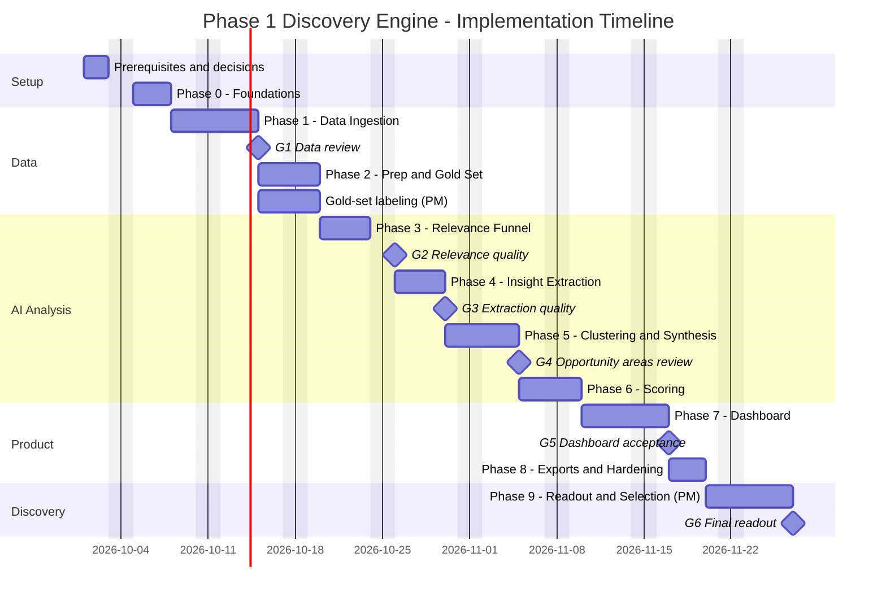
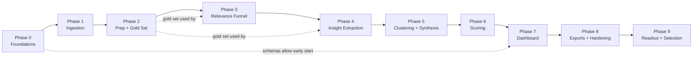

# Implementation Plan: AI-Powered Discovery Engine for Vaguely Remembered Photo Retrieval

> Built from `[ProblemStatement.md](./ProblemStatement.md)` (what and why) and `[architecture.md](./architecture.md)` (how). This plan breaks the Phase 1 build into sequenced phases with tasks, deliverables, acceptance criteria, and PM review gates.

> **Confirmed platform decisions**
>
> - **LLM provider: Anthropic Claude** (changed from Groq on 2026-10-02). **Claude Sonnet 5.5** (`claude-sonnet-5-5`) is the default "small" model for high-volume classification and extraction. **Claude Opus 5.5** (`claude-opus-5-5`) is the "large" model for the P3.9 comparison, escalation, synthesis, and rubrics. Why: the Groq free tier (200K tokens/day per model) stopped every P3.8 gold-set run partway, and Groq Developer-tier upgrades were unavailable. Groq stays supported in code (`llm.provider: groq`) as a fallback. Wherever later sections say "Groq small/large model", read `llm.small_model` / `llm.large_model`.
> - **LLM budget: $8.50 total for the whole project** (PM, 2026-10-02; raised from $5 to $8 the same day for Phase 4 extraction, then to $8.50 to finish the corpus). Enforced in code by `llm.project_budget_usd` (see D1).
> - **Deployment: Streamlit.** The dashboard is deployed on Streamlit Community Cloud. The heavy pipeline runs in GitHub Actions, and both share a hosted Postgres database (architecture Section 21).

## Table of Contents

1. [Plan at a Glance](#1-plan-at-a-glance)
2. [Before You Start: Prerequisites and Open Decisions](#2-before-you-start-prerequisites-and-open-decisions)
3. [Timeline](#3-timeline)
4. [Phase Dependencies](#4-phase-dependencies)
5. [Phase 0: Foundations](#phase-0-foundations)
6. [Phase 1: Data Ingestion](#phase-1-data-ingestion)
7. [Phase 2: Data Prep and Gold Set](#phase-2-data-prep-and-gold-set)
8. [Phase 3: Relevance Classification Funnel](#phase-3-relevance-classification-funnel)
9. [Phase 4: AI Insight Extraction](#phase-4-ai-insight-extraction)
10. [Phase 5: Clustering and Opportunity Synthesis](#phase-5-clustering-and-opportunity-synthesis)
11. [Phase 6: Opportunity Scoring](#phase-6-opportunity-scoring)
12. [Phase 7: PM Dashboard](#phase-7-pm-dashboard)
13. [Phase 8: Exports, Automation, and Hardening](#phase-8-exports-automation-and-hardening)
14. [Phase 9: Discovery Readout and Opportunity Selection](#phase-9-discovery-readout-and-opportunity-selection)
15. [PM Review Gates](#15-pm-review-gates)
16. [Requirements Traceability](#16-requirements-traceability)
17. [Roles and Responsibilities](#17-roles-and-responsibilities)
18. [Definition of Done (All Phases)](#18-definition-of-done-all-phases)
19. [Risk Watchlist by Phase](#19-risk-watchlist-by-phase)
20. [Progress Tracker](#20-progress-tracker)

---

## 1. Plan at a Glance

| Phase | Name                                        | Duration        | Main output                                                                                                      | Gate                             |
| ----- | ------------------------------------------- | --------------- | ---------------------------------------------------------------------------------------------------------------- | -------------------------------- |
| 0     | Foundations                                 | 3 days          | Repo, config, schemas, database (SQLite + hosted Postgres), LLM client, CLI skeleton                             | —                                |
| 1     | Data Ingestion                              | 5 days          | Raw data from all 4 sources in a unified format                                                                  | **G1: Data review**              |
| 2     | Data Prep and Gold Set                      | 3 days          | Cleaned, deduplicated corpus + ~300 hand-labeled items                                                           | —                                |
| 3     | Relevance Classification Funnel             | 4 days          | Each item labeled not retrieval / general retrieval / vague memory retrieval                                     | **G2: Relevance quality**        |
| 4     | AI Insight Extraction                       | 4 days          | Structured insights per item (remembered, forgotten, attempts, breakdown, quote)                                 | **G3: Extraction quality**       |
| 5     | Clustering and Opportunity Synthesis        | 4 days          | 5-8+ opportunity areas with summaries, quotes, research questions                                                | **G4: Opportunity areas review** |
| 6     | Opportunity Scoring                         | 3 days          | 6-dimension scores, composite ranking, explanations                                                              | —                                |
| 7     | PM Dashboard                                | 5 days          | Streamlit dashboard with filters, comparisons, drill-downs, overrides, **deployed on Streamlit Community Cloud** | **G5: Dashboard acceptance**     |
| 8     | Exports, Automation, and Hardening          | 3 days          | CSV / Google Sheets / PDF exports, scheduled GitHub Actions runs, README and deployment runbook                  | —                                |
| 9     | Discovery Readout and Opportunity Selection | 5 days (PM-led) | Selected opportunity area, readout deck/report, interview guide                                                  | **G6: Final readout**            |

**Totals:** about 34 engineering days (~7 weeks for one engineer, ~4-5 weeks for two working in parallel tracks), plus about 1 week of PM-led synthesis in Phase 9.

> The architecture doc estimates 5-6 weeks of engineering. This plan uses the upper end of each phase range and adds time for PM review gates, which is where most schedule slips happen.

---

## 2. Before You Start: Prerequisites and Open Decisions

These items should be resolved in the first 1-2 days, because several phases depend on them.

| #   | Item                                                                                                                                                                                                                      | Needed by                 | Owner         | Notes                                                                                                                                                                                                                                                                                                                                                                                                                                                                                                                                                                                                                       |
| --- | ------------------------------------------------------------------------------------------------------------------------------------------------------------------------------------------------------------------------- | ------------------------- | ------------- | --------------------------------------------------------------------------------------------------------------------------------------------------------------------------------------------------------------------------------------------------------------------------------------------------------------------------------------------------------------------------------------------------------------------------------------------------------------------------------------------------------------------------------------------------------------------------------------------------------------------------- |
| D1  | **LLM account, API key, and budget** (✅ provider: Anthropic Claude, switched from Groq 2026-10-02; ✅ budget: $9.00 total for the project, raised from $5 on 2026-10-02 for Phase 4 and to $9.00 the same day for Phase 5) | Phase 0 (client), Phase 3 | PM + Engineer | Key in `ANTHROPIC_API_KEY` (`.env` locally, GitHub Actions secret for the pipeline). The $9.00 cap covers all LLM spend in all phases; $8.40 was spent by the end of Phase 4, and the PM approved $9.00 for the Phase 5 Opus labels and synthesis (~$0.30 with Message Batches). `llm.project_budget_usd: 9.0` totals every `llm_cost_usd` in `pipeline_runs` and refuses any call whose worst-case cost would cross it. `llm.max_cost_usd_per_run: 1.5` caps a single command (enough for one Opus gold-set run). Raising either needs PM approval. Also set a monthly spend limit in the Anthropic Console as a backstop. |
| D2  | **Google Sheet access**: is the dataset sheet publicly viewable (CSV export works), or is a service account needed? (✅ public; one tab, 445 rows, CSV export works)                                                       | Phase 1                   | PM            | Also confirm which tabs and columns matter                                                                                                                                                                                                                                                                                                                                                                                                                                                                                                                                                                                  |
| D3  | **Google service account** for Sheets export                                                                                                                                                                              | Phase 8                   | Engineer      | Can reuse the account from D2; credentials go into Streamlit and GitHub Actions secrets                                                                                                                                                                                                                                                                                                                                                                                                                                                                                                                                     |
| D4  | **Deployment setup** (✅ decided: Streamlit Community Cloud for the dashboard, GitHub Actions for the pipeline)                                                                                                            | Phase 0                   | Engineer      | Needs a GitHub repository and a Streamlit Community Cloud account linked to it                                                                                                                                                                                                                                                                                                                                                                                                                                                                                                                                              |
| D4a | **Hosted Postgres provider**: Neon or Supabase (free tier)                                                                                                                                                                | Phase 0                   | Engineer      | Required because Streamlit Community Cloud doesn't keep files written by the app; holds all shared data and PM overrides                                                                                                                                                                                                                                                                                                                                                                                                                                                                                                    |
| D4b | **Dashboard viewers** (✅ skipped 2026-10-03: academic project, no invite list)                                                                                                                                            | Phase 7                   | PM            | Anyone who receives the Streamlit link can open the app. A private viewer list is not required.                                                                                                                                                                                                                                                                                                                                                                                                                                                                                                                             |
| D5  | **Scraping review**: confirm `robots.txt` and terms for each source, and agree on rate limits (✅ decided 2026-10-01)                                                                                                      | Phase 1                   | Engineer      | See architecture Section 18. Checked live: Play's review endpoint (`/_/...`) and the iTunes RSS feed (`/*/rss/`*) are disallowed; the App Store page, Sheet CSV export, and Help Community pages are allowed. PM decisions: **Play** uses `google-play-scraper` at 1 request/s as a recorded exception (logged on every run); **App Store** uses only the allowed reviews page (~80 reviews per run across 8 storefronts)                                                                                                                                                                                                   |
| D6  | **Locales/storefronts** to collect (default Play: `in, us, gb, ca, au`; App Store: `us, gb, in, ca, au, nz, ie, sg`)                                                                                                      | Phase 1                   | PM            | Should Hinglish/code-mixed reviews be in scope for Phase 1? Default: flag and count, don't analyze                                                                                                                                                                                                                                                                                                                                                                                                                                                                                                                          |
| D7  | **Gold-set labelers** (✅ Niharika labeled all 300; Alex labeled the 50 overlap rows, 2026-10-01)                                                                                                                          | Phase 2                   | PM            | Retrieval-type agreement 100% (50/50). Category agreement 100% on the 11 overlap rows that are retrieval                                                                                                                                                                                                                                                                                                                                                                                                                                                                                                                    |
| D8  | **Default scoring weights** (✅ signed off 2026-10-02: keep the defaults)                                                                                                                                                  | Phase 6                   | PM            | frequency 0.20, severity 0.20, strategic fit 0.20, evidence quality 0.15, product leverage 0.15, research value 0.10, already in `config/scoring_weights.yaml`. On the published ranking, the ordered top 3 changes in 8 of 12 ±0.05 scenarios; first place (milestone photos, `oa-6e0c776d`) does not. The PM reviewed `eval/opportunity_scores.md` and kept these weights.                                                                                                                                                                                                                                                |

---

## 3. Timeline

Illustrative schedule starting Monday, October 5, 2026, for one engineer, with weekends excluded.

### Two-engineer variant (~4-5 weeks)

| Track  | Engineer A (Data + AI)                    | Engineer B (Product surface)                                                                                  |
| ------ | ----------------------------------------- | ------------------------------------------------------------------------------------------------------------- |
| Week 1 | Phase 0, Phase 1 (Play Store + App Store) | Phase 1 (Google Sheet + Community connectors)                                                                 |
| Week 2 | Phase 2, Phase 3                          | Dashboard skeleton (Phase 7) on fixture data, deployed to Streamlit Community Cloud early; export scaffolding |
| Week 3 | Phase 4, Phase 5                          | Dashboard pages wired to real tables as they land                                                             |
| Week 4 | Phase 6                                   | Phase 7 completion, Phase 8 exports                                                                           |
| Week 5 | Hardening, eval regression                | Hardening, PDF report polish                                                                                  |

The split works because the database schemas are fixed in Phase 0, so the dashboard can be built against fixture data before the AI stages finish.

---

## 4. Phase Dependencies

---

## Phase 0: Foundations

**Goal:** A working project skeleton where every later phase can plug in without restructuring.

**Architecture references:** Sections 3 (Technology Stack), 4 (Repository Structure), 13 (Data Model), 14 (Taxonomies), 15.1-15.2 (LLM Strategy; 15.1a describes the original Groq integration, and P0.6 below records the Anthropic backend), 16 (Orchestration), 20 (Configuration), 21 (Deployment).

### Tasks

- [x] **P0.1** Initialize the GitHub repo with `uv` (or Poetry), Python 3.11+, `pyproject.toml`, `.gitignore` (including `data/`, `.env`, `.streamlit/secrets.toml`), `.env.example`, `.streamlit/secrets.toml.example` *(public repo: [buildwithniharika/google-photos-discovery-engine](https://github.com/buildwithniharika/google-photos-discovery-engine))*
- [x] **P0.2** Create the folder structure from architecture Section 4 (`src/discovery/`, `dashboard/`, `config/`, `prompts/`, `tests/`, `data/`, `.github/workflows/`, `.streamlit/`)
- [x] **P0.3** Write `config/settings.yaml`, `config/taxonomy.yaml`, `config/scoring_weights.yaml`, `config/keywords.yaml` (initial lexicon from architecture Section 7), and a typed config loader (`config.py`)
- [x] **P0.4** Define Pydantic schemas (`models/schemas.py`): `RawItem`, `Item`, `RelevanceResult`, `Insight`, `Cluster`, `OpportunityArea`, `OpportunityScore`, `PMOverride`
- [x] **P0.5** Define SQLAlchemy ORM tables (`models/orm.py`) for all core tables in architecture Section 13.2, including `llm_cache`, `pipeline_runs`, `published_run`, `raw_items`, and `embeddings`; database selected by `DATABASE_URL` (SQLite locally, Postgres when deployed)
- [x] **P0.6** Build the Groq LLM client (`ai/llm_client.py`) on the official `groq` SDK: JSON Schema structured output with JSON-mode fallback, Pydantic validation, retry with backoff (`tenacity`), `retry-after` handling for HTTP 429, token-bucket rate limiter, response caching keyed by model + prompt version + input, token and cost logging *(2026-10-02: an Anthropic backend was added on the official* `anthropic` *SDK and is now the default. It uses* `output_config.format` *JSON Schema structured output (numeric and length limits are stripped from the schema and still checked by Pydantic),* `output_config.effort: low`*, and prompt caching of the system prompt. Retries cover 429 (*`retry-after`*), 5xx, and 529 overloaded. A 429 without* `retry-after` *is treated as a spend limit and stops the stage. Cost counts cache writes and cache reads. A project-wide budget guard,* `llm.project_budget_usd`*, reads the spend already recorded in* `pipeline_runs`*. The Groq path is unchanged. 277 tests pass.)*
- [x] **P0.7** Build the Typer CLI skeleton (`cli.py`) with stub commands: `ingest`, `prep`, `classify`, `extract`, `cluster`, `score`, `export`, `run-all`, `eval`
- [x] **P0.8** Set up `pytest`, linting (`ruff`), and the GitHub Actions CI workflow (`ci.yml`: lint + tests)
- [x] **P0.9** Implement `pipeline_runs` logging: each CLI command records start, end, status, counts, and errors
- [x] **P0.10** Provision hosted Postgres (decision D4a); add `GROQ_API_KEY` and `DATABASE_URL` as GitHub Actions secrets; run table creation against Postgres *(Neon project* `google-photos-discovery-engine`*, Postgres 18,* `aws-us-east-2`*, database* `discovery`*, pooled connection; both secrets set; all 14 tables created locally via* `discovery init-db` *and from GitHub Actions via the* `Initialize database` *workflow)*
- [x] **P0.11** Confirm the Groq account's rate limits for the chosen models and set `requests_per_minute` and `max_concurrency` in `config/settings.yaml` *(confirmed 2026-10-01 from the account's* `x-ratelimit-` headers: free tier, both models 1K requests/day and 8K tokens/min, plus Groq's published 30 RPM; pinned per model at 28 RPM / 7,500 TPM with `max_concurrency: 2`. Tokens/min is the binding limit (~11 calls/min); 1K requests/day means a full run (~4,500 calls) needs the Developer plan or several days)* *(Superseded 2026-10-02 by the switch to Anthropic. The starting limits are conservative: 45 RPM and 30K tokens/min,* `max_concurrency: 2`*. Confirm them from the* `anthropic-ratelimit-`* *headers on the first call and raise them to match the account tier.)*
- [x] **P0.12** Add `ANTHROPIC_API_KEY` to `.env` (PM) and, before Phase 8, as a GitHub Actions secret. Run `discovery llm-check` once to confirm the key, models, structured output, and prompt caching (cost under $0.01). *(2026-10-02: key added to* `.env`*.* `llm-check` *on* `claude-sonnet-5-5` *returned a valid* `RelevanceResult`*, and the repeat call was served from cache. Cost $0.0049. The GitHub Actions secret is still to do before Phase 8.)*

> **Model change (Oct 2026):** Groq moved `llama-3.1-8b-instant` and `llama-3.3-70b-versatile` to Enterprise-only, so the Groq defaults became `openai/gpt-oss-20b` (small) and `openai/gpt-oss-120b` (large).
>
> **Provider change (2026-10-02):** The free-tier daily token cap on GPT-OSS stopped every P3.8 gold run partway, and Groq Developer-tier upgrades were unavailable, so the LLM moved to Anthropic Claude. The small model is `claude-sonnet-5-5` and the large model is `claude-opus-5-5`. List prices per 1M tokens: Sonnet $2 in / $10 out, Opus $4 in / $20 out. Cache reads cost $0.20 per 1M on both, and cache writes cost 1.25× input. The Message Batches API is 50% off. Later phases that name Llama, GPT-OSS, or "Groq" models should read these as "small model" / "large model" from `config/settings.yaml`. A model change must pass the gold-set regression check first.

### Deliverables

- Runnable skeleton: `discovery --help` lists all commands
- All tables created in local SQLite and in hosted Postgres
- LLM client demo: one cached structured call returns a validated object

### Acceptance criteria

- [x] `discovery --help` works; every stub command exits cleanly
- [x] Database tables match architecture Section 13.2, in both SQLite and Postgres *(verified against local Postgres 16 and hosted Neon Postgres 18)*
- [x] A repeated identical Groq call is served from the cache (zero new tokens) *(live* `discovery llm-check` *on both models: second call* `cached=True`*, 0 tokens)*
- [x] A burst of test calls stays within Groq rate limits (no unhandled 429 errors) *(live* `discovery llm-check --burst 40`*: 40 calls, 0 failures, 11.4 req/min, $0.0035)*
- [x] The cache and structured-output checks above pass on Claude (`discovery llm-check`, P0.12; 2026-10-02). Skip the burst test to save budget; the rate limiter and 429 handling are covered by unit tests.
- [x] CI passes on GitHub Actions on an empty test suite plus schema tests *(first push: lint + tests green)*

---

## Phase 1: Data Ingestion

**Goal:** Pull raw data from all four mandatory sources into an immutable raw store and a unified `Item` format.

**Architecture references:** Section 5 (all connectors), Section 6.1 (Normalization), Section 18 (Compliance).

### Tasks

**Shared**

- [x] **P1.1** Implement the `SourceConnector` interface (`ingest/base.py`) and the raw store writer: JSONL files locally (`data/raw/{source}/{run_id}/`), `raw_items` table in Postgres when deployed *(*`raw_items` *holds the latest payload per raw ID; each run also writes an immutable JSONL snapshot; batches of 500 are committed as they arrive, so a block mid-source keeps everything collected so far)*
- [x] **P1.2** Implement per-source mappers to the unified `Item` schema (`prep/normalize.py`), including `analysis_text = title + body` for threads and posts *(Community: the original poster's follow-up replies are appended as "[Update from original poster] ..."; other replies are stored in metadata only. Edited reviews keep up to 5 previous versions in* `metadata.history`*)*
- [x] **P1.3** Add a polite HTTP layer: throttling, jitter, identifying User-Agent, retries, timeouts *(*`ingest/http.py`*: 1 request/s per host plus jitter, retries on 429/5xx honoring* `Retry-After`*, and a* `robots.txt` *check (RFC 9309 wildcards) before every request; see D5)*

**Source 1: Google Play Store** (`ingest/play_store.py`)

- [x] **P1.4** Fetch reviews via `google-play-scraper` with continuation tokens, `sort=NEWEST`, across configured countries (primary: `in`) *(runs under a recorded* `robots.txt` *exception, see D5; duplicates across countries are merged into one item with a* `countries` *list)*
- [x] **P1.5** Capture review ID, text, rating, date, thumbs-up count, app version, and developer reply (stored separately)
- [x] **P1.6** Support incremental runs with `--since` *(*`--since YYYY-MM-DD`*, or* `--since last` *= newest stored review minus a 3-day overlap; works for every source)*

**Source 2: Apple App Store** (`ingest/app_store.py`)

- [x] **P1.7** ~~Fetch the iTunes RSS JSON feed (pages 1-10) for each configured storefront~~ *(changed by D5: the RSS feed is disallowed by* `robots.txt`*, so the default is the* `apps.apple.com` *reviews page per storefront, which shows ~10 recent reviews. RSS is implemented behind* `sources.app_store.method: rss` *and only runs with a recorded exception)*
- [x] **P1.8** Capture review ID, title, text, rating, version, date, country; hash the author name *(version is only available from RSS)*
- [x] **P1.9** ~~Add the Playwright fallback behind a feature flag (off by default)~~ *(not needed: the reviews page is server-rendered and read over plain HTTP)*

**Source 3: Google Sheet dataset** (`ingest/google_sheet.py`)

- [x] **P1.10** Fetch every tab via CSV export (or `gspread` if D2 requires a service account) *(D2: the sheet is public; tabs are discovered from the sheet's HTML view)*
- [x] **P1.11** Auto-detect headers and apply the config column map; keep unknown columns in `metadata`
- [x] **P1.12** Assign platform per row (Reddit / Google Community / Play Store; default Reddit) *(the sheet also contains YouTube, Quora, XDA, and Android Central rows, so two platforms were added:* `YouTube` *and* `Web Forum`*; see G1)*

**Source 4: Google Photos Help Community** (`ingest/community.py`)

- [x] **P1.13** Playwright crawler for the `photos_restore` thread list: paginate or scroll, collect thread URLs, skip already-seen thread IDs *(the list is server-rendered and supports* `max_results`*, so it is read over HTTP in one request; only thread pages need Chromium. Up to 1,200 new threads per run, resuming where the previous run stopped)*
- [x] **P1.14** Thread page parser: title, original question, date, reply count, "same question" count, top replies (labeled as replies) *(replies are labeled* `expert`*,* `op_followup`*, or* `user`*; Google renders recommended/relevant answers twice, and these are de-duplicated)*
- [x] **P1.15** Enforce 2-3 seconds between page loads with jitter *(2.5 s + up to 0.5 s jitter)*

**Testing**

- [x] **P1.16** Recorded HTTP/HTML fixtures for each connector; unit tests for every mapper *(anonymized fixtures in* `tests/fixtures/ingest/`*; 219 tests, no network)*
- [x] **P1.17** Data Quality summary command: counts per source, platform, date range, and missing-field rates *(*`discovery quality`*, Markdown or JSON; flags sources below the volume targets)*

**Running in GitHub Actions**

- [x] **P1.18** First version of `pipeline.yml`: install dependencies and Playwright's Chromium, run `discovery ingest --source all` against hosted Postgres, on manual trigger *(inputs: source, since, limit; the Data Quality summary is written to the run page. Needs the* `AUTHOR_HASH_SALT` *secret in addition to* `DATABASE_URL`*)*
- [x] **P1.19** `app_store_daily.yml`: daily App Store ingestion (start early so iOS reviews accumulate) *(03:17 UTC daily; shares a concurrency group with* `pipeline.yml`*)*

### Deliverables

- Raw data for all four sources from at least one full run, stored in hosted Postgres
- Normalized `items` rows for every source
- Ingestion summary report (counts, date ranges, field completeness)

### Acceptance criteria

- [x] All four connectors complete a run, both locally and in GitHub Actions; a failure in one source does not stop the others *(GitHub Actions full run* `2026-10-01T115154_e491da`*: all four* `completed` *in 73 min. Locally: every connector run against SQLite. Isolation covered by tests: a crashing source is* `failed`*, a source returning 0 items is* `partial`*, and the others continue)*
- [x] Every item has: source name, source URL, platform, original text; plus date and rating where the source provides them *(checked in Neon: 0 items missing URL, platform, or text. Date missing only for 24% of Sheet rows (YouTube relative dates, forum page captures); rating present for every Play/App Store review)*
- [x] Re-running ingestion with `--since` adds only new items *(*`ingest --source play_store --since last` *twice in a row: second run 0 new, 4,839 unchanged)*
- [ ] Target volumes (adjust after G1): Play Store ≥ 20,000 reviews; App Store ≥ 2,000 reviews (across storefronts); all Google Sheet rows; Community ≥ 1,000 threads *(Play 20,000 ✅; Sheet all 445 rows (437 items, 8 rows with no text) ✅; Community 1,204 ✅; **App Store 80 ❌**: the robots-allowed page shows ~10 reviews per storefront, so `app_store_daily.yml` adds only new reviews each day. See G1)*

**Phase 1 results (Oct 1, 2026, hosted Postgres):** 21,721 items. By platform: Android 20,193, Google Community 1,223, Reddit 187, iOS 82, Web Forum 31, YouTube 5. Date ranges: Play 2026-07-14 to 09-30, Community 2026-08-15 to 10-01, App Store 2017-09 to 2026-09, Sheet 2016-09 to 2026-09.

**For the G1 review:**

1. **App Store volume:** 80 vs 2,000. Options: accept and let the daily job accumulate (~5-20 new per day), add more storefronts, or record a robots exception for the RSS feed (~500 per storefront, ~4,000 total).
2. **Play countries return identical reviews:** all 5 countries returned the same 20,000 reviews (80,000 duplicates), so extra countries add requests but no data. Suggest one country (`in`) and raising `max_reviews_per_country` if more history is wanted (20,000 newest reviews = 2.5 months).
3. **Play reviews are mostly very short:** 63% are under 20 characters (median 11, e.g. "Good app"). Expect the Phase 2-3 filters to drop most of them.
4. **Community history:** the 1,200 newest `photos_restore` threads cover only 6 weeks; each later run adds up to 1,200 more (list ceiling `max_threads: 3000`).
5. **Sheet contents:** besides Reddit/Play/Community, the sheet has YouTube (5) and web forum page captures (Quora, XDA, Android Central; 31) rows, mapped to two new platforms. 3 forum rows were blocked pages (403), so they fall back to the sheet's snippet. Forum captures include site navigation text that Phase 2 cleaning must strip.

### 🚦 Gate G1: Data review (PM)

The PM reviews a random sample of 50 items per source and confirms:

- The data is what was expected from each source (e.g. Sheet columns mapped correctly, community questions not confused with replies)
- Volumes are sufficient, or storefronts/limits should be expanded
- Decision D6 (code-mixed language handling) is confirmed

---

## Phase 2: Data Prep and Gold Set

**Goal:** A clean, deduplicated, privacy-safe corpus, plus a hand-labeled gold set to measure AI quality in later phases.

**Architecture references:** Sections 6.2-6.3 (Cleaning, Deduplication), 17.1 (Gold set), 18 (Privacy).

### Tasks

**Cleaning** (`prep/clean.py`)

- [x] **P2.1** HTML/markdown stripping and whitespace normalization into `clean_text` (`original_text` stays untouched)
- [x] **P2.2** Language detection; keep English for analysis, flag code-mixed text
- [x] **P2.3** PII redaction (emails, phone numbers, personal URLs) in `clean_text`
- [x] **P2.4** Author hashing with a salt; drop raw usernames
- [x] **P2.5** Minimum-content filter: < 4 words excluded from AI stages **unless the text contains a Stage A retrieval keyword** (e.g. "can't find screenshots" is kept); excluded items still counted

**Deduplication** (`prep/dedup.py`)

- [x] **P2.6** Exact dedup by content hash; for short texts (< ~12 words), merge only when author and source also match
- [x] **P2.7** Near-duplicate dedup (exact Jaccard ≥ 0.85 on word shingles, long texts only, matched against the kept text rather than chained); keep the longest version as canonical
- [x] **P2.7a** Short-text rule: never merge short generic complaints from different authors; compute `similar_count` for each short item instead
- [x] **P2.8** Cross-source dedup (e.g. Play reviews repeated in the Google Sheet) with multiple `item_sources` rows per canonical item
- [x] **P2.9** Spam/templated text flagging

**Gold set** (`eval/gold_set.py`)

- [x] **P2.10** Draw a stratified sample of ~300 items: across all 4 sources; ~100 likely relevant, ~100 borderline, ~100 likely irrelevant
- [x] **P2.11** Build a simple labeling sheet (CSV or Google Sheet) with the fields from architecture Section 17.1: retrieval type, primary category, content type, remembered cue types, forgotten details, breakdown point, evidence strength
- [x] **P2.12** PM (and a second labeler, if available) labels the set; measure agreement on retrieval type and category on an overlapping 50 items. Labeled 2026-10-01 by niharika (300 rows) and alex (50 overlap rows). `discovery gold-set --agree`: retrieval type 100% (50/50); primary category 100% on the 11 overlap rows that are retrieval. The other 39 overlap rows are `not_retrieval` on both sides, so category stays blank and is excluded from the rate. Saved as `eval/gold_set.csv`. Four cells sit outside the allowed lists: `album_name` used as a remembered cue on `6717b4d2`, `b9fc9b10`, and `f3584a9b` (that value belongs in forgotten details); evidence strength `],[` on `863bc516`, a `not_retrieval` row.
- [x] **P2.13** Write a short **labeling guide** with edge-case rulings (e.g. "photos vanished after restore, need wedding pics" counts as vague memory retrieval)

### Deliverables

- Cleaned, deduplicated `items` table with dedup statistics
- `eval/gold_set.csv` (300 labeled items) and `eval/labeling_guide.md`

Prep run `2026-10-01T145411_58c24d` on the hosted database: 21,721 items in, 21,457 remaining, 8,716 ready for the AI stages. Excluded: min_words 11,776, emoji_only 494, language 321, code_mixed 62, spam 88. Dedup removed 264 items (147 exact, 16 near, 101 same review id across sources). A regex scan of every `clean_text` found no email or phone number (242 redactions). The 50-merge sample for the manual check is `eval/dedup_review.csv`.

### Acceptance criteria

- [x] No raw emails or phone numbers in `clean_text` (regex scan of every cleaned item on 2026-10-01: 0 remaining)
- [x] A manual check of 50 dedup merges finds ≥ 95% correct merges (`eval/dedup_review.csv`, reviewed 2026-10-01: 50/50. Pairs are the same review on Play and the Sheet, the same short praise from one author, or the same recovery letter with a small wording change.)
- [x] Short generic complaints from different authors are **not** merged (test: 20 identical "Search doesn't work" reviews from different authors stay as 20 items)
- [x] Short reviews with retrieval keywords (e.g. "can't find screenshots") reach the AI stages
- [x] Cross-source duplicates show all their sources
- [x] Gold set complete; labeler agreement on retrieval type ≥ 80% (if two labelers). 2026-10-01: 100% on 50 overlap rows (niharika vs alex). Labels: not_retrieval 203, general_retrieval 57, vague_memory_retrieval 38, ambiguous 2.

---

## Phase 3: Relevance Classification Funnel

**Goal:** Separate vague memory retrieval from general retrieval and from unrelated complaints, at low cost.

**Architecture references:** Section 7 (Relevance Funnel), Section 15 (Prompts and Guardrails), Section 17.2 (Metrics).

### Tasks

- [x] **P3.1** Stage A keyword/heuristic prefilter (`ai/prefilter.py`) using `config/keywords.yaml`; rule: retrieval-intent term, or search-feature term + rating ≤ 3. Gold-set recall 100% (95/95) on 2026-10-01 after adding the REL-05 phrasings (`not showing`, `can't see`, `old photos`, `recognizing faces`).
- [x] **P3.2** Write ~40 positive and ~40 negative seed exemplars. 42 positive and 42 negative in `config/keywords.yaml`, written from the problem statement and checked so none overlap the gold set (EVAL-01).
- [x] **P3.3** Stage B semantic filter (`ai/semantic_filter.py`): embed `clean_text` with `BAAI/bge-small-en-v1.5`, compute positive-minus-negative similarity margin, apply threshold τ. τ = -0.08 (`relevance.semantic_margin_threshold`). Margins on this corpus sit near zero; -0.08 is what keeps Stages A+B recall at 96% (91/95).
- [x] **P3.4** 5% random audit sample of Stage B rejections, sent to Stage C to estimate missed relevant items. Seed 0, so a rerun picks the same sample.
- [x] **P3.5** Write `prompts/relevance_v1.md`: definition of vague memory retrieval, exclusion rule for storage/pricing/backup/sync/sharing/deletion, few-shot examples including hard negatives and borderline cases. The current prompt is `prompts/relevance_v5.md` (batched). The history of each version is in P3.8.
- [x] **P3.6** Stage C LLM classifier (`ai/relevance.py`, orchestrated by `ai/funnel.py`) on the small model (now `claude-sonnet-5-5`; first built on Groq `openai/gpt-oss-20b`), returning the JSON schema in architecture Section 7, stored in the `relevance` table; concurrency capped by `llm.max_concurrency` and the configured rate limits. Out-of-scope topics are dropped unless `excluded_topic_blocks_retrieval` is true. **Batching (2026-10-02):** up to 8 items / 8,000 characters per call (`relevance.batch_`*). Each item is marked `<<<FEEDBACK n>>>` and the model returns `{"results":[{"id":n,"result":{...}}]}`. Missing or duplicate ids split the batch in half and retry, and a single item that still fails becomes an item error. This cuts input tokens per item about 4×, and on Anthropic the system prompt is also read from the prompt cache. **Full-corpus run done 2026-10-02 (PM go-ahead), on Neon, with Sonnet 5.5 and prompt v5.** It ran in two passes because of the $1.50 per-run ceiling: runs `2026-10-02T054925_1ea537` (850 items, $1.46) and `2026-10-02T055816_092ab4` (606 items, $1.07; the first 850 were reused). That is $2.53 for 1,456 Stage C items (about $0.0017 per item), with 0 item errors. Of 8,716 eligible items: 121 `vague_memory_retrieval`, 469 `general_retrieval`, 8,126 `not_retrieval`. By source, vague items: Google Sheet 45, Help Community 39, Play Store 36, App Store 1. None of the 5 Stage B audit items was judged retrieval. Counts are in `eval/funnel_report.md`. Relevance rows are now written with chunked delete-and-insert: the old per-row merge took 30+ minutes against Neon, and now Stages A and B take about 4 minutes.
- [x] **P3.7** Evaluation (`eval/metrics.py`): Stage A recall, Stage A+B recall, Stage C precision/recall on the gold set. `discovery eval` and `discovery eval --llm`. Ambiguous gold rows are excluded. A partial Stage C score does not count as meeting the target.
- [x] **P3.8** Tune keywords, τ, and prompt until targets are met; record every prompt version and its metrics. Done 2026-10-02. Keywords and τ meet the Stage A and Stage A+B targets, and **prompt v5 on Claude Sonnet 5.5 meets the Stage C targets: precision 87% (33/38), recall 89% (33/37); after the PM's gold adjudication, 89.5% / 89.5% (34/38)**. `relevance.PROMPT_VERSION` is now 5. Prompt version log (213 Stage C gold candidates; 211 scored after the 2 ambiguous rows are excluded):

  | Prompt | Model               | Run                                         | Vague precision | Vague recall    | Cost                                | Notes                                                                                                                                                                                                                                                                                                                                                                                                                                                                                                                                                                                                                                                                                                                                                                                        |
  | ------ | ------------------- | ------------------------------------------- | --------------- | --------------- | ----------------------------------- | -------------------------------------------------------------------------------------------------------------------------------------------------------------------------------------------------------------------------------------------------------------------------------------------------------------------------------------------------------------------------------------------------------------------------------------------------------------------------------------------------------------------------------------------------------------------------------------------------------------------------------------------------------------------------------------------------------------------------------------------------------------------------------------------- |
  | v1     | Groq `gpt-oss-20b`  | Partial (122/213), Groq `retry-after` 830s  | 75% (12/16)     | 46% (12/26)     | $0 (free tier)                      | One item per call. `eval/relevance_v1_report.md`                                                                                                                                                                                                                                                                                                                                                                                                                                                                                                                                                                                                                                                                                                                                             |
  | v2     | Groq `gpt-oss-20b`  | Stopped after 2 calls (`retry-after` 1219s) | —               | —               | $0                                  | Year/month/app/event alone counts as vague                                                                                                                                                                                                                                                                                                                                                                                                                                                                                                                                                                                                                                                                                                                                                   |
  | v3     | Groq `gpt-oss-120b` | 205/213 (8 items failed JSON twice)         | 69% (18/26)     | 51% (18/35)     | $0 (free tier; $0.03 at list price) | First batched prompt. Its "deleted → not_retrieval" rule was too strong and moved many vague items to general or not_retrieval. `eval/relevance_v3_gpt-oss-120b_report.md`                                                                                                                                                                                                                                                                                                                                                                                                                                                                                                                                                                                                                   |
  | v4     | `claude-sonnet-5-5` | Complete (211/211)                          | 64% (36/56)     | 97% (36/37)     | $0.42                               | Memory-cue rule: any cue (rough time, event, person or pet, source, purpose, what it shows) means vague, even for deleted items. Too loose: 20 false positives. 12 were gold `general` (a file type or "old photos" alone, such as "screenshots", "shared albums", or "missing after changing phone"). 8 were gold `not_retrieval` (deliberate bulk deletion, account deleted, backup off). `eval/relevance_v4_claude-sonnet-5-5_report.md`                                                                                                                                                                                                                                                                                                                                                  |
  | **v5** | `claude-sonnet-5-5` | Complete (211/211)                          | **87% (33/38)** | **89% (33/37)** | $0.42                               | **Meets targets.** Ordered steps: (1) account, backup-off, and other-product cases are `not_retrieval` whatever cues they mention; (2) user-deleted items are vague only when a particular memory is named (an event, a person or pet, a described item, a single month), otherwise `not_retrieval`; (3) items that should still be there are vague with a real cue (event, person, place, a bounded year or month, a source app or chat, an edit, a purpose) and general when described only by a file type, "old photos", unnamed shared albums, a count or size, or "after the update / phone change"; (4) navigation and organization complaints are general. 11 new examples, none from the gold set (the EVAL-01 overlap test passes). `eval/relevance_v5_claude-sonnet-5-5_report.md` |

  v5's remaining 9 errors were mostly contested labels, not a pattern worth another prompt revision. **PM adjudication (2026-10-02):** a year range is a memory cue, so `29cde7` ("can you find my pictures from 2020 through 2024") changed from `general` to `vague`, matching `17d8d5` ("old photos from 2021-2022", which stays `vague`). `e78b7e` ("lost my September photos" after an accidental removal) stays `vague`. Rescored from the saved predictions at no cost: **v5 Sonnet precision 89.5% (34/38), recall 89.5% (34/38)**; v5 Opus 91.4% (32/35) / 84.2% (32/38); v4 Sonnet 66.1% (37/56) / 97.4% (37/38). The table above shows the scores before adjudication. A fallback was checked and not adopted: dropping v4 vague labels below confidence 0.65 would also reach both targets (80% / 89%), but that cutoff was tuned on the gold set itself.
- [x] **P3.9** Compare the small model (Sonnet 5.5) with the large model (Opus 5.5) on the gold set with the best prompt, record the cost/quality trade-off, then choose. Done 2026-10-02 with prompt v5:

  | Model                                | Vague precision | Vague recall    | 3-way label accuracy | Cost per gold run (211 items, 34 calls) | Est. full-corpus Stage C       |
  | ------------------------------------ | --------------- | --------------- | -------------------- | --------------------------------------- | ------------------------------ |
  | **Sonnet 5.5** (`claude-sonnet-5-5`) | 87% (33/38)     | **89% (33/37)** | **86.3% (182/211)**  | **$0.42**                               | ~$2 (~$1 with Message Batches) |
  | Opus 5.5 (`claude-opus-5-5`)         | 89% (31/35)     | 84% (31/37)     | 84.8% (179/211)      | $0.82                                   | ~$4 (~$2 with Message Batches) |

  After the PM's 2026-10-02 gold adjudication: Sonnet 89.5% / 89.5% (3-way 86.7%), Opus 91.4% / 84.2% (3-way 85.3%). The two models agree on 88% of labels (186/211). **Decision: Sonnet 5.5 stays the Stage C model** (`llm.small_model`). Both meet the targets, but Opus costs about twice as much, and its higher precision (+2 points, 2 fewer false positives) comes with lower recall (-5 points). An Opus full-corpus run would also take most of the remaining $5 budget. Opus stays the `large_model` for later phases, but escalating relevance items to it (P4.4) is not worth the cost on this evidence. Reports: `eval/relevance_v5_claude-opus-5-5_report.md` and `_predictions.csv`.

  **Phase 3 spend (against the $5 project cap):** $4.28 recorded in Neon's `pipeline_runs`:

- $0.06 logged at Groq list prices during free-tier runs (billed $0, counted to stay on the safe side);
- $0.005 on `llm-check`;
- $1.67 on the three Claude gold runs (v4 Sonnet $0.42, v5 Sonnet $0.42, v5 Opus $0.82);
- $2.53 on the full-corpus Stage C run.

  **$0.72 is left.** That is not enough for Phase 4 extraction on 590 retrieval items (rough estimate $1.50–3 on Sonnet, about half that with the Message Batches API). **The PM must decide on a budget increase before Phase 4 starts.** The code stops any call that could cross $5.

### Deliverables

- `relevance` table: written by `discovery classify`. Populated for the full corpus on Neon on 2026-10-02: 8,716 rows, 121 of them vague memory retrieval.
- Funnel report: `discovery classify` writes `eval/funnel_report.md` (counts at each stage, per source).
- Relevance evaluation reports, one per prompt and model: `eval/relevance_v1_report.md` (partial), `eval/relevance_v3_gpt-oss-120b_report.md`, and from v4 on `eval/relevance_v{N}_{model}_report.md` plus a `_predictions.csv` with each item's label, confidence, and rationale.
- Model comparison (P3.9): Sonnet vs Opus quality and cost, recorded in P3.9 above. Sonnet 5.5 chosen.

### Acceptance criteria (from architecture Section 17.2)

- [x] Stage A recall ≥ 95%. 2026-10-01: 100% (95/95) on `general_retrieval` + `vague_memory_retrieval`. Ambiguous rows excluded.
- [x] Stages A+B recall ≥ 90%. 2026-10-01: 96% (91/95) at τ = -0.08.
- [x] Stage C on `vague_memory_retrieval`: precision ≥ 0.80, recall ≥ 0.75. 2026-10-02: prompt v5 on Claude Sonnet 5.5, all 211 scored gold items labeled. First measured at precision 87% (33/38) and recall 89% (33/37). After the PM adjudicated `29cde7` to `vague`: precision 89.5% (34/38), recall 89.5% (34/38). End-to-end vague recall, counting Stage A/B drops as misses, is 87% (34/39).
- [x] Out-of-scope topics (backup, storage, etc.) are only kept when `excluded_topic_blocks_retrieval = true`. Enforced in `enforce_scope` after every Stage C response.

### 🚦 Gate G2: Relevance quality (PM)

The PM reviews:

- 30 items classified as `vague_memory_retrieval`, checking they truly match "remember it exists but can't describe it precisely"
- 30 borderline items (`general_retrieval` and excluded topics), checking the scope decisions
- The funnel counts: is there enough vague-retrieval evidence per source? If one source is thin, decide whether to expand volume before Phase 4

---

## Phase 4: AI Insight Extraction

**Goal:** For every retrieval item, extract what users tried to find, remembered, forgot, tried, where it broke down, and how they felt, grounded in verbatim quotes.

**Architecture references:** Section 8 (Extraction), Section 14 (Taxonomies), Section 15 (LLM Strategy and Guardrails).

### Tasks

- [x] **P4.1** Write `prompts/extraction_v1.md` with the extraction schema, taxonomy enums, evidence strength rubric (architecture Section 15.3), "only extract what is stated" rule, and few-shot examples covering all 8 categories
  Nine invented examples (none overlap the gold set; a test checks this) cover every category plus a "tried everything" item where nothing is stated. The prompt also carries the EXT tie-break (a screenshot or document is always `screenshot_document` primary) and the gold labelers' rule that `exact_date` counts as forgotten when the user only names a month or year.
- [x] **P4.2** Implement extraction (`ai/extraction.py`) with Pydantic validation and enum enforcement; batch short items (5-10 per call)
  Up to 6 items or 6,000 characters per call (`extraction.batch_max_items`, `batch_max_chars`). The response must list each item by its number; if the numbers don't match or validation fails, the batch is split in half and retried. One insight per item (multi-story items, EXT-05, are not split).
- [x] **P4.3** Quote grounding check: `evidence_quote` must fuzzy-match `clean_text` (the redacted text the LLM saw) at ≥ 95%; retry once, then null the quote and cap evidence strength at 2. Quotes are displayed and exported from `clean_text`, so redacted details never reappear.
  Matching ignores case, curly quotes, and whitespace, and the stored quote is replaced by the exact matching span of `clean_text`. Quotes under 20 characters must match exactly. The retry tells the model which quote failed.
- [x] **P4.4** Model escalation: re-run with the large model (`llm.large_model`, Claude Opus 5.5) when `confidence < 0.6` or text > 1,500 characters
  Deviation: texts over 1,500 characters go straight to Opus (one item per call) instead of running on Sonnet first, which saves a call. Low-confidence Sonnet results are re-run on Opus; if Opus fails, the Sonnet result is kept. Set `extraction.long_text_chars: null` to keep long texts on Sonnet.
- [x] **P4.5** Populate `user_reported_issue` and `extracted_retrieval_problem` (the required per-item fields)
- [x] **P4.6** Low-confidence queue (`confidence < 0.5`) for PM review
  `discovery extract` writes `eval/extraction_review_queue.csv`. It also lists items whose quote could not be grounded.
- [x] **P4.7** Evaluate on the gold set: category accuracy (top-1 and top-2), content type accuracy, `not_stated` correctness, quote grounding rate
  `discovery eval-extract`, 95 gold retrieval items, Message Batches. 2026-10-02:

  | Prompt | Grounding | Category top-1 | Category top-2 | `not_stated` | Content type | Cost  |
  | ------ | --------- | -------------- | -------------- | ------------ | ------------ | ----- |
  | v1     | 100%      | 72.6%          | 77.9% (miss)   | 94.7%        | 86.3%        | $0.52 |
  | **v2** | **100%**  | **80.0%**      | **94.7%**      | **91.6%**    | 87.4%        | $0.41 |

  v1 put most "my photos are gone" items under `search_trust_breakdown`. The gold labelers sort them by the cue the user gives: time ("old pictures") → `time_based_memory_gap`, a milestone or vacation → `life_event_retrieval`, what happened (phone change, update, album, setting) → `context_based_retrieval_failure`. They keep `search_trust_breakdown` for "search or the app got worse". v2 adds that rule, narrows `other_emergent` to rare cases, and adds two examples. Weak spots to watch: invented remembered cues on items with none (75%, 18/24) and forgotten-detail recall (29%). Neither has a target. Reports: `eval/extraction_v1_claude-sonnet-5-5_report.md`, `eval/extraction_v2_claude-sonnet-5-5_report.md` (each with `_predictions.csv`).
- [x] **P4.8** Run the first full-corpus extraction through the Anthropic Message Batches API (50% off, asynchronous) to stay within rate limits and the $5 budget; later incremental runs use normal calls. Estimate the cost on a sample first and get PM approval if it would exceed the remaining budget
  `discovery extract` uses Message Batches automatically for 100+ pending items (`--batch-api/--no-batch-api` overrides). Escalations and quote retries go through a batch too. It saves the batch ID on the run, and `--batch-id` collects an unfinished batch later. The PM raised the project budget to $8 on 2026-10-02 (estimate: $1.86 with Message Batches). **All 590 items extracted** with prompt v2 on Neon, quote grounding 100% (590/590), 12 items in the low-confidence queue.
  **Overspend:** the first three runs ($1.21, $1.02, $0.76) brought total spend to **$8.21, $0.21 over the $8 cap**. A second, unrequested copy of the `extract` command started as the first run finished (cause not confirmed). It overlapped with the next run, and both started from the same recorded spend, because spend is only recorded when a run ends. Some batch requests were paid twice. Fix: an LLM command now refuses to start while another LLM stage is still running (`llm.block_concurrent_runs_hours: 6`). The PM then raised the cap to $8.50, and the last 8 items (long texts on Opus, normal calls because fewer than 100 were pending) cost $0.19. **Phase 4 extraction total: $3.18. Project spend: $8.40 of $8.50.**

### Deliverables

- `insights` table populated for all retrieval items: written by `discovery extract`. all 590 on Neon (2026-10-02). Run summary: `eval/extraction_report.md`. Review queue: `eval/extraction_review_queue.csv` (12 items)
- Extraction evaluation report: `discovery eval-extract` writes `eval/extraction_v1_{model}_report.md` and `_predictions.csv`; `discovery extract` writes `eval/extraction_report.md`
- Sample review sheet: `discovery extract-review` writes `eval/extraction_review_sample.csv` (50 items spread across sources, with columns for the PM's verdicts)

### Acceptance criteria (from architecture Section 17.2)

- [x] Quote grounding rate ≥ 98%, including quotes that contain redaction markers such as `[PHONE]`. Gold set 100% (95/95); corpus 100% (590/590).
- [x] Primary category accuracy ≥ 70% (top-2 ≥ 85%). Prompt v2: 80.0% (76/95), top-2 94.7% (90/95).
- [x] `not_stated` correctness ≥ 90% (no invented cues or attempts). Prompt v2: 91.6% (87/95).
- [x] Every required per-item field from the problem statement is stored (see architecture Section 13.3). `user_reported_issue`, `extracted_retrieval_problem`, and `evidence_quote` are on every insight row.

### 🚦 Gate G3: Extraction quality (PM)

The PM reads the 50-item sample review sheet and confirms:

- "Remembered" and "forgot" fields reflect what users actually said
- Breakdown points match the user's story
- Categories feel right; note any category that is consistently confused with another (input for Phase 5)

---

## Phase 5: Clustering and Opportunity Synthesis

**Goal:** Group similar retrieval problems into distinct, evidence-backed opportunity areas, check the 8-category taxonomy against the data, and surface emergent problems.

**Architecture references:** Section 9 (Clustering and Synthesis).

### Tasks

- [x] **P5.1** Embed `problem_statement + trying_to_find + breakdown_point` for every insight (`ai/embeddings.py`)
  `insight_text()` builds "problem. Looking for: …. Breakdown: …" and leaves out `not_stated`. Vectors (`BAAI/bge-small-en-v1.5`, local) are stored in `embeddings` under the model key `BAAI/bge-small-en-v1.5#insight` and recomputed every run.
  Deviation: the 190 insights marked `useful_for_discovery: false` ("all my photos are gone", no cue) are left out of clustering (`clustering.only_useful_for_discovery`). With them in, they formed generic "lost photos" clusters. They stay in `insights` for the Evidence Explorer.
- [x] **P5.2** UMAP reduction + HDBSCAN clustering (`ai/clustering.py`); tune `min_cluster_size` and `n_neighbors` for coherent clusters with reasonable noise
  `discovery cluster --sweep` tries a grid (n_neighbors 10/15/30, min_cluster_size 6-15, min_samples, eom/leaf) and prints clusters, noise share, largest-cluster share, and coherence. Chosen: UMAP 10 dimensions, n_neighbors 15, min_dist 0; HDBSCAN min_cluster_size 10, **min_samples 3** (with the default, one cluster held ~95% of items). Result on the 400 useful insights: 13 clusters, 16 unclustered (4%).
- [x] **P5.3** Write `prompts/cluster_label_v1.md`; label each cluster with the large model using ~20 representative, source-diversified items; map each cluster to a taxonomy category or `other_emergent`
  20 representatives per cluster (closest to the centroid, best of each source first), Opus, category definitions copied from extraction v2. All 13 clusters labeled. 12 match the extraction majority category; the timeline date-header cluster went to `other_emergent` (extraction: time-based, 23/32). Without the LLM (`--no-llm`, or the budget runs out) clusters get a heuristic label.
- [x] **P5.4** Group close clusters with the same category into opportunity areas (centroid cosine ≥ 0.8) as sub-themes
  Deviation: threshold **0.93** (`clustering.area_merge_cosine`). At 0.8, six distinct context problems (wrong photos shown, library gone after update, downloads get wrong dates, Locked Folder loss, …) merged into one 173-item area. Pairwise centroid similarity between them is 0.88-0.94; at 0.93 only the two near-identical "app shows the wrong set of photos" clusters merge.
- [x] **P5.5** Deterministic aggregates per area: source breakdown, content types, top remembered cues, forgotten details, search attempts, breakdown-point distribution
  Also stored for Phase 6 scoring: vague/general split, mean vague relevance, platforms, emotions, outcomes, mean frustration, high-stakes share, low-rating share, mean evidence strength, engagement, date range (`ai/opportunity.py`, `opportunity_areas.aggregates`). Cue counts are per item, with wording folded ("My Goa trip" = "goa trip").
- [x] **P5.6** Representative quote selection: high evidence strength, close to centroid, diverse across sources, no near-duplicates (5-8 quotes per area, with source links)
  Score = half evidence strength, half closeness to the area centroid; best of each source first; near-duplicates (rapidfuzz token-set ≥ 85) skipped; only grounded quotes. Stored as `opportunity_evidence.is_representative` with `rank`. An area with fewer than `clustering.min_quotes` (5) is flagged in the report. Preview: all 11 areas have 5-8.
- [x] **P5.7** Write `prompts/opportunity_synthesis_v1.md`; generate problem summaries that cite item IDs; flag uncited sentences
  The model sees exact counts and 25 evidence items numbered E1..E25 (quotes first), and must cite them on every sentence. Citations are mapped back to item IDs; a sentence with no valid citation is kept and flagged (⚠ in the report, `uncited_sentences` in aggregates), and unknown ids are recorded. Run 2026-10-02: 11 areas, 4-5 summary sentences each, **0 uncited sentences**. Each "why it matters" states honestly how much of the area is vague-memory retrieval (most areas are mainly general retrieval).
- [x] **P5.8** Generate 5-8 follow-up research questions per area, each tied to an evidence gap
  Part of the synthesis call; each question carries its evidence gap and the items that raise it. Every area got 7 questions.
- [x] **P5.9** Run-to-run area matching by centroid similarity, so area IDs and PM curation persist on re-runs
  A cluster within cosine 0.9 (`clustering.match_cosine`) of a cluster from the latest LLM-labeled run keeps that cluster's area ID (`--no-llm` previews are never inherited). PM curation is stored in `pm_overrides` with `discovery curate-area AREA_ID --rename/--merge-into/--unmerge/--split-cluster/--archive/--restore` and re-applied every run. Clusters store their pre-merge area, so `--unmerge` works later. A test covers rename, archive, merge, unmerge, and split across six runs.

Commands: `discovery cluster` (full run; `--no-llm` preview; `--estimate` cost only; `--sweep` tuning; `--batch-api/--no-batch-api`; `--batch-id` to collect an unfinished batch). Label and synthesis calls use the Message Batches API (50% off) from 5 calls up. Unchanged calls are served from the LLM cache, so re-running after curation only pays for areas that changed.

**LLM run (2026-10-02, run** `2026-10-02T092729_aa73f2`**, Opus, two Message Batches, 12 minutes):** estimate ~$0.30 (labels ~$0.09, synthesis ~$0.21 at batch prices). The PM raised the project budget from $8.50 to $9.00 for it. **Actual: $0.36** (synthesis outputs were longer than estimated). The curation re-run cost $0.07. **Project spend: $8.83 of $9.00.** A re-run after curation only pays for areas whose input changed.

### Deliverables

- `clusters`, `opportunity_areas`, and `opportunity_evidence` tables populated: written by `discovery cluster` on Neon, run `2026-10-02T092729_aa73f2` (13 clusters, 11 areas, 384 evidence rows)
- Draft opportunity area report (Markdown or CSV) in the format of the problem statement's Example Output: `eval/opportunity_areas.md`, plus the Gate G4 sheet `eval/opportunity_review.csv` (columns for coherence 1-5, specific or generic, action)

### Acceptance criteria

- [x] At least 5-8 distinct opportunity areas, each with ≥ 10 supporting items (or flagged as emerging). 11 areas of 11-79 items, none emerging. 3 are `other_emergent` (timeline date headers, album and folder browsing, mixed-size grid). No cluster maps to screenshot/document (10 items), visual detail (13), or location (1); those items are spread across other areas or unclustered
- [x] Every area has: name, summary, source breakdown, content types, remembered, forgotten, search attempts, breakdown point, representative quotes with links, research questions. Every area has 7-8 quotes with links and 7 research questions. "Forgotten" is "Not stated" where users named nothing they forgot (4 areas)
- [x] No synthesis sentence without a citation (or it is flagged). 0 uncited sentences across 11 areas
- [x] Average PM-judged cluster coherence ≥ 4 / 5 for the top 8 areas
  **Met 2026-10-02: 4.25** (scores 4, 5, 3, 5, 4, 4, 5, 4 for ranks 1-8; all 11 areas scored, 10 of 11 judged specific). The PM marked two actions: split `c13` (shared albums) out of rank 1, and merge rank 3 into rank 4 ("photos vanished"). Report: `eval/opportunity_review_report.md`.
  **Curation applied** in run `2026-10-02T102736_d4e5bd` ($0.07; only the 3 changed areas were re-synthesized, the rest came from the cache). `oa-af73e0ca` is now 105 items (c02 + c04), and its category became Context-Based Retrieval Failure (size-weighted majority), so no area maps to Time-Based Memory Gap now. `oa-69e09da1` is 69 items (c03 + c12), and the new area `oa-5fa72a6b` "Photos shared by family and friends unreachable" has 10 items (c13). Scores for the 8 unchanged areas were carried over into the new sheet, and the PM scored the 3 changed areas (merged `oa-af73e0ca` 3 and not specific, `oa-69e09da1` 4 and not specific, new `oa-5fa72a6b` 4 and specific). **Curated run: still met, 4.25** (top 8: 3, 5, 4, 4, 4, 5, 4, 5; 6 of 8 judged specific).
  Scoring is built: the PM fills `coherence_1_5` (and `specific_not_generic`, `action`) in `eval/opportunity_review.csv`, then `discovery review-areas` checks the sheet against the latest cluster run, averages the top 8 active areas (sheet rank, largest first until Phase 6 ranks them), stores the scores in `pm_overrides` (`coherence`, `specific`), records an `area_review` row in `pipeline_runs`, and writes `eval/opportunity_review_report.md` with the `curate-area` commands for the marked actions. Embedding coherence (mean cosine of items to the area centroid) is shown next to each score as a second signal: 0.85-0.92 for the current 11 areas.

### 🚦 Gate G4: Opportunity areas review (PM)

This is the most important gate. The PM:

- Reads every opportunity area and its quotes
- Merges, splits, or renames areas (curation is stored and re-applied on future runs)
- Confirms the areas are specific (not "search should be better"), which is a success criterion in the problem statement
- Notes which emergent areas are surprising and worth keeping

---

## Phase 6: Opportunity Scoring

**Goal:** Score and rank opportunity areas consistently and transparently on the six dimensions from the problem statement.

**Architecture references:** Section 10 (Scoring Engine).

### Tasks

- [x] **P6.1** Frequency: raw share and source-balanced share of vague-retrieval items, with log-scaled engagement boost; mapped to 1-5 by quantiles (`scoring/dimensions.py`)
  Raw share is vague items in the area over every in-scope vague item (clustered or not). Source-balanced share is the mean of those per-source shares, so a Play-heavy area cannot look frequent only because Play is large. The two are averaged (`scoring.frequency_raw_weight: 0.5`), then multiplied by a log-scaled engagement factor of at most +15% (`engagement_alpha`). Same-question, thumbs-up, upvotes, and vote sums are capped at 100 per item before the log (SC-05). One calendar day contributes at most 10% of an area's vague items (SC-08); undated items are not treated as a burst. With 5 or more areas the adjusted share is mapped by mid-rank quantile (ties share a score, the ends are 1 and 5). Fewer than 5 areas use fixed share cutoffs 0.02 / 0.05 / 0.12 / 0.25 (SC-02).
- [x] **P6.2** Severity: frustration intensity, high-stakes share, low-rating share (re-weighted for sources without ratings)
  `0.5 × intensity + 0.3 × (5 × high-stakes share) + 0.2 × (5 × share of ratings ≤ 2)`. No rated items: the first two weights are scaled to sum to 1 (SC-04). Missing frustration counts as 1.
- [x] **P6.3** Strategic fit: mean vague-memory relevance, adjusted by the share of vague items in the area
  `5 × mean(vague_memory_relevance) × (vague items / items)`, clamped to 1-5. The unclamped product is stored, so a floor of 1 still shows the raw value.
- [x] **P6.4** Evidence quality: mean evidence strength, platform diversity, sample-size factor
  `0.4 × mean strength + 0.3 × (5 × platforms / 4) + 0.3 × (5 × min(1, log n / log 50))`. One platform is called out in the explanation (SC-03).
- [x] **P6.5** Write `prompts/scoring_rubric_v1.md`; Product leverage and Research value rubric scores from the large model, with written rationales
  One call per area on `llm.large_model` (Opus), both scores in the same response. Temperature stays at the client default of 0, and the cache key is the brief, so an unchanged area is not re-scored (SC-10). Message Batches (50% off) from 5 areas. `--no-llm` writes a deterministic heuristic and does not publish. `--estimate` prices the calls. `--batch-id` collects an unfinished batch.
- [x] **P6.6** Composite score with weights from `config/scoring_weights.yaml`; High / Medium / Low bands (`scoring/ranker.py`)
  Weights that do not sum to 1 are normalized before the sum (SC-09). High ≥ 3.8, Medium ≥ 3.0, otherwise Low.
- [x] **P6.7** Guardrails: low-evidence flag (< 10 items or evidence quality < 2.5), never ranked above adequately evidenced areas
  Labeled "Emerging – low evidence". Rank order is adequate evidence first, then composite, then evidence quality, then item count, then area id (SC-06, SC-11).
- [x] **P6.8** Explainability: store every score's inputs (e.g. "Severity 4.2 = intensity 4.1, 38% high-stakes, 61% ≤2-star")
  Each row's `inputs` holds the six explanations, the counts behind them, the rank, the AI-only rank, and the sensitivity summary.
- [x] **P6.9** Weight sensitivity check: does the top-3 ranking change under ±0.05 weight changes?
  Twelve scenarios (each weight ±0.05, then re-normalized). The report lists only the scenarios that change the ordered top 3, and whether PM overrides change it (SC-07).
- [x] **P6.10** Support PM overrides for product leverage and research value
  `discovery override-score AREA --product-leverage N --research-value N --note "..."`. The latest value in `pm_overrides` replaces the model score on the next `discovery score`. The model score and an AI-only composite stay on the row.
- [x] **P6.11** Basic publish step: after scoring completes, set `published_run_id` to this run in one transaction (full sanity checks are added in P8.5)
  Scores and the `published_run` pointer are written together, and only after every active area has a model rubric. The pointer is the cluster run id, so areas and scores join. A heuristic preview, a budget stop, or a skip (no areas, or no vague-retrieval items, SC-01) does not move the pointer.

Commands: `discovery score` (latest cluster run; `--run-id` to score a specific one; `--no-llm`; `--estimate`; `--include-outside-window`; `--batch-api/--no-batch-api`; `--batch-id`). `discovery override-score`.

`scoring.analysis_window_days` is null, so every dated item is in scope (SC-13). Set it to a number of days to drop older feedback; `--include-outside-window` puts them back. Spam is never scored.

**LLM rubric run (2026-10-02):** `discovery score` on cluster run `2026-10-02T102736_d4e5bd`, prompt `scoring_rubric_v1`, `claude-opus-5-5` via Message Batch `msgbatch_017euqQymb8qgVrhqPpcBjEw` (11 calls). Stage status `published`. Cost $0.0622 (30,245 tokens); project spend is now $8.90 of $9.00. Report: `eval/opportunity_scores.md`. Published run is the same cluster id.

  Ranking (composite, all Medium or Low; none High, none flagged low-evidence): milestone photos missing 3.45, edited/saved photos missing from the main view 3.17, backed-up photo blocks vanish 3.13, then wrong dates 3.12 and keyword search 3.10. Nine of eleven areas have strategic fit clamped to 1 because most of their items are general retrieval. The ordered top 3 moves under 8 of the 12 ±0.05 weight scenarios (`oa-6e0c776d` stays first in every one). The PM signed these weights off on 2026-10-02 (decision D8).

### Deliverables

- `opportunity_scores` table with inputs and weights
- Ranked opportunity list with explanations and the sensitivity result

### Acceptance criteria

- [x] All six dimensions plus composite computed for every area, on a 1-5 scale
  Corpus run `2026-10-02T102736_d4e5bd`: all 11 active areas scored 1-5 on six dimensions plus composite (`eval/opportunity_scores.md`). Formulas, clamp, and the write path are also covered by `tests/test_scoring.py`.
- [x] Re-running scoring on the same data gives identical results
  Heuristic re-run in `test_heuristic_scoring_is_repeatable_and_does_not_publish` writes the same six scores, composite, band, inputs, and weights. Model scores are cached by brief (temperature 0), so a second model run does not change them either.
- [x] Every score can be explained from stored inputs
  `opportunity_scores.inputs` stores each dimension's sentence and the counts behind it, plus rank and the sensitivity summary. The report repeats them.
- [x] PM has signed off on default weights (decision D8)
  Signed off 2026-10-02. Weights stay frequency 0.20, severity 0.20, strategic fit 0.20, evidence quality 0.15, product leverage 0.15, research value 0.10 (`config/scoring_weights.yaml`). The PM reviewed the sensitivity section of `eval/opportunity_scores.md`: the ordered top 3 changes in 8 of 12 ±0.05 scenarios, and first place stays milestone photos (`oa-6e0c776d`). The defaults are the weights for this discovery.

---

## Phase 7: PM Dashboard

**Goal:** An interactive dashboard for comparing opportunity areas, drilling into evidence, and correcting AI outputs, deployed on Streamlit Community Cloud.

**Architecture references:** Section 11 (Dashboard), Section 21 (Deployment).

### Tasks

**Deploy first, then build**

- [ ] **P7.0** On day 1, deploy a minimal app shell to Streamlit Community Cloud (main file `dashboard/app.py`, Python 3.11, `DATABASE_URL` and Google credentials in the app's Secrets). This catches dependency and secrets problems early instead of at the end.

**App and pages**

- [x] **P7.1** Streamlit app shell (`dashboard/app.py`) with a shared data-access layer (`dashboard/data_access.py`): SQLAlchemy engine via `st.cache_resource` using the pooled Postgres connection string, every query filtered to the `published_run_id` so a half-finished run is never shown, queries cached with `st.cache_data` keyed by `published_run_id`, banner when a newer run failed or is still running, secrets read from `st.secrets`; lightweight `dashboard/requirements.txt` (no pipeline or ML packages)
- [x] **P7.2** Global sidebar filters: source, platform, problem category, severity (and high-stakes toggle), vague-memory relevance, content type, confidence score, date range, rating, language
- [x] **P7.3** **Overview** page: KPI cards, funnel chart (raw to vague retrieval), items per source over time, category distribution
- [x] **P7.4** **Opportunity Comparison** page: sortable ranked table, radar chart, frequency-vs-severity bubble chart, live weight sliders
- [x] **P7.5** **Opportunity Detail** page: summary, source breakdown, content types, Remembered vs. Forgotten charts, search attempts, breakdown funnel, quotes with links, score breakdown, research questions, PM notes
- [x] **P7.6** **Evidence Explorer** page: searchable, paginated item table with user text (PII-redacted `clean_text`), extracted fields, source link; per-item correction controls
- [x] **P7.7** **Data Quality** page: run history, per-source counts and errors, dedup stats, LLM tokens and cost, quote-grounding failure rate, low-confidence queue, gold-set metrics
- [x] **P7.8** PM overrides written to `pm_overrides` in Postgres; effective value = override if present, else AI value; override badge in the UI; query cache cleared after each override so changes show immediately
- [x] **P7.9** Area curation UI: merge, split, rename opportunity areas

**Deployment hardening**

- [x] **P7.10** Pre-aggregated tables/views for opportunity areas and scores, so pages don't load every item into the app's limited memory
- [x] **P7.11** Keep startup light (no heavy imports or data loads at import time) so the app wakes quickly from sleep
- [x] **P7.12** ~~Set the app to private and invite the viewers from decision D4b~~ **Skipped 2026-10-03.** This is an academic project, so the link stays open to anyone who receives it. No viewer invite list.

### Deliverables

- Dashboard live on Streamlit Community Cloud (anyone with the link can open it), plus local preview via `streamlit run dashboard/app.py`
- Short walkthrough video or doc for the PM

### Acceptance criteria

- [ ] All six pages work on the deployed app with the full dataset, with page loads under ~3 seconds after the app is awake
- [x] Every filter required by the problem statement works and applies across pages
- [x] Every opportunity area field required by the problem statement is visible on the detail page
- [x] Overrides persist through a pipeline re-run **and** an app reboot/redeploy
- [x] While a pipeline run is in progress, the dashboard keeps showing the last published run with no partial data
- [x] Weight slider changes re-rank areas immediately
- [x] Anyone with the link can open the app (P7.12 skipped: academic project, no private viewer list)

### 🚦 Gate G5: Dashboard acceptance (PM)

The PM completes three real tasks unaided **on the deployed Streamlit app**:

1. Find the top 3 opportunity areas for iOS users only
2. Open one area and explain, from the dashboard alone, what users remember, forget, and where retrieval breaks down
3. Correct a misclassified item and confirm the correction persists after a re-run

---

## Phase 8: Exports, Automation, and Hardening

**Goal:** Shareable deliverables, one-command operation, and a reliable, documented system.

**Architecture references:** Section 12 (Exports), Section 16 (Orchestration), Section 18 (Compliance), Section 19 (Cost), Section 21 (Deployment).

### Tasks

**Exports**

- [x] **P8.1** CSV export: `opportunities.csv` and `evidence.csv` (`export/csv_export.py`), served in the app with `st.download_button`
- [x] **P8.2** Google Sheets export: Opportunities, Evidence, Scoring Weights, Methodology tabs (`export/sheets_export.py`), using the service account from `st.secrets` (D3 credentials are still an operator step)
- [x] **P8.3** PDF report (`export/pdf_report.py`) built with **ReportLab** (installs on Streamlit Community Cloud without system packages), generated in memory: executive summary, ranked table, one page per top area in the Example Output format, methodology and limitations appendix
- [x] **P8.4** Every export includes `run_id`, date, weights, and active filters; dashboard Export page wired to all three; nothing written to the app's filesystem

**Automation**

- [x] **P8.5** `discovery run-all`: full incremental pipeline in one command, ending with the **publish step** (architecture Section 16.5): sanity checks, then an atomic update of `published_run_id`; failed checks leave the previous run visible
- [x] **P8.5a** Prevent overlapping runs: GitHub Actions `concurrency` group plus a database advisory lock
- [x] **P8.6** Scheduling in GitHub Actions: `pipeline.yml` runs `discovery run-all` weekly and on manual trigger; `app_store_daily.yml` runs daily; failure email is GitHub's Actions failure notification (see the runbook)
- [x] **P8.7** `discovery purge --older-than` for data retention (keeps the free-tier Postgres within storage limits; the published run is never deleted)
- [x] **P8.12** Optional "Run pipeline now" button on the Export page that dispatches `pipeline.yml` through the GitHub API (fine-grained token in `st.secrets`)

**Hardening**

- [x] **P8.8** Gold-set regression check that runs before any new prompt version is accepted (`discovery eval-regression`, baseline in `eval/regression_baseline.json`)
- [x] **P8.9** End-to-end test on a small fixture corpus (ingest through export). Ingest, prep, publish, and export are real; classify, extract, cluster, and score are stubbed so the test does not call Anthropic
- [x] **P8.10** Cost, runtime, and LLM rate-limit report for a full run (compare with architecture Section 19). `discovery cost-report` writes `eval/cost_report.md`; a full-corpus run was not measured in this pass
- [x] **P8.11** README: local setup, configuration, running, dashboard, exports, troubleshooting
- [x] **P8.13** Deployment runbook: the steps from architecture Section 21.5, how to rotate secrets, how to change LLM models or provider safely (gold-set check first), and what to do when a scheduled run fails (`Docs/deployment-runbook.md`)

### Deliverables

- All three export formats working from the CLI and the deployed dashboard
- Scheduled GitHub Actions pipeline, README, and deployment runbook

### Acceptance criteria

- [x] PDF report matches the problem statement's Example Output structure for each top area (`tests/test_export.py`)
- [ ] A fresh machine can run the full pipeline by following only the README (not tried on a clean machine)
- [ ] Someone new can redeploy the dashboard by following only the runbook (not tried as a redeploy)
- [ ] A scheduled GitHub Actions run completes without manual help, and the deployed dashboard shows the new results without a redeploy; failures appear on the Data Quality page (workflow and Quality page are in place; no live scheduled run yet). `ANTHROPIC_API_KEY` must be set as an Actions secret first
- [x] A run that fails its sanity checks is not published, and the dashboard keeps showing the previous run (`tests/test_pipeline.py`)
- [x] Starting a manual run while a scheduled run is active does not create two overlapping runs (advisory lock plus the shared `discovery-pipeline` concurrency group)
- [ ] A full run stays within the LLM rate limits and the D1 budget (project cap is now $9; a full-corpus run was not measured here)

---

## Phase 9: Discovery Readout and Opportunity Selection

**Goal:** Use the engine to make the Phase 1 decision: which retrieval problem is worth solving first, and what to ask users next. This phase is PM-led, with engineering support.

**Problem statement references:** Success Criteria, Example Output, Non-Goals.

### Tasks

- [x] **P9.1** Freeze the readout run. A fresh GitHub Actions run was not started: `2026-10-02T102736_d4e5bd` is already the latest scored run (published 2026-10-02 11:34 UTC), LLM spend is $8.90 of the $9.00 cap, and a full re-run would cross D1. Recorded in `eval/readout_run.json`
- [x] **P9.2** Weight check on the frozen ranking: first place does not move; `oa-69e09da1` stays in the top 3 in all 12 ±0.05 scenarios; third place (`oa-af73e0ca`) does not. Write-up in `eval/readout_deep_dive.md`
- [x] **P9.3** Deep-dive of the top 3: every representative quote, plus 20 other items where the area is larger than that (the milestone area has 15 items and was read in full). Seed `20261003`. Summaries checked in `eval/readout_deep_dive.md`
- [x] **P9.4** Selected **edited, saved, or new photos missing from the main view** (`oa-69e09da1`) for interviews. Rationale from the six scores and the item read is in `Docs/discovery-readout.md`. Milestone loss stays a backup finding
- [x] **P9.5** Interview guide (11 questions) and screener in `Docs/interview-guide.md`
- [x] **P9.6** Readout: internal PDF `eval/discovery_readout.pdf` plus narrative `Docs/discovery-readout.md` (corpus, method, top areas, selected area, limitations, next steps)
- [x] **P9.7** Learnings for taxonomy, sources, and prompts are in the readout’s last section

### Deliverables

- Discovery readout (PDF report + narrative)
- Selected opportunity area with rationale
- Interview guide and screener

### Acceptance criteria (= problem statement success criteria)

- [x] 5-8 distinct retrieval problem areas identified (11 active areas on the frozen run; the readout table names each one)
- [x] Each area supported by real user evidence with source links (`eval/opportunity_areas.md`, the PDF, and the deep-dive sample)
- [x] Clear account of what users remember and forget during failed retrieval (readout section “What people remember, and what they forget”)
- [x] Areas compared using the consistent scoring model (D8 weights, rubric `scoring_rubric_v1`, `eval/opportunity_scores.md`)
- [x] Vague retrieval problems separated from general Google Photos complaints (121 vague vs 469 general; each area shows its vague count)
- [x] One strong opportunity area selected (`oa-69e09da1`)
- [x] Sharper follow-up interview questions produced (`Docs/interview-guide.md`)
- [x] No generic conclusions such as "search should be better" (the selected claim is a just-saved photo missing from the surface the person opens to use it)

### 🚦 Gate G6: Final readout

Present to stakeholders and agree on the next step for the selected opportunity area (interviews, surveys, or concept testing).

Materials for the meeting are ready (2026-10-03): `Docs/discovery-readout.md`, `eval/discovery_readout.pdf`, and `Docs/interview-guide.md`. The recommended ask is interviews on `oa-69e09da1`. The meeting itself has not been held, so G6 stays open.

---

## 15. PM Review Gates

| Gate                            | After phase | PM time   | Question being answered                                                       | If it fails                                                                 |
| ------------------------------- | ----------- | --------- | ----------------------------------------------------------------------------- | --------------------------------------------------------------------------- |
| **G1** Data review              | 1           | ~2 hours  | Is the raw data the right data, in enough volume?                             | Expand storefronts or limits; fix column mapping; re-run ingestion          |
| **G2** Relevance quality        | 3           | ~2 hours  | Are we correctly isolating vague memory retrieval?                            | Refine the prompt, keywords, or threshold; add hard-negative examples       |
| **G3** Extraction quality       | 4           | ~2 hours  | Do the extracted insights match what users actually said?                     | Tighten the "only what is stated" rule; add few-shot examples; adjust enums |
| **G4** Opportunity areas review | 5           | ~4 hours  | Are the areas distinct, specific, and well evidenced?                         | Retune clustering; merge or split areas; re-run synthesis                   |
| **G5** Dashboard acceptance     | 7           | ~1 hour   | Can the PM answer real questions with the deployed Streamlit dashboard alone? | Fix usability or performance gaps before exports                            |
| **G6** Final readout            | 9           | ~half day | Which problem do we pursue first, and what do we ask users?                   | Extend data collection for thin areas, then re-run                          |

---

## 16. Requirements Traceability

### MVP scope (from the problem statement) mapped to phases

| MVP scope item                                                          | Phase   | Key tasks        |
| ----------------------------------------------------------------------- | ------- | ---------------- |
| Data scraping or ingestion from the four specified sources              | 1       | P1.4-P1.15       |
| Data cleaning and deduplication                                         | 2       | P2.1-P2.9        |
| Relevance classification for photo retrieval and vague memory retrieval | 3       | P3.1-P3.8        |
| AI-powered insight extraction                                           | 4       | P4.1-P4.7        |
| Clustering of similar retrieval problems                                | 5       | P5.1-P5.4        |
| Evidence tables with real user quotes                                   | 4, 5, 7 | P4.3, P5.6, P7.6 |
| Opportunity scoring                                                     | 6       | P6.1-P6.10       |
| A dashboard for comparing problem areas                                 | 7       | P7.3-P7.5        |
| Filters by source, platform, category, and severity                     | 7       | P7.2             |
| Exportable opportunity report in CSV, Google Sheets, or PDF             | 8       | P8.1-P8.4        |

### Required per-item fields mapped to phases

| Field                                                            | Produced in    |
| ---------------------------------------------------------------- | -------------- |
| Source name, source URL, platform, original text, date, rating   | Phase 1        |
| Relevance to vaguely remembered photo retrieval                  | Phase 3        |
| User-reported issue, extracted retrieval problem, evidence quote | Phase 4        |
| AI confidence score                                              | Phases 3 and 4 |

### Required opportunity area fields mapped to phases

| Field                                                                                                                                                              | Produced in |
| ------------------------------------------------------------------------------------------------------------------------------------------------------------------ | ----------- |
| Opportunity name, problem summary, source breakdown, content types, remembered, forgot, search attempts, breakdown point, quotes, source links, research questions | Phase 5     |
| Frequency, severity, evidence quality, strategic fit, product opportunity score                                                                                    | Phase 6     |

### Non-goals: guarded against by

| Non-goal                                                       | How the plan avoids it                                                                                                   |
| -------------------------------------------------------------- | ------------------------------------------------------------------------------------------------------------------------ |
| Designing the final user-facing solution                       | Phase 9 ends at selecting an area and an interview guide, not a solution                                                 |
| Improving Google Photos search directly                        | No search features are built; the engine only analyzes feedback                                                          |
| Production-ready Google-scale system                           | Free-tier MVP (Streamlit Community Cloud + GitHub Actions + hosted Postgres); scaling deferred (architecture Section 24) |
| Analyzing every complaint broadly / generic sentiment analysis | Relevance funnel (Phase 3) filters to retrieval; outputs are structured problems, not sentiment                          |
| Backup, storage, pricing, sharing, deletion issues             | Exclusion rule in Phase 3; kept only when they block retrieval                                                           |
| Claims without traceable evidence                              | Quote grounding (P4.3), citations in synthesis (P5.7), source links everywhere                                           |

---

## 17. Roles and Responsibilities

| Role                          | Responsibilities                                                                                                                                          |
| ----------------------------- | --------------------------------------------------------------------------------------------------------------------------------------------------------- |
| **PM (Niharika)**             | Open decisions D1-D8; gold-set labeling; all review gates; area curation; scoring weights; Phase 9 readout and opportunity selection                      |
| **Engineer(s)**               | Phases 0-8 build; Anthropic API, GitHub Actions, Postgres, and Streamlit Community Cloud setup; evaluation reports; dashboard walkthrough; runbook/README |
| **Second labeler (optional)** | Labels 50 overlapping gold-set items to check agreement                                                                                                   |
| **Stakeholders**              | Attend G6 readout; agree on the next research step                                                                                                        |

---

## 18. Definition of Done (All Phases)

A phase is done only when:

- [ ] All tasks are checked off, or explicitly deferred with a note
- [ ] Acceptance criteria are met and the evidence (metrics, screenshots, reports) is saved
- [ ] Unit tests cover new logic; CI is green
- [ ] Prompt versions and their evaluation metrics are recorded (AI phases)
- [ ] `pipeline_runs` shows a successful run of the new stage
- [ ] Config and README are updated for anything new
- [ ] The PM gate (if any) is passed and the decisions are written down

---

## 19. Risk Watchlist by Phase

| Phase | Top risk                                                                                                      | Early warning sign                                          | Response                                                                                                                                            |
| ----- | ------------------------------------------------------------------------------------------------------------- | ----------------------------------------------------------- | --------------------------------------------------------------------------------------------------------------------------------------------------- |
| 0     | LLM rate limits too tight for development *(happened on the Groq free tier; resolved by moving to Anthropic)* | Frequent HTTP 429 errors; long `retry-after`                | Lower concurrency; batch items per call; move to a paid tier or another provider                                                                    |
| 3-8   | $5 project LLM budget runs out before Phase 6                                                                 | `llm_spend_since` / `discovery runs` totals approaching $5  | Sonnet over Opus; Message Batches API (50% off); prompt caching; stricter prefilter; PM decides on a budget increase before the guard stops a stage |
| 1     | Scrapers blocked or HTML changes                                                                              | Rising error counts; empty pages                            | Slow down; use fallbacks; rely on the raw store for re-runs                                                                                         |
| 1     | Thin iOS data (RSS cap ~500 per storefront)                                                                   | App Store count far below target                            | Add storefronts; start daily ingestion early                                                                                                        |
| 1     | Playwright fails in GitHub Actions                                                                            | Community connector errors only in CI                       | Install Chromium with `playwright install --with-deps`; record fixtures; run community scraping locally as a fallback                               |
| 2     | Unknown or changing Sheet schema                                                                              | Unmapped columns; empty text fields                         | Update the column map; validate headers at ingest                                                                                                   |
| 3     | Too little vague-retrieval content in store reviews                                                           | Low counts after Stage C                                    | Increase Play volume; lean on richer Sheet and Community evidence                                                                                   |
| 3     | Restore threads pull in backup complaints                                                                     | Many items tagged `excluded_topic = backup` kept in scope   | Add hard negatives; tighten the exclusion rule                                                                                                      |
| 3-4   | Anthropic rate limits slow full runs                                                                          | Runs taking hours; many 429 / 529 retries                   | Message Batches API for backfills; higher usage tier; rely on the LLM cache for re-runs                                                             |
| 3-5   | The provider retires a configured model                                                                       | Model-not-found errors                                      | Switch model ID in config; run the gold-set regression before the next real run                                                                     |
| 4     | LLM invents cues or quotes                                                                                    | Grounding rate < 98%; low `not_stated` correctness          | Stronger prompt rules; escalation to the large model (Opus); more few-shots                                                                         |
| 5     | Clusters too broad or generic                                                                                 | PM coherence score < 4; summaries read like "search is bad" | Smaller `min_cluster_size`; split sub-themes; cluster on extracted problems only                                                                    |
| 6     | Weights decide the outcome                                                                                    | Top-3 changes with small weight changes                     | Present ranges instead of a single winner; rely on evidence quality in G6                                                                           |
| 7     | Dashboard slow or out of memory on Streamlit Community Cloud                                                  | Page loads > 3 seconds; app restarts                        | Pre-aggregate in the database; paginate evidence; cache queries; keep startup light                                                                 |
| 7     | Dependency install fails on Streamlit Community Cloud                                                         | Deploy logs show build errors                               | Keep `dashboard/requirements.txt` minimal; deploy on day 1 of Phase 7 (P7.0)                                                                        |
| 7-8   | Database connection limits on free-tier Postgres                                                              | Connection errors under use                                 | Pooled connection string; one cached engine per app (`st.cache_resource`)                                                                           |
| 8     | LLM costs exceed budget                                                                                       | Cost report above D1 ceiling                                | Increase prefilter strictness; Anthropic Message Batches API; rely on cache                                                                         |

---

## 20. Progress Tracker

Update this table as phases complete.

| Phase                      | Status             | Start      | End        | Gate passed | Notes                                                                                                                                                                                                                                                                                                                                                                                                                                                                       |
| -------------------------- | ------------------ | ---------- | ---------- | ----------- | --------------------------------------------------------------------------------------------------------------------------------------------------------------------------------------------------------------------------------------------------------------------------------------------------------------------------------------------------------------------------------------------------------------------------------------------------------------------------- |
| Prerequisites (D1-D8)      | In progress        | 2026-10-01 |            | —           | D1 (Anthropic Claude since 2026-10-02, $9 project budget), D2 (Sheet public), D4 (Streamlit deployment), D4a (Neon), D5 (robots review), D7 (gold-set labelers), D8 (scoring weights, 2026-10-02) decided. D3 and D6 still open. D4b skipped 2026-10-03 (academic project: the dashboard link is shareable).                                                                                                                                                                                                                                          |
| 0 Foundations              | Done               | 2026-10-01 | 2026-10-01 | —           | All tasks and acceptance criteria met. 2026-10-02: Anthropic backend and project budget guard added; P0.12 `llm-check` on Claude passed ($0.0049)                                                                                                                                                                                                                                                                                                                           |
| 1 Data Ingestion           | Done (awaiting G1) | 2026-10-01 | 2026-10-01 | G1 ☐        | 21,721 items in Neon from a full GitHub Actions run; App Store at 80 of 2,000 (robots-compliant page only); 5 points listed for G1                                                                                                                                                                                                                                                                                                                                          |
| 2 Prep and Gold Set        | Done               | 2026-10-01 | 2026-10-01 | —           | Prep `2026-10-01T145411_58c24d`: 21,457 items, 8,716 ready for AI, PII scan clear. 50-merge review 50/50. Gold-set agreement 2026-10-01: retrieval type 100% (50/50), category 100% (11/11 retrieval overlap). Four label cells outside the allowed lists.                                                                                                                                                                                                                  |
| 3 Relevance Funnel         | In progress        | 2026-10-01 |            | G2 ☐        | Stage A recall 100% (95/95). Stages A+B recall 96% (91/95) at τ=-0.08. Stage C targets met 2026-10-02 with prompt v5 on Claude Sonnet 5.5: precision 89.5% (34/38), recall 89.5% (34/38) after the PM adjudicated 3 gold rows. P3.9: Opus 5.5 scored 89% / 84% at 2× the cost, so Sonnet was chosen. Full corpus classified on Neon: 121 vague, 469 general, 8,126 not retrieval ($2.53). LLM spend $4.28 of $5; PM budget decision needed before Phase 4. Gate G2 is next. |
| 4 Insight Extraction       | In progress        | 2026-10-02 |            | G3 ☐        | Prompt v2 meets all targets on the gold set: grounding 100%, category 80.0% (top-2 94.7%), not_stated 91.6%. All 590 corpus items extracted (grounding 100%). LLM spend $8.40 of $8.50: an unrequested duplicate run pushed spend past the $8 cap, so a concurrent-run guard was added and the PM raised the cap to $8.50. Gate G3 is next: `eval/extraction_review_sample.csv`.                                                                                            |
| 5 Clustering and Synthesis | Done (awaiting G4) | 2026-10-02 | 2026-10-02 | G4 ☐        | P5.1-P5.9 done. Run `2026-10-02T092729_aa73f2` on Opus: 13 clusters, 11 areas of 11-79 items, 7-8 quotes and 7 research questions each, 0 uncited sentences, 3 emergent-category areas. Area merge threshold 0.93 instead of 0.8. Cost $0.36. PM raised the budget to $9.00. G4 coherence 4.25 (target 4). PM split shared albums out and merged the two "photos vanished" areas (re-run $0.07); curated run still 4.25. Spend $8.83 of $9.00.                              |
| 6 Scoring                  | Done               | 2026-10-02 | 2026-10-02 | —           | P6.1-P6.11 done. Run `2026-10-02T102736_d4e5bd` published: 11 areas, Opus rubric `scoring_rubric_v1`, $0.0622. Top composite 3.45 Medium. D8 signed off 2026-10-02: default weights kept after the ±0.05 check (top 3 moves in 8 of 12 scenarios; first place does not). Spend $8.90 of $9.00.                                                                                                                                                                              |
| 7 Dashboard                | In progress        | 2026-10-02 |            | G5 ☐        | P7.1–P7.11 local: six pages, sidebar filters, `pm_overrides`, published-run views. P7.12 skipped 2026-10-03 (shareable link, no private viewers). P7.0 (Community Cloud) still open. Walkthrough: `Docs/dashboard-walkthrough.md`                                                                                                                                                                                                                                                                         |
| 8 Exports and Hardening    | Done               | 2026-10-02 | 2026-10-02 | —           | P8.1–P8.13 in the repo: CSV, Sheets, and PDF; `run-all` publish checks; advisory lock; weekly `pipeline.yml`; purge; gold-set gate; cost report; README and `Docs/deployment-runbook.md`. Tests cover export, publish, the lock, purge, and a fixture ingest-to-export. Still open: a clean-machine README run, a runbook-only redeploy, a live scheduled Actions run, and a full-corpus cost check against the $9 cap. D3 service account and the `ANTHROPIC_API_KEY` Actions secret remain operator steps. |
| 9 Readout and Selection    | Ready for G6       | 2026-10-03 | 2026-10-03 | G6 ☐        | Frozen run `2026-10-02T102736_d4e5bd` (no fresh Actions run: spend $8.90 of $9.00, and this is already the latest scored run). Selected `oa-69e09da1` for interviews. Readout `Docs/discovery-readout.md`, PDF `eval/discovery_readout.pdf`, guide `Docs/interview-guide.md`. G6 meeting not held. |

