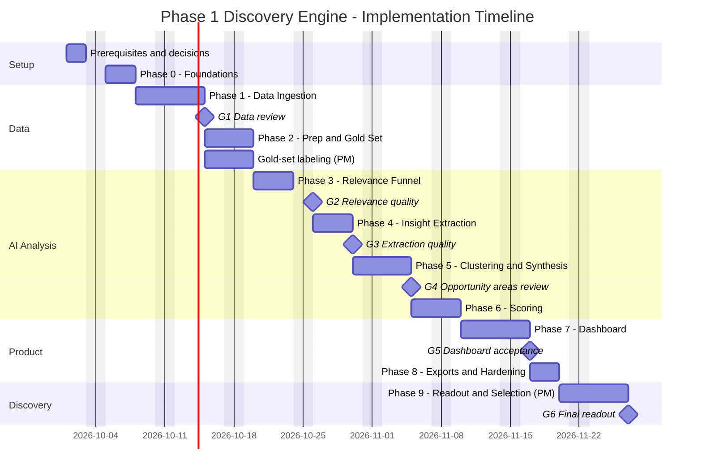
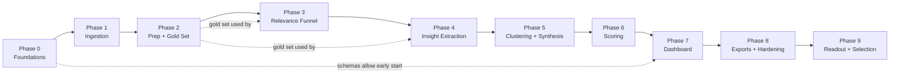

# Implementation Plan: AI-Powered Discovery Engine for Vaguely Remembered Photo Retrieval

> Built from [`ProblemStatement.md`](./ProblemStatement.md) (what and why) and [`architecture.md`](./architecture.md) (how). This plan breaks the Phase 1 build into sequenced phases with tasks, deliverables, acceptance criteria, and PM review gates.

> **Confirmed platform decisions**
> - **LLM provider: Groq** (small Llama-class model for high-volume classification and extraction, a larger model for synthesis and rubrics).
> - **Deployment: Streamlit.** The dashboard is deployed on Streamlit Community Cloud. The heavy pipeline runs in GitHub Actions, and both share a hosted Postgres database (architecture Section 21).

## Table of Contents

1. [Plan at a Glance](#1-plan-at-a-glance)
2. [Before You Start: Prerequisites and Open Decisions](#2-before-you-start-prerequisites-and-open-decisions)
3. [Timeline](#3-timeline)
4. [Phase Dependencies](#4-phase-dependencies)
5. [Phase 0: Foundations](#phase-0-foundations)
6. [Phase 1: Data Ingestion](#phase-1-data-ingestion)
7. [Phase 2: Data Prep and Gold Set](#phase-2-data-prep-and-gold-set)
8. [Phase 3: Relevance Classification Funnel](#phase-3-relevance-classification-funnel)
9. [Phase 4: AI Insight Extraction](#phase-4-ai-insight-extraction)
10. [Phase 5: Clustering and Opportunity Synthesis](#phase-5-clustering-and-opportunity-synthesis)
11. [Phase 6: Opportunity Scoring](#phase-6-opportunity-scoring)
12. [Phase 7: PM Dashboard](#phase-7-pm-dashboard)
13. [Phase 8: Exports, Automation, and Hardening](#phase-8-exports-automation-and-hardening)
14. [Phase 9: Discovery Readout and Opportunity Selection](#phase-9-discovery-readout-and-opportunity-selection)
15. [PM Review Gates](#15-pm-review-gates)
16. [Requirements Traceability](#16-requirements-traceability)
17. [Roles and Responsibilities](#17-roles-and-responsibilities)
18. [Definition of Done (All Phases)](#18-definition-of-done-all-phases)
19. [Risk Watchlist by Phase](#19-risk-watchlist-by-phase)
20. [Progress Tracker](#20-progress-tracker)

---

## 1. Plan at a Glance

| Phase | Name | Duration | Main output | Gate |
|---|---|---|---|---|
| 0 | Foundations | 3 days | Repo, config, schemas, database (SQLite + hosted Postgres), Groq client, CLI skeleton | — |
| 1 | Data Ingestion | 5 days | Raw data from all 4 sources in a unified format | **G1: Data review** |
| 2 | Data Prep and Gold Set | 3 days | Cleaned, deduplicated corpus + ~300 hand-labeled items | — |
| 3 | Relevance Classification Funnel | 4 days | Each item labeled not retrieval / general retrieval / vague memory retrieval | **G2: Relevance quality** |
| 4 | AI Insight Extraction | 4 days | Structured insights per item (remembered, forgotten, attempts, breakdown, quote) | **G3: Extraction quality** |
| 5 | Clustering and Opportunity Synthesis | 4 days | 5-8+ opportunity areas with summaries, quotes, research questions | **G4: Opportunity areas review** |
| 6 | Opportunity Scoring | 3 days | 6-dimension scores, composite ranking, explanations | — |
| 7 | PM Dashboard | 5 days | Streamlit dashboard with filters, comparisons, drill-downs, overrides, **deployed on Streamlit Community Cloud** | **G5: Dashboard acceptance** |
| 8 | Exports, Automation, and Hardening | 3 days | CSV / Google Sheets / PDF exports, scheduled GitHub Actions runs, README and deployment runbook | — |
| 9 | Discovery Readout and Opportunity Selection | 5 days (PM-led) | Selected opportunity area, readout deck/report, interview guide | **G6: Final readout** |

**Totals:** about 34 engineering days (~7 weeks for one engineer, ~4-5 weeks for two working in parallel tracks), plus about 1 week of PM-led synthesis in Phase 9.

> The architecture doc estimates 5-6 weeks of engineering. This plan uses the upper end of each phase range and adds time for PM review gates, which is where most schedule slips happen.

---

## 2. Before You Start: Prerequisites and Open Decisions

These items should be resolved in the first 1-2 days, because several phases depend on them.

| # | Item | Needed by | Owner | Notes |
|---|---|---|---|---|
| D1 | **Groq account, API key, and tier** (✅ provider decided: Groq) | Phase 0 (client), Phase 3 | PM + Engineer | Free tier is fine for development; a paid (Developer) tier is recommended for full runs because of daily rate limits. Confirm budget ceiling (expected: well under a few USD per full run). |
| D2 | **Google Sheet access**: is the dataset sheet publicly viewable (CSV export works), or is a service account needed? | Phase 1 | PM | Also confirm which tabs and columns matter |
| D3 | **Google service account** for Sheets export | Phase 8 | Engineer | Can reuse the account from D2; credentials go into Streamlit and GitHub Actions secrets |
| D4 | **Deployment setup** (✅ decided: Streamlit Community Cloud for the dashboard, GitHub Actions for the pipeline) | Phase 0 | Engineer | Needs a GitHub repository and a Streamlit Community Cloud account linked to it |
| D4a | **Hosted Postgres provider**: Neon or Supabase (free tier) | Phase 0 | Engineer | Required because Streamlit Community Cloud doesn't keep files written by the app; holds all shared data and PM overrides |
| D4b | **Dashboard viewers**: email addresses allowed to open the private app | Phase 7 | PM | The app shows user quotes, so it should not be public |
| D5 | **Scraping review**: confirm `robots.txt` and terms for each source, and agree on rate limits | Phase 1 | Engineer | See architecture Section 18 |
| D6 | **Locales/storefronts** to collect (default Play: `in, us, gb, ca, au`; App Store: `us, gb, in, ca, au, nz, ie, sg`) | Phase 1 | PM | Should Hinglish/code-mixed reviews be in scope for Phase 1? Default: flag and count, don't analyze |
| D7 | **Gold-set labelers**: who hand-labels ~300 items, and when | Phase 2 | PM | About 4-6 hours of labeling, ideally two people for agreement checks |
| D8 | **Default scoring weights** sign-off | Phase 6 | PM | Defaults: frequency 0.20, severity 0.20, strategic fit 0.20, evidence quality 0.15, product leverage 0.15, research value 0.10 |

---

## 3. Timeline

Illustrative schedule starting Monday, October 5, 2026, for one engineer, with weekends excluded.

### Two-engineer variant (~4-5 weeks)

| Track | Engineer A (Data + AI) | Engineer B (Product surface) |
|---|---|---|
| Week 1 | Phase 0, Phase 1 (Play Store + App Store) | Phase 1 (Google Sheet + Community connectors) |
| Week 2 | Phase 2, Phase 3 | Dashboard skeleton (Phase 7) on fixture data, deployed to Streamlit Community Cloud early; export scaffolding |
| Week 3 | Phase 4, Phase 5 | Dashboard pages wired to real tables as they land |
| Week 4 | Phase 6 | Phase 7 completion, Phase 8 exports |
| Week 5 | Hardening, eval regression | Hardening, PDF report polish |

The split works because the database schemas are fixed in Phase 0, so the dashboard can be built against fixture data before the AI stages finish.

---

## 4. Phase Dependencies

---

## Phase 0: Foundations

**Goal:** A working project skeleton where every later phase can plug in without restructuring.

**Architecture references:** Sections 3 (Technology Stack), 4 (Repository Structure), 13 (Data Model), 14 (Taxonomies), 15.1-15.2 (LLM Strategy, including Groq integration details in 15.1a), 16 (Orchestration), 20 (Configuration), 21 (Deployment).

### Tasks

- [x] **P0.1** Initialize the GitHub repo with `uv` (or Poetry), Python 3.11+, `pyproject.toml`, `.gitignore` (including `data/`, `.env`, `.streamlit/secrets.toml`), `.env.example`, `.streamlit/secrets.toml.example` *(local git repo initialized; GitHub remote not yet created)*
- [x] **P0.2** Create the folder structure from architecture Section 4 (`src/discovery/`, `dashboard/`, `config/`, `prompts/`, `tests/`, `data/`, `.github/workflows/`, `.streamlit/`)
- [x] **P0.3** Write `config/settings.yaml`, `config/taxonomy.yaml`, `config/scoring_weights.yaml`, `config/keywords.yaml` (initial lexicon from architecture Section 7), and a typed config loader (`config.py`)
- [x] **P0.4** Define Pydantic schemas (`models/schemas.py`): `RawItem`, `Item`, `RelevanceResult`, `Insight`, `Cluster`, `OpportunityArea`, `OpportunityScore`, `PMOverride`
- [x] **P0.5** Define SQLAlchemy ORM tables (`models/orm.py`) for all core tables in architecture Section 13.2, including `llm_cache`, `pipeline_runs`, `published_run`, `raw_items`, and `embeddings`; database selected by `DATABASE_URL` (SQLite locally, Postgres when deployed)
- [x] **P0.6** Build the Groq LLM client (`ai/llm_client.py`) on the official `groq` SDK: JSON Schema structured output with JSON-mode fallback, Pydantic validation, retry with backoff (`tenacity`), `retry-after` handling for HTTP 429, token-bucket rate limiter, response caching keyed by model + prompt version + input, token and cost logging
- [x] **P0.7** Build the Typer CLI skeleton (`cli.py`) with stub commands: `ingest`, `prep`, `classify`, `extract`, `cluster`, `score`, `export`, `run-all`, `eval`
- [x] **P0.8** Set up `pytest`, linting (`ruff`), and the GitHub Actions CI workflow (`ci.yml`: lint + tests)
- [x] **P0.9** Implement `pipeline_runs` logging: each CLI command records start, end, status, counts, and errors
- [ ] **P0.10** Provision hosted Postgres (decision D4a); add `GROQ_API_KEY` and `DATABASE_URL` as GitHub Actions secrets; run table creation against Postgres *(ready: `db_init.yml` workflow and `discovery init-db`; needs the Neon/Supabase database and GitHub repo)*
- [ ] **P0.11** Confirm the Groq account's rate limits for the chosen models and set `requests_per_minute` and `max_concurrency` in `config/settings.yaml` *(defaults set to Groq's published free-tier limits; confirm against the account's Limits page)*

> **Model change (Oct 2026):** Groq moved `llama-3.1-8b-instant` and `llama-3.3-70b-versatile` to Enterprise-only. Defaults are now `openai/gpt-oss-20b` (small) and `openai/gpt-oss-120b` (large), both with strict JSON Schema support. Later phases that name Llama models should read these as "small model" / "large model" from `config/settings.yaml`.

### Deliverables

- Runnable skeleton: `discovery --help` lists all commands
- All tables created in local SQLite and in hosted Postgres
- Groq client demo: one cached structured call returns a validated object

### Acceptance criteria

- [x] `discovery --help` works; every stub command exits cleanly
- [x] Database tables match architecture Section 13.2, in both SQLite and Postgres *(verified locally against Postgres 16; hosted Postgres pending P0.10)*
- [ ] A repeated identical Groq call is served from the cache (zero new tokens) *(passes in unit tests; live check `discovery llm-check` needs `GROQ_API_KEY`)*
- [ ] A burst of test calls stays within Groq rate limits (no unhandled 429 errors) *(passes in unit tests; live check `discovery llm-check --burst 40` needs `GROQ_API_KEY`)*
- [ ] CI passes on GitHub Actions on an empty test suite plus schema tests *(136 tests and lint pass locally; needs the GitHub repo)*

---

## Phase 1: Data Ingestion

**Goal:** Pull raw data from all four mandatory sources into an immutable raw store and a unified `Item` format.

**Architecture references:** Section 5 (all connectors), Section 6.1 (Normalization), Section 18 (Compliance).

### Tasks

**Shared**

- [ ] **P1.1** Implement the `SourceConnector` interface (`ingest/base.py`) and the raw store writer: JSONL files locally (`data/raw/{source}/{run_id}/`), `raw_items` table in Postgres when deployed
- [ ] **P1.2** Implement per-source mappers to the unified `Item` schema (`prep/normalize.py`), including `analysis_text = title + body` for threads and posts
- [ ] **P1.3** Add a polite HTTP layer: throttling, jitter, identifying User-Agent, retries, timeouts

**Source 1: Google Play Store** (`ingest/play_store.py`)

- [ ] **P1.4** Fetch reviews via `google-play-scraper` with continuation tokens, `sort=NEWEST`, across configured countries (primary: `in`)
- [ ] **P1.5** Capture review ID, text, rating, date, thumbs-up count, app version, and developer reply (stored separately)
- [ ] **P1.6** Support incremental runs with `--since`

**Source 2: Apple App Store** (`ingest/app_store.py`)

- [ ] **P1.7** Fetch the iTunes RSS JSON feed (pages 1-10) for each configured storefront
- [ ] **P1.8** Capture review ID, title, text, rating, version, date, country; hash the author name
- [ ] **P1.9** Add the Playwright fallback behind a feature flag (off by default)

**Source 3: Google Sheet dataset** (`ingest/google_sheet.py`)

- [ ] **P1.10** Fetch every tab via CSV export (or `gspread` if D2 requires a service account)
- [ ] **P1.11** Auto-detect headers and apply the config column map; keep unknown columns in `metadata`
- [ ] **P1.12** Assign platform per row (Reddit / Google Community / Play Store; default Reddit)

**Source 4: Google Photos Help Community** (`ingest/community.py`)

- [ ] **P1.13** Playwright crawler for the `photos_restore` thread list: paginate or scroll, collect thread URLs, skip already-seen thread IDs
- [ ] **P1.14** Thread page parser: title, original question, date, reply count, "same question" count, top replies (labeled as replies)
- [ ] **P1.15** Enforce 2-3 seconds between page loads with jitter

**Testing**

- [ ] **P1.16** Recorded HTTP/HTML fixtures for each connector; unit tests for every mapper
- [ ] **P1.17** Data Quality summary command: counts per source, platform, date range, and missing-field rates

**Running in GitHub Actions**

- [ ] **P1.18** First version of `pipeline.yml`: install dependencies and Playwright's Chromium, run `discovery ingest --source all` against hosted Postgres, on manual trigger
- [ ] **P1.19** `app_store_daily.yml`: daily App Store ingestion (start early so iOS reviews accumulate)

### Deliverables

- Raw data for all four sources from at least one full run, stored in hosted Postgres
- Normalized `items` rows for every source
- Ingestion summary report (counts, date ranges, field completeness)

### Acceptance criteria

- [ ] All four connectors complete a run, both locally and in GitHub Actions; a failure in one source does not stop the others
- [ ] Every item has: source name, source URL, platform, original text; plus date and rating where the source provides them
- [ ] Re-running ingestion with `--since` adds only new items
- [ ] Target volumes (adjust after G1): Play Store ≥ 20,000 reviews; App Store ≥ 2,000 reviews (across storefronts); all Google Sheet rows; Community ≥ 1,000 threads

### 🚦 Gate G1: Data review (PM)

The PM reviews a random sample of 50 items per source and confirms:

- The data is what was expected from each source (e.g. Sheet columns mapped correctly, community questions not confused with replies)
- Volumes are sufficient, or storefronts/limits should be expanded
- Decision D6 (code-mixed language handling) is confirmed

---

## Phase 2: Data Prep and Gold Set

**Goal:** A clean, deduplicated, privacy-safe corpus, plus a hand-labeled gold set to measure AI quality in later phases.

**Architecture references:** Sections 6.2-6.3 (Cleaning, Deduplication), 17.1 (Gold set), 18 (Privacy).

### Tasks

**Cleaning** (`prep/clean.py`)

- [ ] **P2.1** HTML/markdown stripping and whitespace normalization into `clean_text` (`original_text` stays untouched)
- [ ] **P2.2** Language detection; keep English for analysis, flag code-mixed text
- [ ] **P2.3** PII redaction (emails, phone numbers, personal URLs) in `clean_text`
- [ ] **P2.4** Author hashing with a salt; drop raw usernames
- [ ] **P2.5** Minimum-content filter: < 4 words excluded from AI stages **unless the text contains a Stage A retrieval keyword** (e.g. "can't find screenshots" is kept); excluded items still counted

**Deduplication** (`prep/dedup.py`)

- [ ] **P2.6** Exact dedup by content hash; for short texts (< ~12 words), merge only when author and source also match
- [ ] **P2.7** Near-duplicate dedup with MinHash LSH (Jaccard ≥ 0.85) on long texts only (≥ ~12 words); keep the longest version as canonical
- [ ] **P2.7a** Short-text rule: never merge short generic complaints from different authors; compute `similar_count` for each short item instead
- [ ] **P2.8** Cross-source dedup (e.g. Play reviews repeated in the Google Sheet) with multiple `item_sources` rows per canonical item
- [ ] **P2.9** Spam/templated text flagging

**Gold set** (`eval/gold_set.py`)

- [ ] **P2.10** Draw a stratified sample of ~300 items: across all 4 sources; ~100 likely relevant, ~100 borderline, ~100 likely irrelevant
- [ ] **P2.11** Build a simple labeling sheet (CSV or Google Sheet) with the fields from architecture Section 17.1: retrieval type, primary category, content type, remembered cue types, forgotten details, breakdown point, evidence strength
- [ ] **P2.12** PM (and a second labeler, if available) labels the set; measure agreement on retrieval type and category on an overlapping 50 items
- [ ] **P2.13** Write a short **labeling guide** with edge-case rulings (e.g. "photos vanished after restore, need wedding pics" counts as vague memory retrieval)

### Deliverables

- Cleaned, deduplicated `items` table with dedup statistics
- `eval/gold_set.csv` (~300 labeled items) and the labeling guide

### Acceptance criteria

- [ ] No raw emails or phone numbers in `clean_text` (spot check of 200 items + regex scan)
- [ ] A manual check of 50 dedup merges finds ≥ 95% correct merges
- [ ] Short generic complaints from different authors are **not** merged (test: 20 identical "Search doesn't work" reviews from different authors stay as 20 items)
- [ ] Short reviews with retrieval keywords (e.g. "can't find screenshots") reach the AI stages
- [ ] Cross-source duplicates show all their sources
- [ ] Gold set complete; labeler agreement on retrieval type ≥ 80% (if two labelers)

---

## Phase 3: Relevance Classification Funnel

**Goal:** Separate vague memory retrieval from general retrieval and from unrelated complaints, at low cost.

**Architecture references:** Section 7 (Relevance Funnel), Section 15 (Prompts and Guardrails), Section 17.2 (Metrics).

### Tasks

- [ ] **P3.1** Stage A keyword/heuristic prefilter (`ai/prefilter.py`) using `config/keywords.yaml`; rule: retrieval-intent term, or search-feature term + rating ≤ 3
- [ ] **P3.2** Write ~40 positive and ~40 negative seed exemplars (from the problem-statement examples and gold set)
- [ ] **P3.3** Stage B semantic filter (`ai/semantic_filter.py`): embed `clean_text`, compute positive-minus-negative similarity margin, apply threshold τ
- [ ] **P3.4** 5% random audit sample of Stage B rejections, sent to Stage C to estimate missed relevant items
- [ ] **P3.5** Write `prompts/relevance_v1.md`: definition of vague memory retrieval, exclusion rule for storage/pricing/backup/sync/sharing/deletion, 6-10 few-shot examples including hard negatives and borderline cases
- [ ] **P3.6** Stage C LLM classifier (`ai/relevance.py`) on Groq's small model (e.g. `llama-3.1-8b-instant`), returning the JSON schema in architecture Section 7, stored in the `relevance` table; concurrency capped by the configured Groq rate limits
- [ ] **P3.7** Evaluation (`eval/metrics.py`): Stage A recall, Stage A+B recall, Stage C precision/recall on the gold set
- [ ] **P3.8** Tune keywords, τ, and prompt until targets are met; record every prompt version and its metrics
- [ ] **P3.9** If the small Groq model misses the precision target, compare against the large model on the gold set and record the cost/quality trade-off before choosing

### Deliverables

- `relevance` table populated for the full corpus
- Funnel report: counts at each stage, per source
- Relevance evaluation report against the gold set

### Acceptance criteria (from architecture Section 17.2)

- [ ] Stage A recall ≥ 95%
- [ ] Stages A+B recall ≥ 90%
- [ ] Stage C on `vague_memory_retrieval`: precision ≥ 0.80, recall ≥ 0.75
- [ ] Out-of-scope topics (backup, storage, etc.) are only kept when `excluded_topic_blocks_retrieval = true`

### 🚦 Gate G2: Relevance quality (PM)

The PM reviews:

- 30 items classified as `vague_memory_retrieval`, checking they truly match "remember it exists but can't describe it precisely"
- 30 borderline items (`general_retrieval` and excluded topics), checking the scope decisions
- The funnel counts: is there enough vague-retrieval evidence per source? If one source is thin, decide whether to expand volume before Phase 4

---

## Phase 4: AI Insight Extraction

**Goal:** For every retrieval item, extract what users tried to find, remembered, forgot, tried, where it broke down, and how they felt, grounded in verbatim quotes.

**Architecture references:** Section 8 (Extraction), Section 14 (Taxonomies), Section 15 (LLM Strategy and Guardrails).

### Tasks

- [ ] **P4.1** Write `prompts/extraction_v1.md` with the extraction schema, taxonomy enums, evidence strength rubric (architecture Section 15.3), "only extract what is stated" rule, and few-shot examples covering all 8 categories
- [ ] **P4.2** Implement extraction (`ai/extraction.py`) with Pydantic validation and enum enforcement; batch short items (5-10 per call)
- [ ] **P4.3** Quote grounding check: `evidence_quote` must fuzzy-match `clean_text` (the redacted text the LLM saw) at ≥ 95%; retry once, then null the quote and cap evidence strength at 2. Quotes are displayed and exported from `clean_text`, so redacted details never reappear.
- [ ] **P4.4** Model escalation: re-run with the large Groq model (e.g. `llama-3.3-70b-versatile` or `openai/gpt-oss-120b`) when `confidence < 0.6` or text > 1,500 characters
- [ ] **P4.5** Populate `user_reported_issue` and `extracted_retrieval_problem` (the required per-item fields)
- [ ] **P4.6** Low-confidence queue (`confidence < 0.5`) for PM review
- [ ] **P4.7** Evaluate on the gold set: category accuracy (top-1 and top-2), content type accuracy, `not_stated` correctness, quote grounding rate
- [ ] **P4.8** Run the first full-corpus extraction through Groq's Batch API (or a paid tier) to stay within rate limits; later incremental runs use normal calls

### Deliverables

- `insights` table populated for all retrieval items
- Extraction evaluation report
- Sample review sheet: 50 items with original text next to extracted fields

### Acceptance criteria (from architecture Section 17.2)

- [ ] Quote grounding rate ≥ 98%, including quotes that contain redaction markers such as `[PHONE]`
- [ ] Primary category accuracy ≥ 70% (top-2 ≥ 85%)
- [ ] `not_stated` correctness ≥ 90% (no invented cues or attempts)
- [ ] Every required per-item field from the problem statement is stored (see architecture Section 13.3)

### 🚦 Gate G3: Extraction quality (PM)

The PM reads the 50-item sample review sheet and confirms:

- "Remembered" and "forgot" fields reflect what users actually said
- Breakdown points match the user's story
- Categories feel right; note any category that is consistently confused with another (input for Phase 5)

---

## Phase 5: Clustering and Opportunity Synthesis

**Goal:** Group similar retrieval problems into distinct, evidence-backed opportunity areas, check the 8-category taxonomy against the data, and surface emergent problems.

**Architecture references:** Section 9 (Clustering and Synthesis).

### Tasks

- [ ] **P5.1** Embed `problem_statement + trying_to_find + breakdown_point` for every insight (`ai/embeddings.py`)
- [ ] **P5.2** UMAP reduction + HDBSCAN clustering (`ai/clustering.py`); tune `min_cluster_size` and `n_neighbors` for coherent clusters with reasonable noise
- [ ] **P5.3** Write `prompts/cluster_label_v1.md`; label each cluster with the large Groq model using ~20 representative, source-diversified items; map each cluster to a taxonomy category or `other_emergent`
- [ ] **P5.4** Group close clusters with the same category into opportunity areas (centroid cosine ≥ 0.8) as sub-themes
- [ ] **P5.5** Deterministic aggregates per area: source breakdown, content types, top remembered cues, forgotten details, search attempts, breakdown-point distribution
- [ ] **P5.6** Representative quote selection: high evidence strength, close to centroid, diverse across sources, no near-duplicates (5-8 quotes per area, with source links)
- [ ] **P5.7** Write `prompts/opportunity_synthesis_v1.md`; generate problem summaries that cite item IDs; flag uncited sentences
- [ ] **P5.8** Generate 5-8 follow-up research questions per area, each tied to an evidence gap
- [ ] **P5.9** Run-to-run area matching by centroid similarity, so area IDs and PM curation persist on re-runs

### Deliverables

- `clusters`, `opportunity_areas`, and `opportunity_evidence` tables populated
- Draft opportunity area report (Markdown or CSV) in the format of the problem statement's Example Output

### Acceptance criteria

- [ ] At least 5-8 distinct opportunity areas, each with ≥ 10 supporting items (or flagged as emerging)
- [ ] Every area has: name, summary, source breakdown, content types, remembered, forgotten, search attempts, breakdown point, representative quotes with links, research questions
- [ ] No synthesis sentence without a citation (or it is flagged)
- [ ] Average PM-judged cluster coherence ≥ 4 / 5 for the top 8 areas

### 🚦 Gate G4: Opportunity areas review (PM)

This is the most important gate. The PM:

- Reads every opportunity area and its quotes
- Merges, splits, or renames areas (curation is stored and re-applied on future runs)
- Confirms the areas are specific (not "search should be better"), which is a success criterion in the problem statement
- Notes which emergent areas are surprising and worth keeping

---

## Phase 6: Opportunity Scoring

**Goal:** Score and rank opportunity areas consistently and transparently on the six dimensions from the problem statement.

**Architecture references:** Section 10 (Scoring Engine).

### Tasks

- [ ] **P6.1** Frequency: raw share and source-balanced share of vague-retrieval items, with log-scaled engagement boost; mapped to 1-5 by quantiles (`scoring/dimensions.py`)
- [ ] **P6.2** Severity: frustration intensity, high-stakes share, low-rating share (re-weighted for sources without ratings)
- [ ] **P6.3** Strategic fit: mean vague-memory relevance, adjusted by the share of vague items in the area
- [ ] **P6.4** Evidence quality: mean evidence strength, platform diversity, sample-size factor
- [ ] **P6.5** Write `prompts/scoring_rubric_v1.md`; Product leverage and Research value rubric scores from the large Groq model, with written rationales
- [ ] **P6.6** Composite score with weights from `config/scoring_weights.yaml`; High / Medium / Low bands (`scoring/ranker.py`)
- [ ] **P6.7** Guardrails: low-evidence flag (< 10 items or evidence quality < 2.5), never ranked above adequately evidenced areas
- [ ] **P6.8** Explainability: store every score's inputs (e.g. "Severity 4.2 = intensity 4.1, 38% high-stakes, 61% ≤2-star")
- [ ] **P6.9** Weight sensitivity check: does the top-3 ranking change under ±0.05 weight changes?
- [ ] **P6.10** Support PM overrides for product leverage and research value
- [ ] **P6.11** Basic publish step: after scoring completes, set `published_run_id` to this run in one transaction (full sanity checks are added in P8.5)

### Deliverables

- `opportunity_scores` table with inputs and weights
- Ranked opportunity list with explanations and the sensitivity result

### Acceptance criteria

- [ ] All six dimensions plus composite computed for every area, on a 1-5 scale
- [ ] Re-running scoring on the same data gives identical results
- [ ] Every score can be explained from stored inputs
- [ ] PM has signed off on default weights (decision D8)

---

## Phase 7: PM Dashboard

**Goal:** An interactive dashboard for comparing opportunity areas, drilling into evidence, and correcting AI outputs, deployed on Streamlit Community Cloud.

**Architecture references:** Section 11 (Dashboard), Section 21 (Deployment).

### Tasks

**Deploy first, then build**

- [ ] **P7.0** On day 1, deploy a minimal app shell to Streamlit Community Cloud (main file `dashboard/app.py`, Python 3.11, `DATABASE_URL` and Google credentials in the app's Secrets). This catches dependency and secrets problems early instead of at the end.

**App and pages**

- [ ] **P7.1** Streamlit app shell (`dashboard/app.py`) with a shared data-access layer (`dashboard/data_access.py`): SQLAlchemy engine via `st.cache_resource` using the pooled Postgres connection string, every query filtered to the `published_run_id` so a half-finished run is never shown, queries cached with `st.cache_data` keyed by `published_run_id`, banner when a newer run failed or is still running, secrets read from `st.secrets`; lightweight `dashboard/requirements.txt` (no pipeline or ML packages)
- [ ] **P7.2** Global sidebar filters: source, platform, problem category, severity (and high-stakes toggle), vague-memory relevance, content type, confidence score, date range, rating, language
- [ ] **P7.3** **Overview** page: KPI cards, funnel chart (raw to vague retrieval), items per source over time, category distribution
- [ ] **P7.4** **Opportunity Comparison** page: sortable ranked table, radar chart, frequency-vs-severity bubble chart, live weight sliders
- [ ] **P7.5** **Opportunity Detail** page: summary, source breakdown, content types, Remembered vs. Forgotten charts, search attempts, breakdown funnel, quotes with links, score breakdown, research questions, PM notes
- [ ] **P7.6** **Evidence Explorer** page: searchable, paginated item table with user text (PII-redacted `clean_text`), extracted fields, source link; per-item correction controls
- [ ] **P7.7** **Data Quality** page: run history, per-source counts and errors, dedup stats, LLM tokens and cost, quote-grounding failure rate, low-confidence queue, gold-set metrics
- [ ] **P7.8** PM overrides written to `pm_overrides` in Postgres; effective value = override if present, else AI value; override badge in the UI; query cache cleared after each override so changes show immediately
- [ ] **P7.9** Area curation UI: merge, split, rename opportunity areas

**Deployment hardening**

- [ ] **P7.10** Pre-aggregated tables/views for opportunity areas and scores, so pages don't load every item into the app's limited memory
- [ ] **P7.11** Keep startup light (no heavy imports or data loads at import time) so the app wakes quickly from sleep
- [ ] **P7.12** Set the app to private and invite the viewers from decision D4b

### Deliverables

- Dashboard live on Streamlit Community Cloud (private URL), plus local preview via `streamlit run dashboard/app.py`
- Short walkthrough video or doc for the PM

### Acceptance criteria

- [ ] All six pages work on the deployed app with the full dataset, with page loads under ~3 seconds after the app is awake
- [ ] Every filter required by the problem statement works and applies across pages
- [ ] Every opportunity area field required by the problem statement is visible on the detail page
- [ ] Overrides persist through a pipeline re-run **and** an app reboot/redeploy
- [ ] While a pipeline run is in progress, the dashboard keeps showing the last published run with no partial data
- [ ] Weight slider changes re-rank areas immediately
- [ ] Only invited viewers can open the app

### 🚦 Gate G5: Dashboard acceptance (PM)

The PM completes three real tasks unaided **on the deployed Streamlit app**:

1. Find the top 3 opportunity areas for iOS users only
2. Open one area and explain, from the dashboard alone, what users remember, forget, and where retrieval breaks down
3. Correct a misclassified item and confirm the correction persists after a re-run

---

## Phase 8: Exports, Automation, and Hardening

**Goal:** Shareable deliverables, one-command operation, and a reliable, documented system.

**Architecture references:** Section 12 (Exports), Section 16 (Orchestration), Section 18 (Compliance), Section 19 (Cost), Section 21 (Deployment).

### Tasks

**Exports**

- [ ] **P8.1** CSV export: `opportunities.csv` and `evidence.csv` (`export/csv_export.py`), served in the app with `st.download_button`
- [ ] **P8.2** Google Sheets export: Opportunities, Evidence, Scoring Weights, Methodology tabs (`export/sheets_export.py`), using the service account from `st.secrets`
- [ ] **P8.3** PDF report (`export/pdf_report.py`) built with **ReportLab** (installs on Streamlit Community Cloud without system packages), generated in memory: executive summary, ranked table, one page per top area in the Example Output format, methodology and limitations appendix
- [ ] **P8.4** Every export includes `run_id`, date, weights, and active filters; dashboard Export page wired to all three; nothing written to the app's filesystem

**Automation**

- [ ] **P8.5** `discovery run-all`: full incremental pipeline in one command, ending with the **publish step** (architecture Section 16.5): sanity checks, then an atomic update of `published_run_id`; failed checks leave the previous run visible
- [ ] **P8.5a** Prevent overlapping runs: GitHub Actions `concurrency` group plus a database advisory lock
- [ ] **P8.6** Scheduling in GitHub Actions: `pipeline.yml` runs `discovery run-all` weekly and on manual trigger; `app_store_daily.yml` runs daily; failure email notifications enabled
- [ ] **P8.7** `discovery purge --older-than` for data retention (keeps the free-tier Postgres within storage limits)
- [ ] **P8.12** Optional "Run pipeline now" button on the Export page that dispatches `pipeline.yml` through the GitHub API (fine-grained token in `st.secrets`)

**Hardening**

- [ ] **P8.8** Gold-set regression check that runs before any new prompt version is accepted
- [ ] **P8.9** End-to-end test on a small fixture corpus (ingest through export)
- [ ] **P8.10** Cost, runtime, and Groq rate-limit report for a full run (compare with architecture Section 19)
- [ ] **P8.11** README: local setup, configuration, running, dashboard, exports, troubleshooting
- [ ] **P8.13** Deployment runbook: the steps from architecture Section 21.5, how to rotate secrets, how to change Groq models safely (gold-set check first), and what to do when a scheduled run fails

### Deliverables

- All three export formats working from the CLI and the deployed dashboard
- Scheduled GitHub Actions pipeline, README, and deployment runbook

### Acceptance criteria

- [ ] PDF report matches the problem statement's Example Output structure for each top area
- [ ] A fresh machine can run the full pipeline by following only the README
- [ ] Someone new can redeploy the dashboard by following only the runbook
- [ ] A scheduled GitHub Actions run completes without manual help, and the deployed dashboard shows the new results without a redeploy; failures appear on the Data Quality page
- [ ] A run that fails its sanity checks is not published, and the dashboard keeps showing the previous run
- [ ] Starting a manual run while a scheduled run is active does not create two overlapping runs
- [ ] A full run stays within Groq rate limits and the D1 budget ceiling

---

## Phase 9: Discovery Readout and Opportunity Selection

**Goal:** Use the engine to make the Phase 1 decision: which retrieval problem is worth solving first, and what to ask users next. This phase is PM-led, with engineering support.

**Problem statement references:** Success Criteria, Example Output, Non-Goals.

### Tasks

- [ ] **P9.1** Final full pipeline run on fresh data (GitHub Actions manual trigger); freeze the `run_id` used for the readout
- [ ] **P9.2** Review the ranked list with the weight sensitivity check; confirm the top areas are stable
- [ ] **P9.3** Deep-dive the top 3 areas: read all representative quotes plus 20 random items each, to check the summaries hold up
- [ ] **P9.4** **Select one opportunity area** for deeper research or concept development, with a written rationale based on the six scores and the evidence
- [ ] **P9.5** Turn that area's research questions into an **interview guide** (8-12 questions) and a short screener for recruiting participants
- [ ] **P9.6** Write the readout: PDF export plus a short narrative covering the corpus, method, top areas, selected area, limitations, and next steps
- [ ] **P9.7** Record learnings for the next phase: taxonomy changes, sources to add, prompt improvements

### Deliverables

- Discovery readout (PDF report + narrative)
- Selected opportunity area with rationale
- Interview guide and screener

### Acceptance criteria (= problem statement success criteria)

- [ ] 5-8 distinct retrieval problem areas identified
- [ ] Each area supported by real user evidence with source links
- [ ] Clear account of what users remember and forget during failed retrieval
- [ ] Areas compared using the consistent scoring model
- [ ] Vague retrieval problems separated from general Google Photos complaints
- [ ] One strong opportunity area selected
- [ ] Sharper follow-up interview questions produced
- [ ] No generic conclusions such as "search should be better"

### 🚦 Gate G6: Final readout

Present to stakeholders and agree on the next step for the selected opportunity area (interviews, surveys, or concept testing).

---

## 15. PM Review Gates

| Gate | After phase | PM time | Question being answered | If it fails |
|---|---|---|---|---|
| **G1** Data review | 1 | ~2 hours | Is the raw data the right data, in enough volume? | Expand storefronts or limits; fix column mapping; re-run ingestion |
| **G2** Relevance quality | 3 | ~2 hours | Are we correctly isolating vague memory retrieval? | Refine the prompt, keywords, or threshold; add hard-negative examples |
| **G3** Extraction quality | 4 | ~2 hours | Do the extracted insights match what users actually said? | Tighten the "only what is stated" rule; add few-shot examples; adjust enums |
| **G4** Opportunity areas review | 5 | ~4 hours | Are the areas distinct, specific, and well evidenced? | Retune clustering; merge or split areas; re-run synthesis |
| **G5** Dashboard acceptance | 7 | ~1 hour | Can the PM answer real questions with the deployed Streamlit dashboard alone? | Fix usability or performance gaps before exports |
| **G6** Final readout | 9 | ~half day | Which problem do we pursue first, and what do we ask users? | Extend data collection for thin areas, then re-run |

---

## 16. Requirements Traceability

### MVP scope (from the problem statement) mapped to phases

| MVP scope item | Phase | Key tasks |
|---|---|---|
| Data scraping or ingestion from the four specified sources | 1 | P1.4-P1.15 |
| Data cleaning and deduplication | 2 | P2.1-P2.9 |
| Relevance classification for photo retrieval and vague memory retrieval | 3 | P3.1-P3.8 |
| AI-powered insight extraction | 4 | P4.1-P4.7 |
| Clustering of similar retrieval problems | 5 | P5.1-P5.4 |
| Evidence tables with real user quotes | 4, 5, 7 | P4.3, P5.6, P7.6 |
| Opportunity scoring | 6 | P6.1-P6.10 |
| A dashboard for comparing problem areas | 7 | P7.3-P7.5 |
| Filters by source, platform, category, and severity | 7 | P7.2 |
| Exportable opportunity report in CSV, Google Sheets, or PDF | 8 | P8.1-P8.4 |

### Required per-item fields mapped to phases

| Field | Produced in |
|---|---|
| Source name, source URL, platform, original text, date, rating | Phase 1 |
| Relevance to vaguely remembered photo retrieval | Phase 3 |
| User-reported issue, extracted retrieval problem, evidence quote | Phase 4 |
| AI confidence score | Phases 3 and 4 |

### Required opportunity area fields mapped to phases

| Field | Produced in |
|---|---|
| Opportunity name, problem summary, source breakdown, content types, remembered, forgot, search attempts, breakdown point, quotes, source links, research questions | Phase 5 |
| Frequency, severity, evidence quality, strategic fit, product opportunity score | Phase 6 |

### Non-goals: guarded against by

| Non-goal | How the plan avoids it |
|---|---|
| Designing the final user-facing solution | Phase 9 ends at selecting an area and an interview guide, not a solution |
| Improving Google Photos search directly | No search features are built; the engine only analyzes feedback |
| Production-ready Google-scale system | Free-tier MVP (Streamlit Community Cloud + GitHub Actions + hosted Postgres); scaling deferred (architecture Section 24) |
| Analyzing every complaint broadly / generic sentiment analysis | Relevance funnel (Phase 3) filters to retrieval; outputs are structured problems, not sentiment |
| Backup, storage, pricing, sharing, deletion issues | Exclusion rule in Phase 3; kept only when they block retrieval |
| Claims without traceable evidence | Quote grounding (P4.3), citations in synthesis (P5.7), source links everywhere |

---

## 17. Roles and Responsibilities

| Role | Responsibilities |
|---|---|
| **PM (Niharika)** | Open decisions D1-D8; gold-set labeling; all review gates; area curation; scoring weights; Phase 9 readout and opportunity selection |
| **Engineer(s)** | Phases 0-8 build; Groq, GitHub Actions, Postgres, and Streamlit Community Cloud setup; evaluation reports; dashboard walkthrough; runbook/README |
| **Second labeler (optional)** | Labels 50 overlapping gold-set items to check agreement |
| **Stakeholders** | Attend G6 readout; agree on the next research step |

---

## 18. Definition of Done (All Phases)

A phase is done only when:

- [ ] All tasks are checked off, or explicitly deferred with a note
- [ ] Acceptance criteria are met and the evidence (metrics, screenshots, reports) is saved
- [ ] Unit tests cover new logic; CI is green
- [ ] Prompt versions and their evaluation metrics are recorded (AI phases)
- [ ] `pipeline_runs` shows a successful run of the new stage
- [ ] Config and README are updated for anything new
- [ ] The PM gate (if any) is passed and the decisions are written down

---

## 19. Risk Watchlist by Phase

| Phase | Top risk | Early warning sign | Response |
|---|---|---|---|
| 0 | Groq free-tier rate limits too tight for development | Frequent HTTP 429 errors in test runs | Lower concurrency; upgrade to a paid tier before Phase 3 |
| 1 | Scrapers blocked or HTML changes | Rising error counts; empty pages | Slow down; use fallbacks; rely on the raw store for re-runs |
| 1 | Thin iOS data (RSS cap ~500 per storefront) | App Store count far below target | Add storefronts; start daily ingestion early |
| 1 | Playwright fails in GitHub Actions | Community connector errors only in CI | Install Chromium with `playwright install --with-deps`; record fixtures; run community scraping locally as a fallback |
| 2 | Unknown or changing Sheet schema | Unmapped columns; empty text fields | Update the column map; validate headers at ingest |
| 3 | Too little vague-retrieval content in store reviews | Low counts after Stage C | Increase Play volume; lean on richer Sheet and Community evidence |
| 3 | Restore threads pull in backup complaints | Many items tagged `excluded_topic = backup` kept in scope | Add hard negatives; tighten the exclusion rule |
| 3-4 | Groq rate limits slow full runs | Runs taking hours; many retries | Batch API for backfills; paid tier; rely on the LLM cache for re-runs |
| 3-5 | Groq retires a configured model | Model-not-found errors | Switch model ID in config; run the gold-set regression before the next real run |
| 4 | LLM invents cues or quotes | Grounding rate < 98%; low `not_stated` correctness | Stronger prompt rules; escalation to the large Groq model; more few-shots |
| 5 | Clusters too broad or generic | PM coherence score < 4; summaries read like "search is bad" | Smaller `min_cluster_size`; split sub-themes; cluster on extracted problems only |
| 6 | Weights decide the outcome | Top-3 changes with small weight changes | Present ranges instead of a single winner; rely on evidence quality in G6 |
| 7 | Dashboard slow or out of memory on Streamlit Community Cloud | Page loads > 3 seconds; app restarts | Pre-aggregate in the database; paginate evidence; cache queries; keep startup light |
| 7 | Dependency install fails on Streamlit Community Cloud | Deploy logs show build errors | Keep `dashboard/requirements.txt` minimal; deploy on day 1 of Phase 7 (P7.0) |
| 7-8 | Database connection limits on free-tier Postgres | Connection errors under use | Pooled connection string; one cached engine per app (`st.cache_resource`) |
| 8 | LLM costs exceed budget | Cost report above D1 ceiling | Increase prefilter strictness; Groq Batch API; rely on cache |

---

## 20. Progress Tracker

Update this table as phases complete.

| Phase | Status | Start | End | Gate passed | Notes |
|---|---|---|---|---|---|
| Prerequisites (D1-D8) | In progress | 2026-10-01 | | — | D1 (Groq) and D4 (Streamlit deployment) decided |
| 0 Foundations | In progress | 2026-10-01 | | — | P0.1-P0.9 done; P0.10-P0.11 need Groq key, hosted Postgres, GitHub repo |
| 1 Data Ingestion | Not started | | | G1 ☐ | |
| 2 Prep and Gold Set | Not started | | | — | |
| 3 Relevance Funnel | Not started | | | G2 ☐ | |
| 4 Insight Extraction | Not started | | | G3 ☐ | |
| 5 Clustering and Synthesis | Not started | | | G4 ☐ | |
| 6 Scoring | Not started | | | — | |
| 7 Dashboard | Not started | | | G5 ☐ | |
| 8 Exports and Hardening | Not started | | | — | |
| 9 Readout and Selection | Not started | | | G6 ☐ | |
